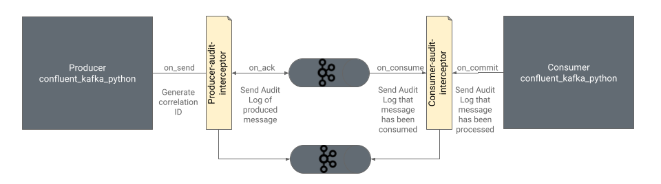

Interceptors in Apache Kafka are plugins that intercept and potentially modify data that is being produced or consumed by Kafka clients. It allows the externalization of common functionality among clients without having to modify the underlying Kafka code. These interceptors can either be producer interceptors or consumer interceptors and act on a single message at a time. Interceptors hook into various stages of a produce or consume request, allowing access to the message and metadata through custom code.


Interceptors play a critical role in the Apache Kafka ecosystem, with use cases around observability, logging, and simple transformations with Kafka producers and consumers. Some of the common use cases or implementations of interceptors are:


1. Disaster Recovery: The [Consumer Timestamp Interceptor](https://docs.confluent.io/platform/current/multi-dc-deployments/replicator/replicator-failover.html#configuring-the-consumer-for-failover-timestamp-preservation) is used by consumers to translate the offsets of the source cluster to the offsets in the destination cluster based on the timestamp of the message in a replicated environment.
2. Monitoring: The [monitoring interceptor](https://docs.confluent.io/platform/current/control-center/installation/clients.html) allows users to monitor production and consumption of messages in the Confluent Control Center by producing telemetry to an additional topic for each message intercepted by the interceptor.
3. Observability: One of the most common use cases for interceptors is implementing distributed tracing for Kafka clients. The [Zipkin interceptor](https://github.com/openzipkin-contrib/brave-kafka-interceptor) enables tracing for Kafka producers and consumers and sends these traces to Zipkin.
4. Generic Tooling: Interceptors can also be used for general-purpose automation, such as auto-creating topics if it do not exist or verifying message integrity with signatures, etc.
5. Data transformation: Since interceptors can also potentially modify the Kafka message, it can be used to do simple transformations on the message before producing or consuming.


## Building interceptors

The official Apache Kafka client library produces an interface  for writing producer and consumer interceptors in Java. These interceptors can be configured by setting the configuration `producer.interceptor.classes` for the producer interceptors and `consumer.interceptor.classes` for the consumer interceptors.


### Producer Interceptor

The [ProducerInterceptor](https://kafka.apache.org/10/javadoc/org/apache/kafka/clients/producer/ProducerInterceptor.html) interface has the following abstract methods:


* `ProducerRecord&lt;K, V> onSend(ProducerRecord&lt;K, V> record);` \
The onSend method is called when the producer client calls the send() method. This method has access to the complete Producer Record and can mutate the record as well before returning it to the next stage of the producer lifecycle.
* `void onAcknowledgement(RecordMetadata metadata, Exception exception);` \
The onAcknowledgement method is called when the broker returns the acknowledgement back to the client along with the metadata about the message, such as the message offset and partition.
* `void close();` \
The close method is called when the interceptor is closed. This is typically for any cleanup or closing activity that needs to be performed.

Since the ProducerInterceptor extends the interface Configurable, the following method is also available within the ProducerInterceptor:


* `void configure(Map&lt;String, ?> configs);` \
The configure method is called when an instance of the producer interceptor is created. This is typically for instantiating any global values for the interceptor.

ProducerInterceptor callbacks may be called from multiple threads. Interceptor implementation must ensure thread safety, if needed.


### Consumer Interceptor

The [Consumernterceptor](https://kafka.apache.org/10/javadoc/org/apache/kafka/clients/consumer/ConsumerInterceptor.html) interface has the following abstract methods:


* ConsumerRecords&lt;K, V> onConsume(ConsumerRecords&lt;K, V> records); \
The onConsume method is called just before the records are returned by the broker due to a poll() call from the consumer. The method has access to the consumer records returned in the batch and can potentially modify the records before returning them. 
* void onCommit(Map&lt;TopicPartition, OffsetAndMetadata> offsets); \
The onCommit method is called when the consumer offsets are committed to the broker. It is provided with details about the topic partition and offsets that were committed.
* void close(); \
Similar to the ProducerInterceptor, the close method can be used for any cleanup or closing activity that needs to be performed when the interceptor is closed.

Similar to the ProducerInterceptor, the ConsumerInterceptor also extends the interface `Configurable` and provides the configure method for any global instantiation. Unlike the ProducerInterceptor, the ConsumerInterceptor is called from the same thread that invokes `KafkaConsumer.poll(long)`.

These Producer and Consumer Interceptor APIs are natively only exposed in the official Java client that is part of the Apache Kafka project. However, there are multiple other client libraries out there for languages apart from Java. [Librdkafka](https://github.com/confluentinc/librdkafka) is one such popular Kafka client library written in C and C++. There are multiple other client libraries in languages such as Python, Go, C#, PHP, Rust, Haskell, and Javascript that are built using librdkafka. One would want to extend the client capabilities in these languages as well and build an interceptor. However, the interceptor API is currently only available for C language clients.

In this blog, we will go over the step-by-step process of developing custom interceptors for both producers and consumers using librdkafka for C and other languages that use librdkafka.


## Building interceptors with librdkafka

Similar to the Java library, the librdkafka library exposes various functions in C to implement a producer or consumer interceptor at various stages of the produce/consume request.

For the producer interceptor, the following functions are made available:


* on_send
* on_acknowledgement

For the consumer interceptor, the following functions are made available:


* on_consume
* on_commit

Once these methods are implemented, a shared object file needs to be created, which can then be used by the librdkafka clients as plugins. Although the interceptors need to be written in C, they can be used by any librdkafka client in any language supported.

Interceptors can be implemented along with the client application code by defining the above mentioned methods using the direct API if the client language is C or by being implemented as an external standalone plugin library that uses the direct APIs. If the client language is not C, the latter approach needs to be taken by writing the interceptor code as an external plugin in C and integrating the shared object into the client’s plugin library.


#### Key Gotcha

> While the Java library for building interceptors allows for mutating the messages, the librdkafka API for interceptors does not allow modification of messages. Interceptors built with librdkafka are read-only interceptors. However, librdkafka interceptors can add, remove, or modify headers in a message.


### Use Case

We will be building a producer and consumer interceptor to perform an audit of the message trail from producers and consumers. These interceptors will capture audit information about a message produced or consumed and send the audit details to another topic. The audit topic can be in the same cluster where the original production or consumption is happening or in a different cluster.

When the message is initially produced, a correlation ID is generated and added to the message as a header. This correlation ID serves as an identifier for tracking the message across the broker and consumer(s). This allows us to build an audit trail for each individual message and track consumption or data loss.



We will be demonstrating the following functionality while building the interceptors:


* Intercepting a message when a message is produced
* Intercepting the metadata when the broker sends an acknowledgement back to the producer
* Defining custom configuration for the interceptor
* Intercepting the messages before it is consumed by the consumer
* Initializing global configuration for an interceptor and cleaning up the configuration

We will not be covering the scenarios for intercepting the offsets when committed by the consumer or when the configuration is copied instead of creating a new configuration for Kafka clients.


### Producer Interceptor with librdkafka


#### Interceptor instance

Each interceptor plugin has an Interceptor instance, which is created either when the plugin (interceptor) is loaded or when the configuration which was previously set is copied.

We will be declaring the interceptor instance in a struct called ici: \


```c
struct ici {
        rd_kafka_conf_t *audit_producer_conf;         /**< Interceptor-specific config */
        char *audit_topic;
};
```


The Interceptor instance can contain any number of members of any type. Here we are declaring an interceptor instance with 2 members:


* `rd_kafka_conf_t *audit_producer_conf;` - Used to store the producer configuration for the audit topic
* `char *audit_topic;` - Used to store the name of the audit topic


#### conf_init

When `plugin.library.paths` is set, the plugin’s conf initializer is called. In the initializer function, we can create and define global objects and functions for the interceptor. In the init function, we will instantiate the Interceptor instance `ici` along with defining the interceptor methods to be called for various interceptor lifecycle stages, such as new interceptor, configuration set, configuration copied (duplicated) and configuration destroyed.


```c
static void conf_init0(rd_kafka_conf_t *conf) {
    struct ici *ici;

    ici = calloc(1, sizeof(*ici));
    ici->audit_producer_conf = rd_kafka_conf_new();
    
    rd_kafka_conf_interceptor_add_on_new(conf, __FILE__, on_new, ici);
    rd_kafka_conf_interceptor_add_on_conf_set(conf, __FILE__, on_conf_set, ici);
    rd_kafka_conf_interceptor_add_on_conf_destroy(conf, __FILE__,
                                                      on_conf_destroy, ici);
}

rd_kafka_resp_err_t conf_init(rd_kafka_conf_t *conf,
                              void **plug_opaquep,
                              char *errstr,
                              size_t errstr_size){
    conf_init0(conf);

    return RD_KAFKA_RESP_ERR_NO_ERROR;
}
```


Here, we are initializing the `ici` object along with instantiating the members of the `ici` struct. Along with that, we are defining the methods for when a new interceptor is created, when the configuration is set, and when the configuration is destroyed, i.e., when the interceptor is destroyed.

The conf_init method has access to the complete client configuration, which is passed to the on_new, on_conf_set and on_conf_destroy methods.


#### on_new

The on_new method is called when rd_kafka_new() or equivalent methods in other languages are called. We will use this method to set up the interceptor.


```c
static rd_kafka_resp_err_t on_new(rd_kafka_t *rk,
                                  const rd_kafka_conf_t *conf,
                                  void *ic_opaque,
                                  char *errstr,
                                  size_t errstr_size) {
    struct ici *ici = ic_opaque;

    rd_kafka_interceptor_add_on_send(rk, __FILE__, on_send, ici);
    rd_kafka_interceptor_add_on_acknowledgement(rk, __FILE__,
                                                    on_acknowledgement, ici);
    return RD_KAFKA_RESP_ERR_NO_ERROR;
}
```


Here, we define the methods for the 2 important events of a producer interceptor: on_send and on_acknowledgement. Both these methods will have access to the interceptor object.


#### on_conf_set

The on_conf_set method is called for each configuration set by the kafka client. The method should return one of `RD_KAFKA_CONF_OK`, `RD_KAFKA_CONF_INVALID` or `RD_KAFKA_CONF_UNKNOWN`. 


* If the configuration is a configuration that is expected by the interceptor and not necessary for the client, the method should return `RD_KAFKA_CONF_OK`. 
* If the method returns `RD_KAFKA_CONF_UNKNOWN`, librdkafka will check if the configuration is valid with other interceptors and, finally, with the list of other configurations that librdkafka recognizes. 
* Returning `RD_KAFKA_CONF_INVALID` will cause the client to fail. This should only be returned if the configuration name is expected by the interceptor but the value is not as expected.

```c
static rd_kafka_conf_res_t on_conf_set(rd_kafka_conf_t *conf,
                                       const char *name,
                                       const char *val,
                                       char *errstr,
                                       size_t errstr_size,
                                       void *ic_opaque) {

    struct ici *ici = ic_opaque;
    int level       = 3;
    const char *prefix = "audit.";


    if (strcmp(name, "audit.topic")==0) {
        ici->audit_topic = strdup(val);
        return RD_KAFKA_CONF_OK;
    }
    

    if (strncmp(prefix, name, strlen(prefix)) == 0) {
        size_t prop_len = strlen(name)-strlen(prefix);
        char *prop = (char *)malloc((prop_len + 1) * sizeof(char));
        strncpy(prop, name+strlen(prefix), prop_len);
        rd_kafka_conf_set(ici->audit_producer_conf, prop, val, errstr, errstr_size);
        return RD_KAFKA_CONF_OK;
    }
     else {
        /* UNKNOWN makes the conf_set() call continue with
            * other interceptors and finally the librdkafka properties. */
        return RD_KAFKA_CONF_UNKNOWN;
    }

    return RD_KAFKA_CONF_UNKNOWN;
}
```


Here, we are checking if the configuration name is “audit.topic” or if it starts with “audit.” before returning `RD_KAFKA_CONF_UNKNOWN` if it does not match the criteria. If the criteria is met, the interceptor instance ici is updated with the values.


#### on_conf_destroy

The `on_conf_destroy` method is called when rd_kafka_conf_destroy() or equivalent methods in other languages are called. We will use this method to clean up and free memory for any objects that were created as part of the interceptor. \


```c
static void ici_destroy(struct ici *ici) {
    if (ici->audit_producer_conf)
            free(ici->audit_producer_conf);
    if (ici->audit_topic)
            free(ici->audit_topic);
    free(ici);
}

static rd_kafka_resp_err_t on_conf_destroy(void *ic_opaque) {
        struct ici *ici = ic_opaque;
        ici_destroy(ici);
        return RD_KAFKA_RESP_ERR_NO_ERROR;
}
```


#### on_send

The `on_send` method is called when the client application code calls the produce() method. The on_send method has access to the top level object `rd_kafka_t` and the message produced `rd_kafka_message_t`. The method also has access to the interceptor instance ici for any global variables.


```c
static rd_kafka_resp_err_t on_send(rd_kafka_t *rk, rd_kafka_message_t *rkmessage, void *ic_opaque) {
    struct ici *ici = ic_opaque;
    if (!rkmessage || !rkmessage->payload) {
        fprintf(stderr, "No message payload to process.\n");
        return RD_KAFKA_RESP_ERR_NO_ERROR;
    }

    char *correlation_id = generate_correlation_id();

    rd_kafka_headers_t *headers;
    rd_kafka_message_headers(rkmessage, &headers);
    if (!headers) {
        headers = rd_kafka_headers_new(8);
    }

    rd_kafka_header_add(headers, "correlation_id", -1, correlation_id, -1);

    rd_kafka_message_set_headers(rkmessage, headers);
    free(correlation_id);

    return RD_KAFKA_RESP_ERR_NO_ERROR;
}
```


We are fetching the message headers, and if there are no message headers, we are initializing it. Finally, we set the header `correlation_id` with the random UUID generated.


#### on_acknowledgement

The `on_acknowledgement` method is called when the broker returns the message acknowledgement with the message metadata, such as offset and partition of the message in the broker, along with the complete message produced.


```c
rd_kafka_resp_err_t on_acknowledgement(rd_kafka_t *rk,
                                       rd_kafka_message_t *rkmessage,
                                       void *ic_opaque) {
        struct ici *ici = ic_opaque;

        const void *correlation_id;
        size_t correlation_id_size;

        const rd_kafka_conf_t *producer_conf = rd_kafka_conf(rk);
        char client_id[512];
        size_t client_id_size = sizeof(client_id);
        rd_kafka_conf_get(producer_conf, "client.id", client_id, &client_id_size);
        const char *topic = rd_kafka_topic_name(rkmessage->rkt);
        rd_kafka_headers_t *headers;
        rd_kafka_message_headers(rkmessage, &headers);
        if (!headers) {
            headers = rd_kafka_headers_new(8);
        }
   
    if (rd_kafka_header_get(headers, 0, "correlation_id", &correlation_id, &correlation_id_size) == RD_KAFKA_RESP_ERR_NO_ERROR) {
        time_t rawtime;
        struct tm * timeinfo;

        time ( &rawtime );
        timeinfo = localtime ( &rawtime );
            // Send the message to an audit topic using a separate producer instance
        rd_kafka_t *audit_rk = init_audit_producer(ici);
        if (audit_rk) {
            char *json_payload = generate_json_payload(asctime(timeinfo), correlation_id, topic, client_id, rkmessage->partition, rkmessage->offset);
            rd_kafka_producev(
                audit_rk,
                RD_KAFKA_V_TOPIC(ici->audit_topic),
                RD_KAFKA_V_MSGFLAGS(RD_KAFKA_MSG_F_COPY),
                RD_KAFKA_V_VALUE(json_payload, strlen(json_payload)),
                RD_KAFKA_V_KEY(correlation_id, correlation_id_size),
                RD_KAFKA_V_END
            );
            rd_kafka_flush(audit_rk, 10000); // Wait for messages to be delivered
            rd_kafka_destroy(audit_rk); // Clean up the audit producer
        }
    }
        return RD_KAFKA_RESP_ERR_NO_ERROR;
}
```


Using the top-level `rd_kafka_t` object, we can fetch the producer configuration, such as the client ID, and using the `rd_kafka_message_t` object, we can fetch the headers for the correlation ID. We will instantiate a producer using the audit producer configuration stored in the interceptor object `ici`. Finally, we will produce the audit JSON message to the audit topic before cleaning up the resources created.


#### Helper functions

There are 2 helper functions for generating a random UUID, which will be used as the correlation id and for generating a JSON payload for the audit message. For the sake of brevity, we will omit the code in this blog but the complete code can be found on [Github](https://github.com/Platformatory/libdrdkafka-interceptors/blob/7d99698479119e5df931304a5a88ee3838a4c510/audit_producer_interceptor.c#L15).


```c
char *generate_correlation_id() {
    // Omitted for brevity
}

char *generate_json_payload(const char *timestamp, const char *correlation_id,
                            const char *topic, const char *client, int partition, long offset) {
    // Omitted for brevity
}
```


#### Error Handling

Every method in the librdkafka interceptor API expects an error code to be returned. `RD_KAFKA_RESP_ERR_NO_ERROR` is to be returned if there are no errors in the method. The full list of error codes can be found in the [librdkafka source code](https://github.com/confluentinc/librdkafka/blob/10824053b4832435f9fd47d72c63ae7dd14aa798/src/rdkafka.h#L281).


#### Compiling

We will need [librdkafka](https://github.com/confluentinc/librdkafka), [jannson](https://github.com/akheron/jansson) and [libuuid](https://linux.die.net/man/3/libuuid) installed in the environment where the interceptor will be compiled.

For ubuntu:


```bash
sudo apt install librdkafka-dev libjansson-dev uuid-dev
```


GCC will be used to build a shared object file after compiling the C interceptor code.


```bash
gcc -o audit_producer_interceptor.so -shared -fPIC audit_producer_interceptor.c -lrdkafka -ljansson -luuid
```


#### Testing

Once the shared object is built, we can plug it into the client application code. To test the interceptor, we will be using Python with the [confluent-kafka-python](https://github.com/confluentinc/confluent-kafka-python) library, which is  a wrapper for librdkafka in Python.


```python
from confluent_kafka import Producer
import random
import os

conf = {
    'bootstrap.servers': 'localhost:9092',
    'plugin.library.paths': os.getcwd()+'/audit_producer_interceptor.so',  # Ensure correct path
    'client.id': 'demo-producer',
    'audit.bootstrap.servers': os.environ.get('AUDIT_BOOTSTRAP_SERVER'),
    'audit.sasl.mechanism': 'PLAIN',
    'audit.security.protocol': 'SASL_SSL',
    'audit.sasl.username': os.environ.get('AUDIT_SASL_USERNAME'),
    'audit.sasl.password': os.environ.get('AUDIT_SASL_PASSWORD'),
    'audit.topic': 'audit_topic',
}

def main():

    producer = Producer(conf)

    def delivery_report(err, msg):
        if err is not None:
            print(f"Message delivery failed: {err}")
        else:
            print(f"Message delivered to {msg.topic()} [{msg.partition()}]")

    # Produce a message
    producer.produce('test_topic', "Hello world! Here's a random number - "+str(random.randint(1, 2100)), callback=delivery_report)

if __name__ == "__main__":
    main()
```


Notice the `plugin.library.paths` which is set to the path of the shared object previously compiled. The shared object can also be placed in `/usr/local/lib` or `/usr/lib` based on the librdkafka version and the `plugin.library.path` can be set to just the name of the shared object  - `audit_producer_interceptor.`

The audit producer and topic configuration is defined with the `audit.` prefix. It can be the same Kafka cluster or an entirely different cluster.

Once we run the python application, we should be able to consume from the audit topic. An example of the message from the audit topic -


```json
{
  "timestamp": "Fri Jun  7 13:23:43 2024",
  "correlation_id": "c0613861-f1a9-47f0-9b92-09a2346fe250",
  "action": "produce",
  "topic": "test_topic",
  "client": "ksb-demo-producer",
  "partition": 0,
  "offset": 13
}
```


Complete code for the producer interceptor can be found on [GitHub](https://github.com/Platformatory/libdrdkafka-interceptors/blob/main/audit_producer_interceptor.c) along with the code for the [test client](https://github.com/Platformatory/libdrdkafka-interceptors/blob/main/test/producer.py).


### Consumer Interceptor with librdkafka

A consumer interceptor can be built similar to the producer interceptor with the same set of APIs except for the consumer specific hooks such as `on_consume` and `on_commit` instead of `on_send` and `on_acknowledgement`.

A consumer interceptor has an Interceptor instance, which was defined as ici in the producer interceptor. The interceptor’s lifecycle starts with the conf_init method, where we define the on_new, on_conf_set and on_conf_destroy methods, similar to the producer interceptor. In the on_new method, we define the methods for on_consume and on_commit.


#### on_consume

The `on_consume` method is called just before the consumer client receives the messages fetched through the `rd_kafka_consumer_poll()` method or equivalent method in other client language libraries. The on_consume method is called for each individual message, even if the consumer fetches multiple message for each poll. The on_consume method has access to the top level object `rd_kafka_t` and the message produced, `rd_kafka_message_t`. The method also has access to the interceptor instance ici for any global variables.


```c
static rd_kafka_resp_err_t on_consume(rd_kafka_t *rk, rd_kafka_message_t *rkmessage, void *ic_opaque) {
    struct ici *ici = ic_opaque;
    if (!rkmessage || !rkmessage->payload) {
        printf("No message payload to process.\n");
        return RD_KAFKA_RESP_ERR_NO_ERROR;
    }

    rd_kafka_headers_t *headers = NULL;
    if (rd_kafka_message_headers(rkmessage, &headers) == RD_KAFKA_RESP_ERR_NO_ERROR) {
        const void *correlation_id;
        size_t correlation_id_size;

        const rd_kafka_conf_t *consumer_conf = rd_kafka_conf(rk);
        char group_id[512];
        size_t group_id_size = sizeof(group_id);
        rd_kafka_conf_get(consumer_conf, "group.id", group_id, &group_id_size);
        const char *topic = rd_kafka_topic_name(rkmessage->rkt);
        if (rd_kafka_header_get(headers, 0, "correlation_id", &correlation_id, &correlation_id_size) == RD_KAFKA_RESP_ERR_NO_ERROR) {
            time_t rawtime;
            struct tm * timeinfo;

            time ( &rawtime );
            timeinfo = localtime ( &rawtime );


            rd_kafka_t *audit_rk = init_audit_producer(ici);
            if (audit_rk) {
                char *json_payload = generate_json_payload(asctime(timeinfo), correlation_id, topic, group_id, rkmessage->partition, rkmessage->offset);
                rd_kafka_producev(
                    audit_rk,
                    RD_KAFKA_V_TOPIC(ici->audit_topic),
                    RD_KAFKA_V_MSGFLAGS(RD_KAFKA_MSG_F_COPY),
                    RD_KAFKA_V_VALUE(json_payload, strlen(json_payload)),
                    RD_KAFKA_V_KEY(correlation_id, correlation_id_size),
                    RD_KAFKA_V_END
                );
                rd_kafka_flush(audit_rk, 10000); // Wait for messages to be delivered
                rd_kafka_destroy(audit_rk); // Clean up the audit producer
            }
        } else {
            fprintf(stderr, "AuditInterceptor: Correlation ID header missing.\n");
        }
    } else {
        fprintf(stderr, "AuditInterceptor: No headers found.\n");
    }

    return RD_KAFKA_RESP_ERR_NO_ERROR;
}
```


Similar to the producer interceptor’s on_acknowledgement method, we instantiate a producer for the audit message and send a JSON message to the audit topic.


#### on_commit

The `on_commit` method is called when the offsets are committed by the consumer. The on_commit method has access to the top-level object rd_kafka_t and the offsets that were committed. The method also receives the interceptor instance and any error that was returned during the offset commit.

Since the on_commit method does not have the message and the headers of the message, we will not be able to generate an audit message. The audit message requires the correlation ID that is part of the message header. The example will not include an implementation of the on_commit method.


#### Compiling

Similar to the producer interceptor, we will be using gcc to compile the interceptor and generate a shared object.


```bash
gcc -o audit_consumer_interceptor.so -shared -fPIC audit_consumer_interceptor.c -lrdkafka -ljansson
```


#### Testing

We can use the following python code to test the consumer interceptor -


```python
from confluent_kafka import Consumer
import os

conf = {
    'bootstrap.servers': 'localhost:9092',
    'group.id': 'ksb-demo-group',
    'auto.offset.reset': 'earliest',
    'plugin.library.paths': os.getcwd()+'/audit_consumer_interceptor',  # Ensure correct path
    'audit.bootstrap.servers': os.environ.get('AUDIT_BOOTSTRAP_SERVER'),
    'audit.sasl.mechanism': 'PLAIN',
    'audit.security.protocol': 'SASL_SSL',
    'audit.sasl.username': os.environ.get('AUDIT_SASL_USERNAME'),
    'audit.sasl.password': os.environ.get('AUDIT_SASL_PASSWORD'),
    'audit.topic': 'audit_topic',
}

consumer = Consumer(conf)
consumer.subscribe(['test_topic'])

try:
    while True:
        msg = consumer.poll(timeout=1.0)
        if msg is None:
            continue
        if msg.error():
            print("Consumer error: {}".format(msg.error()))
            continue
        print(f'Received message: {msg.value().decode("utf-8")}')
finally:
    consumer.close()
```


The interceptor is declared using the `plugin.library.paths` configuration. Once we run the application, the interceptor will produce a message to the audit topic.


## Conclusion

Although not every client language library built using librdkafka supports building interceptors natively, we can work around it by building interceptors in C and plugging it into the respective client language code using the configuration `plugin.library.paths`. Interceptors drive various use cases as mentioned earlier but should only be used to perform non-blocking operations, especially in the `on_send` and `on_consume` methods since these can contribute to the latency experienced by the client application.

The complete source code and the test scripts can be found on [GitHub](https://github.com/Platformatory/libdrdkafka-interceptors). The librdkafka [test cases for interceptors](https://github.com/confluentinc/librdkafka/blob/master/tests/interceptor_test/interceptor_test.c) are also an excellent source for examples of writing interceptors for librdkafka.