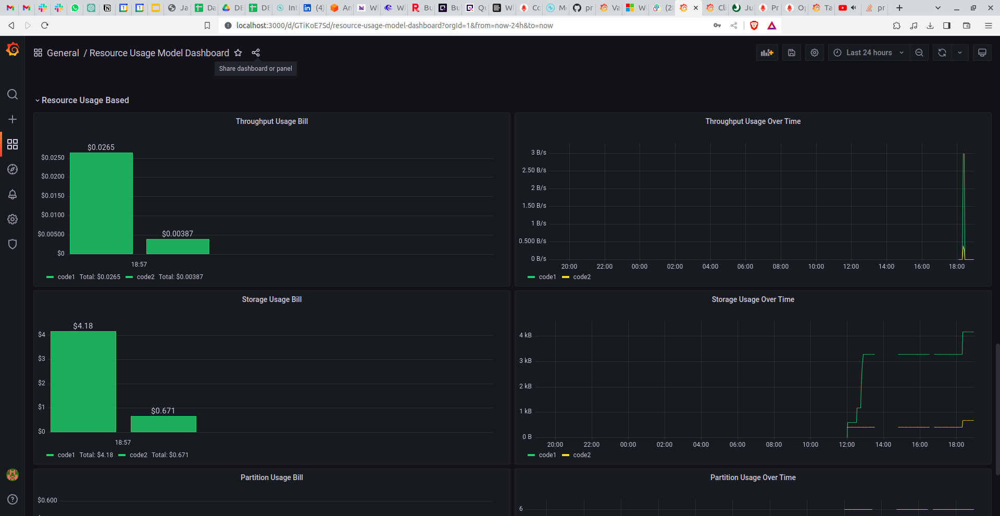

# Introduction

Kafka is the most popular streaming platform, used by more than 80% of the Fortune 100 companies. Several of these enterprises run a number of Kafka clusters, that are (usually) operated by a data / streaming platform team.

One concern that emerges for such platform teams is to understand usage patterns and attribute costs to their internal customers, for both cost transparency and profit. On a cloud service such as Confluent cloud, it is relatively simple to crunch these stats out of the metrics API. But for other deployments, this can be a somewhat tough problem to solve.

To begin with there are two broad archetypes for how Kafka platform teams manage.

- Single-tenant clusters: This is pretty simple. All costs are passed on to the tenant.
- Multi-tenant clusters: Every tenant is essentially being provided a topic as a service. They may have multiple producers and consumers.

How do we solve for the latter in particular? Let’s explore.

# Kafka Operational Costs

Let’s begin by figuring out the costs of running Kafka. This is not magic and will vary for each organization. The costs can be majorly differentiated into 2 categories. They are,

- Fixed Costs
- Variable Costs

*Fixed Costs* are the costs which are incurred to keep the Kafka cluster operational. Irrespective of the usage of the Kafka cluster, there are costs associated with running a Kafka cluster. This includes,

- Compute unit costs - Kafka Brokers, Zookeeper, Schema Registry nodes etc.
- Tooling costs - Monitoring tool, SIEM tool etc.
- Personnel costs - Kafka administrators, support team etc.

*Variable Costs* are the costs which are subject to vary as per the usage of the Kafka cluster. Generally, this cost will grow as the scale of the data in a organization grows. This includes,

- Network costs - Throughput, Max. Connections etc.
- Storage costs - Local Storage, Tiered storage etc.

Therefore, the fully loaded cost of a Kafka cluster is pretty subjective. Charging internal customers is a little tricky. 

# Chargeback Models

When we built this Chargeback solution, we scoped for three models,

- Cost Centre
- Resource Usage Based
- Client Usage Based

## Cost Centre

In this model, we charge the tenants a fraction of the total costs incurred for keeping the Kafka cluster operational. The cost-split among the tenants are determined by their usage of the Kafka cluster when compared to the total usage of the Kafka cluster. For example, assume there are 5 teams using a Kafka cluster which incurs a monthly cost of $10,000 and clocks 10 Mbps of average throughput per broker. If every team contributes to 2 Mbps of average throughput per broker, then each team will be liable to pay $2000 for Kafka services. 

Cost Centre model enables billing the tenants based on a *fair share* of the total cost. This model would fit best in scenarios where the Kafka cluster utilization is not high. Generally, the Kafka clusters are over-provisioned to account for growth over time but the cluster capacity utilization does not grow fast enough. So, splitting costs based on relative usage is fair to the customers.

## Resource Usage Based

In this model, we charge the tenants based on their absolute usage of the Kafka resources. The Kafka resources which will be billed include,

- Partitions
- Disk Storage
- Broker Throughput

The above mentioned resources are the ones which can be tracked easily and attributed to the operational costs. 

A per-unit cost for each of the above mentioned resources will need to be calculated by doing a  thorough load testing on Kafka clusters.

The tenants pays only for the resources utilized and not based on total costs of running the Kafka cluster. This model would fit well for scenarios with high Kafka cluster utilization. When the cluster capacity utilization is high, it is best adopt a *pay-for-what-you-use* strategy as the costs are generally justified because of high usage.

## Client Usage Based

In this model, we charge the tenants based on their clients’ throughput numbers.This is similar to the *Resource Usage Based* model but we charge the tenants for the amount of data they send and/or read from the Kafka cluster.

There are 3 sub types in this model based on who pays,

- Producer Pays - *Only Producer clients pay for the data sent to the cluster*
- Consumer Pays - *Only Consumer clients pay for the data read from the cluster*
- Producer and Consumer Pays - *Both Producer and Consumer clients pay for the data sent and read by them respectively*

Client throughput is measured as *bytes-per-second* in the Kafka world. Therefore, a unit *bytes-per-second* cost for both write and read operations will need be predefined by the platform team. Unit costs can be calculated based on the observed monthly average client throughput. 

This model would fit well in scenarios with very high Kafka cluster utilization over long periods of time. The advantage of this model is it offers simple pricing strategy for the tenants by paying for what they send and read rather than usage of Kafka related resources.

# Solution

Before we get to the solution, it is important to understand the considerations involved,

- Avoid introducing additional costs as much as possible
- Avoid additional development efforts as much as possible
- Make use of existing capabilities of Kafka
- Use tools which are open-source and widely used in Kafka ecosystem

The solution we built uses the Kafka JMX metrics, Prometheus and Grafana. Let’s take a look at how it works.

Kafka JMX metrics provides a veritable list of useful metrics which gives us a detailed information on the operations of the Kafka cluster. Some of the useful broker-side metrics include,

- [kafka_server_brokertopicmetrics_bytesinpersec](https://docs.confluent.io/platform/current/kafka/monitoring.html#bytesinpersec)
- [kafka_log_log_size](https://docs.confluent.io/platform/current/kafka/monitoring.html#size)
- [kafka_cluster_partition_replicascount](https://docs.confluent.io/platform/current/kafka/monitoring.html#replicascount)
- [kafka_server_produce_byte_rate](https://docs.confluent.io/platform/current/kafka/monitoring.html#request-quota)
- [kafka_server_fetch_byte_rate](https://docs.confluent.io/platform/current/kafka/monitoring.html#request-quota)

**Note:** We will only be using the Broker-side metrics to do the Chargeback calculation as this is something which will be always available to the platform team managing Kafka clusters.

The throughput rates, storage usage and partitions count can be inferred from the JMX metrics. But, we will need to attribute the clients or topics to a customer. This will be done by tagging the clients and/or topics to a Chargecode which will be unique for a tenant. 

*Chargecode* is a user-defined unique identifier for a tenant associated with a specific Kafka cluster. Chargecode definition will include match configuration which defines the topics and/or clients associated with that tenant in that specific Kafka cluster. Please note the Client quotas will need to predefined to capture the client specific throughput rate on the broker side.

Prometheus will be used to scrape the relevant JMX metrics and re-tag them with the Chargecode as per the defined Chargecode configuration. Prometheus enables metric re-tagging through “metric_relabel_configs” definition. 

Grafana dashboards are created to visualize the usage and cost per Chargecodes by querying the Prometheus database. The dashboards will demonstrate the Bill per chargecode, Top N Chargecodes based on Storage, Partitions and Throughput usage etc. The dashboards are meant to enable the platform engineers in an organization to make an informed decision on managing resources and distributing costs

# Configurations

## Chargeback Model Configuration

Let’s look at how to configure a Chargeback model for billing tenants in a Kafka cluster. Below is a sample configuration.

```yaml
clusters:
  - cluster1:
      cluster_name: Cluster1 # Common Key with Chargecode configuration
      cluster_id: 12345 # Unique cluster ID
      throughput_units: bytes
      currency_code: USD
      total_costs: 5000
      total_capacity:
        throughput_tps: 1000
        storage: 100000000
        partitions_max: 1000
      chargeback_model: cost_center # The model type
      chargeback_config:
        partition_unit_rate: 0.05
        throughput_unit_rate: 0.1
        storage_unit_rate: 0.001

  - cluster3:
      cluster_name: Cluster3
      cluster_id: 56789
      throughput_units: bytes
      currency_code: USD
      total_costs: 5000
      total_capacity:
        throughput_tps: 1000
        storage: 100000000
        partitions_max: 1000
      chargeback_model: usage_based
      chargeback_config:
        partition_unit_rate: 0.05
        throughput_unit_rate: 0.1
        storage_unit_rate: 0.001

  - cluster2:
      cluster_name: Cluster2
      cluster_id: 98765
      throughput_units: bytes
      currency_code: USD
      total_costs: 6000
      total_capacity:
        throughput_tps: 1000
        storage: 100000000
        partitions_max: 1000
      chargeback_model: client_usage_based
      chargeback_config:
        usage_model: producer_pays  # Supported models: producer_pays, consumer_pays, producer_consumer_pays
        throughput_in_unit_rate: 0.15
        throughput_out_unit_rate: 0.05
```

One Chargeback model per Kafka cluster. The fields per cluster include,

- *cluster_name* - Unique name for the cluster. This will be the common key for both model and chargecode configuration.
- *cluster_id* - Unique identifier for internal identification.
- *throughput_units* - Unit for the throughput measurement. Either “bytes” or “records”. Only “bytes” for client usage based model.
- *currency_code* - The currency unit for the bill generated
- *total_costs* - Monthly total operational cost of the Kafka cluster
- *total_capacity* - Total capacity available for that Kafka cluster
    - *throughput_tps* - Allowed maximum throughput transactions (bytes or records) per second
    - *storage* - Allowed maximum storage in bytes
    - *partitions_max* - Allowed maximum topic partitions count
- *chargeback_model* - The model type for the Chargeback calculation
- *chargeback_config* - The per-unit rates for various resources and client throughput
    - *partition_unit_rate* - Unit price for a topic partition
    - *storage_unit_rate* - Unit price for each storage byte
    - *throughput_unit_rate* - Unit price for each byte or record written to a Broker
    - *usage_model* - The sub-model type for Client usage based model. Valid values are “producer_pays”, “consumer_pays” and “producer_consumer_pays”
    - *throughput_in_unit_rate* - Unit price for each byte or record sent by a producer client. Only applicable for Client usage based model.
    - *throughput_out_unit_rate* - Unit price for each byte or record read by a consumer client. Only applicable for Client usage based model.

## Chargecode Configuration

Let’s look at how to define Chargecodes for billing tenants in a Kafka cluster. Below is a sample configuration.

```yaml
chargecodes:
  - chargecode_name: Chargecode1
    target_cluster: Cluster1   # Joining Key
    match_config:
      - entity: client_id    # Either client_id or topic
        match_type: prefix   # Either prefix, regex or literal
        match_expression: "clientA_"
      - entity: topic
        match_type: literal
        match_expression: "important_topics"

  - chargecode_name: Chargecode2
    target_cluster: Cluster2
    match_config:
      - entity: client_id
        match_type: regex
        match_expression: "^clientB_.+"
      - entity: topic
        match_type: literal
        match_expression: "special_topics"

  - chargecode_name: Chargecode3
    target_cluster: Cluster3
    match_config:
      - entity: client_id
        match_type: literal
        match_expression: "clientC"
      - entity: topic
        match_type: prefix
        match_expression: "experimental_"
```

Ideally, one Chargecode configuration per team per cluster. There will be one or more Chargecodes associated with a Kafka cluster. The fields per Chargecode definition include,

- *chargecode_name* - Unique name for the Chargecode. Generally, the team name will be used
- *target_cluster* - The Kafka cluster to which the Chargecode will be associated
- *match_config* - The topic or client mapping associated with the tenant
    - *entity -* Entity type. Either “topic” or “client_id”
    - *match_type* - Matching logic. Either “literal”, “prefix” or “regex”
    - *match_expression* - The resource name to match

## Prometheus Configuration

The defined Chargecode configuration will be converted into a “*metric_relabel_configs*” in the Prometheus configuration. Below is a sample Prometheus configuration for one Kafka cluster with Chargecode mapping defined under the “metric_relabel_configs” section.

```yaml
global:
  scrape_interval:     15s
  evaluation_interval: 15s

rule_files:
  - /etc/prometheus/rules.yml

scrape_configs:
  - job_name: 'kafka-broker'
    scrape_interval: 5s
    metrics_path: /
    static_configs:
      - targets: ['kafka1:9101','kafka2:9102','kafka3:9103']
        labels:
          env: "dev"
          cluster: "Cluster1"
    relabel_configs:
      - source_labels: [__address__]
        target_label: hostname
        regex: '([^:]+)(:[0-9]+)?'
        replacement: '${1}'
    metric_relabel_configs:
      - source_labels: ['cluster', 'topic']
        separator: '_'
        target_label: chargecode
        regex: '^Cluster1_important_topics$'
        replacement: 'Chargecode1'
      - source_labels: ['cluster', 'client_id']
        separator: '_'
        target_label: chargecode
        regex: '^Clister1_clientA_(.*)$'
        replacement: 'Chargecode1'
```

Additionally, we will define a custom metric called “*broker_throughput_rate*” which calculates the rate of the bytes produced to Kafka using the Prometheus Rules. This will be used as the throughput metric in the “Resource Usage Based” Chargeback model.

```yaml
groups:
  ### BROKER THROUGHPUT RATE
  - name: record_broker_throughput_rate
    rules:  
      ## Throughput related units calculation - Bytes
      - record: broker_throughput_rate
        expr: rate(kafka_server_brokertopicmetrics_bytesinpersec[5m])
        labels:
          env: "dev"
          cluster: "Cluster1"
```

# Dashboards

Simple and reusable Grafana dashboards are provisioned to view the usage and costs of different tenants in an organization. Let’s look at the dashboard for each of the Chargeback model.

## Cost Centre

The following metrics are highlighted in the Cost Center model dashboard.

- Total cost for the Kafka cluster
- Current cluster capacity utilization
- Chargecode wise split of the cost
    - In Amount
    - In Percentage
- Top 5 Chargecodes based on usage,
    - Throughput
    - Partition
    - Storage


## Resource Usage Based

The following metrics are highlighted in the Resource Usage Based model dashboard.

- Total cost for the Kafka cluster
- Current cluster capacity utilization
- Total Bill based on current usage
- Profit/Loss value (Bill - Cost)
- Chargecode wise split of the usage
    - In Amount
    - In Percentage
- Top 5 Chargecodes based on usage,
    - Throughput
    - Partition
    - Storage
- Usage bill per Chargecode for each resource type
    - Throughput
    - Partition
    - Storage
- Usage metrics per Chargecode over time for each resource type
    - Throughput
    - Partition
    - Storage





## Client Usage Based

The following metrics are highlighted in the Client Usage Based model dashboard.

- Total cost for the Kafka cluster
- Current cluster capacity utilization
- Total Bill based on current usage
- Profit/Loss value (Bill - Cost)
- Chargecode wise split based on client usage
    - In Amount
    - In Percentage
- Top 5 Clients per Chargecode based on usage,
- Usage bill per Chargecode based on each client type
    - Producer
    - Consumer
- Usage (throughput) metrics per Chargecode over time for each client type
    - Producer
    - Consumer


# Conclusion

In conclusion, implementing a Kafka chargeback solution is an effective way to attribute operational costs to various tenants in a multi-tenant Kafka environment. By leveraging the power of Kafka JMX metrics, Prometheus, and Grafana, platform teams can gain detailed insights into usage patterns and accurately distribute costs based on a variety of chargeback models. Not only does this encourage responsible usage of resources, but it also provides transparency and fairness in cost attribution. Looking ahead, we aim to refine and expand this solution, incorporating client side JMX metrics and introducing more visulaization features.
