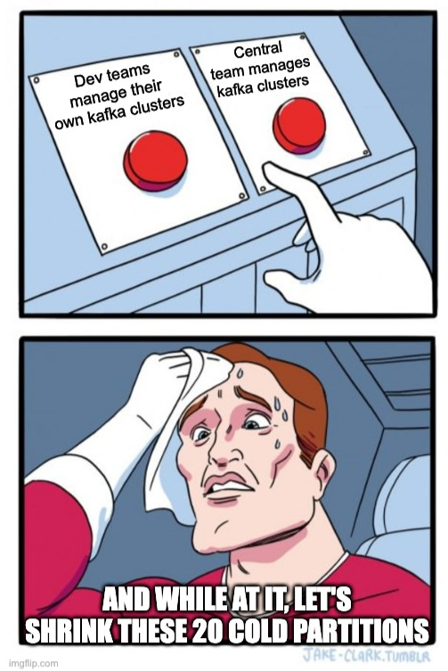

# Introduction

Managing Kafka clusters is all good as a platform team until you have a handful of teams and a handful of clusters. 

Let’s visit some common scenarios where every platform team has ended up with a mish-mash of ungoverned clusters or topics that eventually needs some garden cleaning (for good reason). 

- You need to move or migrate topics in the same cluster (surprise, Kafka can’t shrink partitions so you will have to create a new topic and replicate to mirror the old). You may need to move or migrate a topic (let’s say with hot, noisy neighbor partitions) to a different cluster altogether
- You may want to move a whole cluster to better infrastructure (or more commonly because you have a disaster!). 
- You need to change the authentication mechanism and (re)distribute credentials. 
- Your devs are complaining and need help optimizing their configurations (and they have no clue what they’re doing).

If you’ve been there, done that and burnt your hands, you’re not alone. The part that makes this all pretty hard in the Kafka world is the nature of Kafka’s API, where clients do much of the song and dance. We have a proposal for a future proofing for all these concerns that includes:

- The ability to route a client to a specific cluster (bootstrap.servers) dynamically, without having these hardcoded in the client
  - ProTip: Very useful for entire cluster migrations
- The ability to route a client to a specific topic, based on a higher order messaging or routing primitive, without being joined in the hip with a set of topics
  - ProTip: Very useful for topic migrations, but also routing multiple types of messages to the same topic
- Credential Mediation
  - Giving clients their auth instruments, dynamically. Potentially references to secret stores or serving the credentials straight up (but ability to rotate on the server-side as well as revoking them on-demand)
- Configuration profile
  - Ability to provide some of your well optimized for latency, throughput, durability, availability or otherwise just your distillation of best practices for producer, consumer, admin client configurations.

Having some abstractions to achieve these cross cutting concerns is a good measure and will yield sanity to platform operators who may need to defer great control to themselves. In general, for large scale use-cases, it is always good to have some insulation and indirection in between kafka clients and the server, ala proxy patterns very popular in the HTTP/REST world.

This post intends to propose common solutions (as a series) that would help overcome these problems and in the true spirit of a platform, provide an effective amount of self service.

# Approach 1: Discover topics through Language specific SDKs and a rule-based routing layer

This is a pattern where a language specific SDK handles the following concern, by talking to a metadata or a catalog service. 

Typically, the client here would, before instantiating a kafka client, locate the target kafka service using

- A HTTP/REST call to the catalog service (using some form of security: Such as basic auth or OAuth)
  - Express an intent (such as to produce or consume) on a certain topic or domain of topics (such as prefix pattern) OR by the virtue of it’s client ID, be routed to the appropriate cluster
- Receive the kafka bootstrap location
  - Optionally, mediated credentials for both kafka and typically, schema registry
- The above, being cached with a TTL
- Return a Kafka client instance

This approach has a wider-domain of applicability, beyond containerized environments, but it does require

- A secured, metadata or catalog service  (run by you)
  - Which ideally has automation for inventory discovery across multiple clusters
  - Combined with routing rules
- Language specific, idiomatic service locator implementation (“SDK”)
  - And therefore code changes to existing applications including exception handling

flowchart LR

 subgraph PRODUCERS["Producers"]
        P1("Producer 1")
        P2("Producer 2")
        P3("Producer 3")
  end
 subgraph CG1["Consumer Group 1"]
        C1("Consumer 1")
  end
 subgraph CG2["Consumer Group 2"]
        C2("Consumer 1")
        C3("Consumer 2")
  end
 subgraph CG3["Consumer Group 3"]
        C4("Consumer 1")
        C5("Consumer 2")
  end

 subgraph GW["Rule Based Routing Layer"]
    direction LR
        API["APIs (Kong)"]
        US["Upstream (Catalog Service)"]
  end
 subgraph K1["Kafka Cluster 1"]
        B1["Broker 1"]
        B2["Broker 2"]
        B3["Broker 3"]
  end
subgraph K2["Kafka Cluster 2"]
        B4["Broker 1"]
        B5["Broker 2"]
        B6["Broker 3"]
  end

    P1 & P2 & P3 -- 1.GetInfo --> GW -- 2.Response --> P1 & P2 & P3
    CG1 & CG2 & CG3  -- 1.GetInfo --> GW -- 2.Response --> CG1 & CG2 & CG3
    P1 -- 3.Produces --> K1
    P2 -- 3.Produces --> K2
    P3 -- 3.Produces --> CC
    API --> US
    K1 -- 4.Consumes --> CG1
    K2 -- 4.Consumes --> CG2
    CC -- 4.Consumes --> CG3

    %% Styling
    classDef kafkaStyle fill:#e0f7e9,stroke:#4caf50,stroke-width:2px;
    class K1,K2 kafkaStyle;

We get into the description and implementation details here: [Unified Access Layer: Part 2: Rule Based Routing](https://platformatory.io/blog/unified-access-layer-part-2-rule-based-routing)

# Approach 2: Use a Service Mesh (for Kubernetes Environment)

A service mesh (like Istio, Kuma) can be leveraged as a layer to access Kafka resources. It typically includes service discovery mechanisms that allow services to dynamically discover and communicate with each other, and this can be extended to Kafka by enabling services to discover Kafka brokers and other Kafka-related services (like schema registries or Kafka Connect connectors).

***Understanding Service Mesh and Sidecar Pattern***

***Service Mesh***: A service mesh is an infrastructure layer that enables managed, observable, and secure communication between microservices. It typically includes features like traffic management, security, and observability.

***Sidecar Pattern***: In a service mesh, the sidecar pattern involves deploying a helper container (sidecar) alongside each microservice container. This sidecar handles the networking responsibilities such as routing, proxying, and observing traffic.

***Key Concepts***:

***Local Sidecar Endpoint***: Each microservice communicates with its own local sidecar proxy rather than directly with other services or external endpoints.

***Broker / Mesh Filters***: The sidecar uses rules and filters (configured in the service mesh) to manage traffic, including routing requests to the appropriate upstream services.

***Central idea***: You produce to or consume from a local sidecar endpoint (which uses broker / mesh filters to route the request upstream).

Let's dissect this.

- You produce to or consume from a local sidecar endpoint:
  - Produce: In Kafka terminology, producing refers to sending data (messages) to a Kafka topic.
  - Consume: Consuming refers to retrieving data (messages) from a Kafka topic.
  - Local Sidecar Endpoint: Instead of directly interacting with Kafka brokers, your application sends data to a local sidecar proxy endpoint. This proxy is running in the same pod as your application.

- Which uses broker / mesh filters:
  - Broker: This typically refers to the Kafka brokers that handle message storage and retrieval.
  - Mesh Filters: These are configurations within the service mesh that dictate how traffic should be managed. Filters can include rules for load balancing, retries, timeouts, security policies, etc.

- To route the request upstream:
  - Upstream: In networking, upstream refers to the direction towards the service you are communicating with. Here, it means the Kafka brokers.
  - The local sidecar proxy receives the request and, based on the configured filters and routing rules, forwards (or routes) the request to the appropriate Kafka broker.

Here's the overall architecture diagram for this idea.

flowchart TD
  %% Kubernetes environment
  subgraph K8S ["Kubernetes"]
    direction TB
    
    %% Service Mesh (Istio)
    subgraph Istio ["Service Mesh (Istio)"]
      direction TB
      
      %% Producer Pods
      subgraph P1Pod ["Pod: Producer 1"]
        direction TB
        P1("Producer 1")
        P1Envoy["Envoy Proxy (P1)"]
        Filter1["Mesh Filter (P1)"]
        P1 -->|Produces To| P1Envoy --> Filter1
      end
      
      subgraph P2Pod ["Pod: Producer 2"]
        direction TB
        P2("Producer 2")
        P2Envoy["Envoy Proxy (P2)"]
        Filter2["Mesh Filter (P2)"]
        P2 -->|Produces To| P2Envoy --> Filter2
      end

      %% Kafka Cluster 1
      subgraph K1 ["Kafka Cluster 1"]
        direction TB
        subgraph Broker1Pod1 ["Pod: Broker 1"]
          direction TB
          Broker1Envoy1["Envoy Proxy (Broker 1)"]
          Broker1_1("Broker 1")
          Broker1Envoy1 --> Broker1_1
        end

        subgraph Broker1Pod2 ["Pod: Broker 2"]
          direction TB
          Broker1Envoy2["Envoy Proxy (Broker 2)"]
          Broker1_2("Broker 2")
          Broker1Envoy2 --> Broker1_2
        end
        
        subgraph Broker1Pod3 ["Pod: Broker 3"]
          direction TB
          Broker1Envoy3["Envoy Proxy (Broker 3)"]
          Broker1_3("Broker 3")
          Broker1Envoy3 --> Broker1_3
        end
        
        Topic1["Topic 1"]
        Topic2["Topic 2"]
      end
      
      %% Kafka Cluster 2
      subgraph K2 ["Kafka Cluster 2"]
        direction TB
        subgraph Broker2Pod1 ["Pod: Broker 1"]
          direction TB
          Broker2Envoy1["Envoy Proxy (Broker 1)"]
          Broker2_1("Broker 1")
          Broker2Envoy1 --> Broker2_1
        end

        subgraph Broker2Pod2 ["Pod: Broker 2"]
          direction TB
          Broker2Envoy2["Envoy Proxy (Broker 2)"]
          Broker2_2("Broker 2")
          Broker2Envoy2 --> Broker2_2
        end
        
        subgraph Broker2Pod3 ["Pod: Broker 3"]
          direction TB
          Broker2Envoy3["Envoy Proxy (Broker 3)"]
          Broker2_3("Broker 3")
          Broker2Envoy3 --> Broker2_3
        end
        
        Topic3["Topic 3"]
        Topic4["Topic 4"]
      end

      %% Consumer Pods
      subgraph C1Pod ["Pod: Consumer 1"]
        direction TB
        C1("Consumer 1")
        C1Envoy["Envoy Proxy (C1)"]
        Filter3["Mesh Filter (C1)"]
        C1 -->|Consumes From| C1Envoy --> Filter3
      end

      subgraph C2Pod ["Pod: Consumer 2"]
        direction TB
        C2("Consumer 2")
        C2Envoy["Envoy Proxy (C2)"]
        Filter4["Mesh Filter (C2)"]
        C2 -->|Consumes From| C2Envoy --> Filter4
      end
    end
  end

  %% Connections
  Filter1 -->|Produces to| Topic1 & Topic2
  Filter2 -->|Produces to| Topic3 & Topic4
  Topic1 -->|Consumed by| Filter3
  Topic3 -->|Consumed by| Filter4
  Broker1Envoy1 -->|Manages| Topic1 & Topic2
  Broker1Envoy2 -->|Manages| Topic1 & Topic2
  Broker1Envoy3 -->|Manages| Topic1 & Topic2
  Broker2Envoy1 -->|Manages| Topic3 & Topic4
  Broker2Envoy2 -->|Manages| Topic3 & Topic4
  Broker2Envoy3 -->|Manages| Topic3 & Topic4

  %% Styling
  classDef kafkaStyle fill:#e0f7e9,stroke:#4caf50,stroke-width:2px;
  class K1,K2 kafkaStyle;

Downsides to using a service mesh: 
- It is another piece of middleware that needs someone familiar with the internals (like Envoy proxy) to be able to operate it. 
- Tenancy: the more tenants, the more valuable it is to operate. Careful planning is needed for policy, automation, tenancy and isolation. 
- Being another piece of the services in the request path requires understanding on configuration, operation and integration within the organization. That with the governance between different teams.

# Approach 3: Virtualize the Kafka Cluster and Topic (through a Kafka Gateway)

In this approach, the gateway (e.g., [Conduktor](https://docs.conduktor.io/gateway/)) is a network proxy for Apache Kafka with capabilities that are extensible and customizable through plugins.

Here is the architecture diagram to visualize the capabilities.

flowchart TD
 subgraph PRODUCERS["Producers"]
        P1("Producer 1")
        P2("Producer 2")
  end
 subgraph CG1["Consumer Group 1"]
        C1("Consumer 1")
  end
 subgraph CG2["Consumer Group 2"]
        C2("Consumer 2")
        C3("Consumer 3")
  end
 subgraph CONSUMERS["Consumers"]
        CG1
        CG2
  end
 subgraph GW["Kafka Gateway"]
    direction LR
        AA["Authentication & Authorization"]
        PL["Plugins"]
  end
 subgraph K1["Kafka Cluster"]
        B1["Broker 1"]
        B2["Broker 2"]
        B3["Broker 3"]
  end
 subgraph D1["Destinations"]
        K1
        CC["Confluent Cloud"]
  end
  subgraph A1["Producers & Consumers"]
    direction LR
    PRODUCERS
    CONSUMERS
  end
    P1 & P2 -- Produce --> GW -- Consume --> CG1 & CG2
    K1 & CC -- Messages --> GW
    AA --> PL
    GW -- Forward ---> K1 & CC

  classDef kafkaStyle fill:#e0f7e9,stroke:#4caf50,stroke-width:2px;
  class A1,D1 kafkaStyle;

 
The gateway is deployed between the producers/consumers and the Kafka clusters and because it is Kafka protocol compliant, there are very small changes (like a new bootstrap server) needed for the clients to connect to the gateway. Typically, the gateway provides authentication via the support for security protocols just like the brokers (PLAINTEXT, SSL, SASL SSL, mTLS). The interesting component of the gateway is the Interceptors where we can write the business logic, especially routing the requests which is the central topic here. The gateway can also support processing flow (could be a pipeline of interceptors) where each component of the pipeline can be invoked sequentially during a produce request and the responses from the broker go through the pipeline in the reverse order.

Some pros of the approach:
- being Kafka protocol compliant implies that they can support multiple vendors
- extensibility of the gateway could bring in operational insights into security, compliance, monitoring and alerting
- provides centralized management for one team to manage access and configuration

Some downsides of the approach:
- they add latency depending on how they are implemented (Conduktor add latencies in the order of  milliseconds) which can increase if encryption is enabled using a custom encryption key. Latency can increase if the processing flow pipeline has a number of plugins.
- proprietary tools could result in vendor lock-ins
- initial setup and configration could be complex

# Approach 4: Discover Topics using a Data Catalog + Self-Service Portal

A data catalog allows organizations to managing and discovering data assets (in this case, Kafka clusters/streams, topics, schemas). Depending on the choice of the data catalog, it could support Kafka resource natively or have limited support. Ideally, you would need a data catalog that supports Kafka out-of-the-box. 

Here are a few options:
***Apache Atlas***: is the only Open Source solution that integrates well with Kafka, provides management and governance of data streams. It helps in Metadata management (tracks lineage and metadata for Kafka topics), Classification (allows classification and tagging of Kafka topics), Search and discovery (easy search and discovery of Kafka streams).

***Confluent stream catalog***: supports Kafka resources (Schemas, Topics, Connectors, Clusters, Environments, Streaming data pipelines, Apache Flink® compute pools) on Confluent Cloud. It offers benefits such as improved metadata management and easier integration with external systems. 

***Other options***: GCP supports a catalog for Pub-Sub. AWS Glue Catalog unfortunately has limited support for streams (through the integration with Amazon MSK or Managed Service for Kafka). Azure supports Azure Catalog (similar features like AWS Glue Catalog). Collibra has some limited support for Kafka (apart from Metadata management and governance, it supports data quality checks for streaming data). We can also look at OpenMetadata, Databricks unity catalog and Amundsen among others. For everything else, there’s the Hive metastore. 

Here's the architecture diagram for the idea:

flowchart TD

 subgraph PRODUCERS["Producers"]
        P1("Producer 1")
        P2("Producer 2")
  end
 subgraph CG1["Consumer Group 1"]
        C1("Consumer 1")
  end
 subgraph CG2["Consumer Group 2"]
        C2("Consumer 2")
        C3("Consumer 3")
  end
 subgraph CONSUMERS["Consumers"]
        CG1
        CG2
  end
 subgraph SSP["Self-Service Portal"]
        PO1["Portal"]
  end
 subgraph DC["Data Catalog for Kafka"]
    direction LR
        API["APIs"]
        MM["Metadata Management & Lineage"]
        TL["Classification & Tagging"]
        DG["Data Governance"]
        DQ["Data Quality"]
  end
 subgraph SSPDC["Self-Service Portal & Data Catalog"]
        direction TB
        SSP
        DC
  end
 subgraph KC["Kafka Cluster"]
        B1["Broker 1"]
        B2["Broker 2"]
        B3["Broker 3"]
  end
subgraph KC1["Kafka Cluster"]
        B4["Broker 1"]
        B5["Broker 2"]
        B6["Broker 3"]
  end
 subgraph D1["Destinations"]
        direction TB
        KC
        KC1
        CC["Cloud Provider (Confluent, AWS MSK, Azure, GCP)"]
        
  end
  subgraph A1["Producers & Consumers"]
    direction LR
    PRODUCERS
    CONSUMERS

  end
    P1 & P2 -- Produce (with Metadata) --> DC -- Consume (with Metadata) --> CG1 & CG2
    KC & KC1 & CC -- Messages (with Metadata) --> DC    
    DC -- Forward (with Metadta) ---> KC & KC1 & CC
    SSP -- Configures --> DC
    

  classDef kafkaStyle fill:#e0f7e9,stroke:#4caf50,stroke-width:2px;
  class D1,SSPDC,A1 kafkaStyle;

These data catalogs offer APIs that allow organizations to seamlessly integrate the data catalog with other systems, automate metadata management tasks, and build custom applications on top of the catalog’s capabilities. This flexibility is crucial for maintaining an efficient and scalable data management ecosystem. 

All of the above broadly captures business and technical metadata. You still need a discovery interface to query by these parameters. Ideally, you also need a self-service portal for credential vending.

Data catalog also comes with potential downsides related to complexity, performance, consistency, vendor lock-in, maintenance, and learning curve. Careful evaluation of the factors is essential to determine if the use of a catalog is suitable for your specific streaming application and organizational needs.

# Conclusion

Creating a system that helps a centralized Kafka infrastructure team to easily create, label and vend information reduces common problems and dependencies. Same benefits are passed on to the producers and consumers thus creating a scalable system/organization. 
