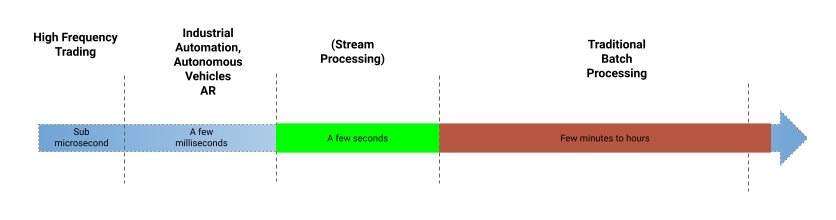
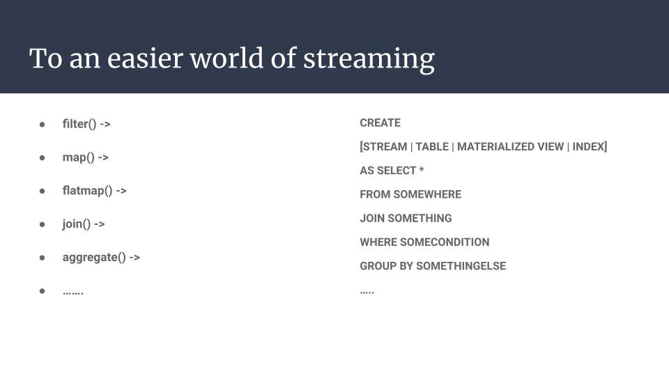
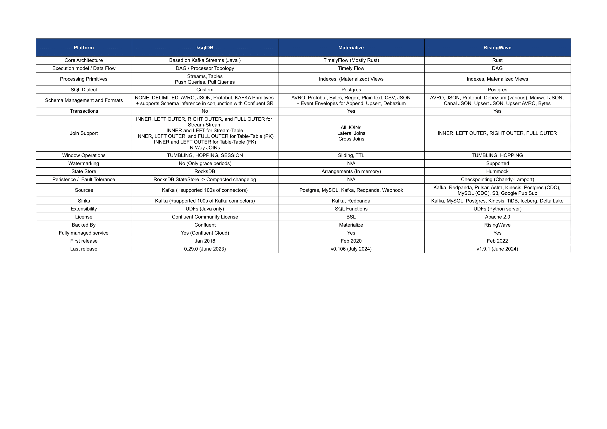

# Stream Processing

In the modern era of digitalization, data needs to be made available for making important business decisions and insights in “real-time”. The definition of “real-time” varies with use-cases and is measured by the latency from the source to the destination. For example, use-cases such as High Frequency Trading (HFT) require sub microsecond latency and are not attainable through any software-based stream processing system but through FPGAs. Further down the spectrum, we have another hard real-time use case of self-driving cars and industrial automation, which can tolerate a few milliseconds of latency. On the other end, we have the traditional batch processing, which can vary from minutes to hours to even days.

## Challenges with Stream Processing

For the rest of the use cases, we can rely on a stream processing system that processes data in “real-time”. For such real-time processing systems, there are constraints within the system, such as constraints on how quickly the data can be made available for processing from various other systems. It is usually the weakest link in the chain that contributes to the constraints. This makes stream processing in “real-time” a hard problem to solve. 

The challenge with stream processing is that stream processing operations are actually defined on the future state of data, i.e., the system needs to be aware of how to process data that arrives in the future. This is different from conventional databases, even data warehouses, or the general landscape of OLAP systems, where the computation is done on data that already exists. 

Another major challenge with stream processing is that the data is unbounded and unpredictable. As with any distributed system, nothing is trustworthy, especially the network. Therefore, unbounded data also means that the data can arrive late or not in order. The stream processing system should be able to handle these challenges and process data while providing a correctness and consistency guarantee.

## Stream Processing Frameworks

There are many systems built to solve the challenges of stream processing in “real-time”. A stream processing engine is capable of processing data as it arrives and handling data that arrives in the future. The processing typically involves filtering, transforming, joining, and aggregating one or more streams of data. Some of the popular frameworks for stream processing are Apache Storm, Apache Samza, Apache Ignite, Apache Flink, Kafka Streams, and Apache Spark Streaming. Each of these frameworks or engines provides unique ways of processing data, with various pros and cons. Among these, Apache Flink is a popular project that can handle both streaming and batch processing. Such stream processing engines provide an interface in a programming language such as Java or Python and typically allow performing low-level computations on streaming data.

### SQL: Universal language for data

Stream processing engines that provide low-level APIs are great for use cases that require either direct access to the state store or processing data at a granular level. However, a lot of use cases can be implemented without writing a lot of boilerplate code and building bloated code bases. SQL has emerged as a solution to this problem, with some of the stream processing engines, such as Apache Flink and Apache Spark Streaming, supporting it.

SQL has stood the test of time and is a query language familiar to most data engineers. It solves the developer experience problem for stream processing and allows expressing the computation to be performed in a simple DSL that is understood not just by data engineers but also by data scientists or statisticians. This allows expressing the processing operations as SQL like statements instead of functional code.

# Streaming Databases

The use of SQL for stream processing led to the emergence of a new category of stream processing engines called streaming databases. Streaming databases provide an interface for stream processing while abstracting some of the complexities involved in running a distributed system for stream processing. KsqlDB was one of the earliest projects in the space and provided an SQL interface on top of Kafka and Kafka Streams. RisingWave, Materialize, and DeltaStream are some of the leading and emerging projects.

## Streaming Databases vs Stream Processing vs Real Time OLAP

Although both a stream processing engine and a streaming database serve the same purpose, they are different by definition. A stream processing engine uses a local state, which is distributed across all workers that the framework uses. These state stores might be queryable as well. Whereas a streaming database has storage as a first class concern and decouples the storage and compute. In the case of a stream processing framework, the data flow is in the control of the person writing the job. Streaming databases hide the stream processing from the user and have query planners, optimizers that do the heavy lifting for the data flow. Streaming databases are more declarative, while stream processing frameworks are typically imperative.

Real time analytical databases such as Apache Druid, Apache Pinot, or Clickhouse, on the other hand, are meant for querying data in real-time post ingestion. These databases handle ad-hoc and user facing analytics. Whereas a streaming database is meant to work on data before it is ingested into a RTOLAP database for querying.

## Comparing Streaming Databases

While evaluating a streaming database, asking a few questions about the features, design, and capabilities can help.

### Sources and Sinks

One of the major considerations is regarding the supported sources and sinks of data. Does it have direct support for Postgres, Oracle CDC, or Change Data Capture from various other platforms out of the box? This allows saving hope and maintaining an additional component, such as Debezium, for the CDC. Another important source/sink is Kafka. Since Kafka has emerged as the de-facto protocol for streaming, it is important that the streaming database support the Kafka protocol for source and sink.

### SQL

One of the primary reasons to adopt a streaming database is the developer experience and the abstraction that it provides over a stream processing framework. A key aspect is the dialect of SQL that is supported. For example, many streaming databases are Postgres wire protocol compliant, which helps developers familiar with Postgres adopt it with ease. Typical use-cases in stream processing involve enriching data; hence, it is important to look at the JOINs supported. Finally, the streaming database should have support for various schema formats, such as Avro, JSON, Protobuf, etc.

### Consistency Model

A key concern with stream processing is the correctness of the data, which implies the streaming database should support transactions or atleast atomicity of the data. In any distributed system, data might arrive later than intended, and the system should be capable of handling such late-arriving data. An important consideration is the types of windows supported for joins and aggregations. Watermarking has traditionally been a concept in the realm of stream processing frameworks, but there have been recent improvements that bring concepts like watermarking into the world of streaming databases. Support for watermarking is another consideration for evaluation.

### Extensibility

Even if the streaming database does not support all transformations or operations desired, it should allow the user to extend the capabilities of the system using a User Defined Function (UDF). For UDFs, the languages supported and the level of extensibility are key factors for evaluation.

### Fault Tolerance

An important aspect of any distributed system dealing with mission critical data is the ability to recover from failure without losing data. One should understand the state management and the Recovery Point Objective (RPO) / Recovery Time Objective (RTO) that the streaming database supports.

### Maturity

When evaluating any software, the maturity and age of the software is a basic criteria for evaluation. Another relevant criteria is the adoption of the streaming database. If the streaming database is adopted by companies that are running it at scale with a proven record, it adds to the credibility of the database. Real benchmarks from customers help understand the performance of the system better. 

### Architecture

Finally, understanding the implementation details helps in designing and troubleshooting the stream processing better. An aspect of evaluation is understanding the data flow model, the key primitives, and user facing APIs / constructs.

## Comparison of 3 OSS streaming databases

For this blog post, we will be providing a comparison between three open source databases - KsqlDB, RisingWave, and Materialize. We will briefly compare them across the previously mentioned factors and provide a reference for evaluation.

### KsqlDB

KsqlDB provides an SQL DSL on top of Kafka Streams, and therefore it inherits both the advantages and disadvantages of Kafka Streams. KsqlDB translates the SQL query and plans the processor topology before executing a Kafka Streams application behind the scenes. KSQL has two processing primitives - Streams and Tables. Tables are essentially a compacted stream. KSQL is not ANSI SQL complaint, hence, the syntax is custom. KsqlDB does not support transactions.

KsqlDB integrates out-of-the-box with [Confluent Schema Registry](https://docs.confluent.io/platform/current/schema-registry/index.html), supporting JSON, Avro, JSON Schema, and Protobuf formats. KSQL supports Stream-Stream, Stream-Table joins, and in-general, n-way joins. However, there are certain [limitations](https://github.com/confluentinc/ksql/issues?q=is%3Aissue+is%3Aopen+join+label%3Aenhancement) to how joins can be done. In terms of windows, KSQL supports Tumbling, Hopping, and Session windows. There is no concept of watermarking in ksqlDB, however, there is a concept of grace periods. If the late arriving data does not arrive within a specific upper bound, then the window is closed.

For the state store, ksqlDB uses RocksDB, and the state store is backed up through a changelog topic. There is no snapshotting or checkpointing of data. In the event of a disaster, ksqlDB can replay the changelog topic and reconstruct the state. This is a time consuming process, and hence the RTO is always > 0.

KsqlDB supports Kafka for source and sink. However, it also allows configuring Kafka connectors using SQL, which implies that all the Kafka connectors can be considered a source and sink for ksqlDB. KsqlDB allows writing custom processing logic using Java-based UDFs. KsqlDB is backed by Confluent and is open source with a [Confluent Community License](https://github.com/confluentinc/ksql/blob/master/LICENSE-ConfluentCommunity).

### Materialize

Materialize is based on the TimelyFlow data model and written in Rust. The processing is based on Materialized Views, which are like an aggregation of streams. Materialize also has indexes, which are like tables used for enrichment. The SQL used in Materialize is fully wire compatible with Postgres. Materialize supports transactions as well.

Materialize supports JSON, Avro, and Protobuf formats but does not support JSON Schema yet. Materialize supports all forms of joins, including varieties such as lateral joins or cartesian cross joins. For windowing, sliding and TTL windows are supported.

Materialize is based on the timely differential data flow model, which uses the concept of arrangements to store the state. However, these are stored in memory, and the fault tolerance for these is unclear. Materialize ensures consistency using a concept called virtual timestamps and provides [consistency guarantees](https://materialize.com/docs/get-started/isolation-level/) for input, internal, and output.

Materialize supports Kafka, Postgres, MySQL, and webhooks for sources and Kafka for sinking. There is no support for UDFs, however, there is extensive support for SQL functions. Materialize is maintained by a company with the same name and is under a Business Source License (BSL).

### RisingWave

RisingWave is also written in Rust and has Materialized Views and Indexes as the primary processing primitives. RisingWave is fully wire compatible with Postgres and supports transactions. RisingWave supports transactions as well.

RisingWave supports Avro, JSON, and Protobuf, along with a few dialects of JSON such as Canal JSON and Maxwell JSON. In terms of joins, RisingWave supports inner and outer joins, with Tumbling and Hopping windows supported. 

The state store in RisingWave is a custom state store, which is not quite RocksDB and is called Hammock. Hammock uses S3 for storage and supports checkpointing for fault tolerance.  RisingWave adopts the Chandy–Lamport algorithm to create checkpoints. RisingWave supports watermarking, similar to Apache Flink.

RisingWave supports Kafka, Pulsar, S3, Kinesis, Google Pub Sub, and Postgres/MySQL CDC for sources and Kafka, MySQL, Postgres, Kinesis, Iceberg, and Delta Lake for sinking. UDFs can be written in Python for extensibility. RisingWave is maintained by a company with the same name and is open source under an Apache 2.0 license.

