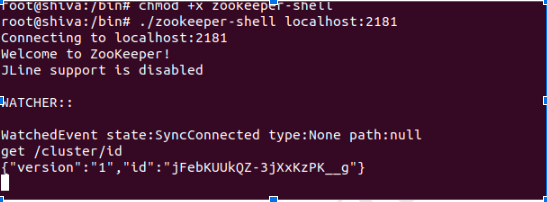
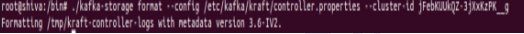

# **Introduction**

In its evolution, Kafka has recently shifted away from relying on ZooKeeper to manage its essential metadata and now embraces a quorum-based controller using Kafka Raft, or KRaft (pronounced 'craft'), which has been generally available since Confluent Platform version 7.4.

Apache Kafka has traditionally entrusted ZooKeeper with crucial tasks such as storing metadata, managing brokers, controlling topics, and overseeing cluster configurations. Initially, this centralized approach with ZooKeeper was ideal for ensuring robust distributed coordination and reliable leader election mechanisms. However, the complexity of maintaining ZooKeeper alongside a Kafka cluster has become evident over time. Moreover, ZooKeeper's limitations have emerged as a bottleneck, restricting the scalability of Kafka clusters by limiting the number of partitions a single broker can effectively manage.

Recognizing these challenges and seeking to streamline Kafka's architecture, the Kafka community introduced [KIP-500](https://cwiki.apache.org/confluence/display/KAFKA/KIP-500%3A+Replace+ZooKeeper+with+a+Self-Managed+Metadata+Quorum). This initiative aims to phase out ZooKeeper and introduce a more efficient metadata quorum solution. This blog post is dedicated to guiding you through the transition from ZooKeeper to KRaft. We will provide a step-by-step roadmap for migrating your Kafka deployment to KRaft.

# **Why Bye to ZooKeeper ?**

ZooKeeper data is replicated across a number of nodes forming an ensemble, using the ZooKeeper Atomic Broadcast (ZAB) protocol to ensure data consistency across all nodes. However, integrating ZooKeeper with Kafka involves managing a separate distributed system alongside Kafka itself, which introduces additional complexities in deployment, management, and troubleshooting.

Moreover, ZooKeeper introduces scalability bottlenecks that limit the number of topics and partitions supported within a Kafka cluster. For example, during controller failover events, the newly elected controller must retrieve metadata from ZooKeeper, including details for all topics, which can impact performance. Additionally, any metadata updates require propagation to other brokers via RPCs, and as the number of partitions increases, the propagation time grows, potentially slowing down the system.

In contrast, other distributed systems like MongoDB, Cassandra, and Elasticsearch handle metadata management internally, eliminating the need for external tools like ZooKeeper. This streamlined approach significantly simplifies deployment and operational management—imagine handling just one distributed system instead of two! Furthermore, internal metadata management enhances scalability and efficiency, optimizing operations and providing stronger guarantees for Kafka's functionality.

# **Hello from KRaft!**

To address challenges with ZooKeeper, the Kafka community introduced KRaft, a new way to handle metadata directly within Kafka itself. Unlike ZooKeeper, which required managing a separate system alongside Kafka, KRaft integrates metadata management into Kafka using an event-driven approach.

KRaft uses a quorum-based controller with an event-driven implementation of the Raft protocol. This controller manages an event log stored in a special topic named "__cluster_metadata." Unlike regular topics, data in "__cluster_metadata" is written synchronously to disk, ensuring reliability required by Raft.

## **Advantages of KRaft**


* Simplicity: KRaft streamlines Kafka’s architecture by eliminating the need for a separate coordination service like ZooKeeper. Users and operators only need to manage one system, and KRaft uses the same configuration, failure handling, and security mechanisms as Kafka’s data plane, making it easier to learn and operate.
* Scalability: KRaft enhances Kafka’s scalability by reducing the load on the metadata store. In KRaft mode, only a subset of brokers, known as the controller quorum, handles metadata. This setup minimizes connections and requests to the metadata store, enabling Kafka to support more brokers and topics without impacting performance.
* Availability: KRaft improves Kafka’s availability by allowing the system to handle partial failures. Only a quorum of controllers is needed to process requests, so if some controllers are down or disconnected, the remaining ones can still maintain cluster operations. This makes Kafka more resilient to network issues and data center failures.
* Simplified Deployment and Management: With KRaft, you no longer need to manage a separate ZooKeeper cluster, reducing operational complexity and costs. Kafka users can continue using existing tools and APIs, such as the Admin API and kafka-reassign-partitions tool, for managing their clusters.
* Increased Security: KRaft supports encryption and authentication for client-server communication using SSL/TLS or SASL, ensuring that Kafka metadata is protected from unauthorized access or tampering.

By adopting KRaft, Kafka enhances its scalability, simplifies operations, and integrates metadata management directly into its architecture, offering a more efficient alternative to ZooKeeper.

# **How to migrate from ZooKeeper to KRaft**

While KRaft has been production-ready for several releases now, with continuous feature enhancements, the majority of existing Kafka clusters still rely on ZooKeeper. However, there's growing interest among users to migrate to KRaft to overcome the limitations associated with ZooKeeper, as discussed earlier.

Moreover, ZooKeeper will be deprecated within the Kafka project, with support expected to be fully removed in an upcoming release. This development underscores the urgency for Kafka users to plan and execute migrations from ZooKeeper to KRaft.

Before beginning the migration process, our Kafka brokers are currently operating in ZooKeeper-mode and are connected to the ZooKeeper ensemble where metadata is stored. Let's follow the steps below to migrate to KRaft.

## **Step 1: Retrieve the cluster ID**


* You must format storage for your Kafka cluster with the ID of the existing cluster. You can get this ID with the zookeeper-shell tool.





## **Step 2: Configure a KRaft controller quorum**


* Set up the KRaft controller quorum responsible for managing metadata in KRaft mode.
* Number of KRaft controller nodes should match the current ZooKeeper ensemble size.
* Migration does not support transitioning to "combined" mode nodes.
* Configure each KRaft controller node with connections to ZooKeeper.
* Add the flag zookeeper.metadata.migration.enable=true to signal the migration intent.
* Upon startup, KRaft controllers establish a quorum and elect a leader.
* Controllers enter a waiting state for Kafka brokers to register.

```
process.roles=controller
node.id=3000
controller.quorum.voters=3000@localhost:9093
controller.listener.names=CONTROLLER
listeners=CONTROLLER://:9093
# Enable the migration
  zookeeper.metadata.migration.enable=true
# ZooKeeper client configuration
  zookeeper.connect=localhost:2181
# Enable migrations for cluster linking
  confluent.cluster.link.metadata.topic.enable=true
# Other configuration entries
```


## **Step 3: Format storage with the ID you saved previously**


* Format storage on each node with the ID and the controller configuration file.





## **Step 4: Start each controller**


* Start each controller, specifying the configuration file with migration enabled.
```
./bin/kafka-server-start.sh ./etc/kafka/kraft/controller.properties
```

## **Step 5: Enable migration on the brokers**


* Modify the Kafka broker configurations to include connection details for all nodes in the KRaft controller quorum.
* Enable the migration process using `zookeeper.metadata.migration.enable=true` in the broker configurations.
* Roll restart each Kafka broker one by one after updating its configuration.
* Upon restart, brokers will register with the KRaft controller quorum instead of ZooKeeper.
* This transition phase is referred to as the "hybrid phase," where some brokers are still using ZooKeeper while the KRaft controller quorum starts managing metadata.
* The KRaft controller leader initiates the migration process by copying all metadata from ZooKeeper to the __cluster_metadata topic in Kafka.
* This ensures that all metadata (broker registrations, topic configurations, etc.) are replicated and synchronized across the KRaft quorum.

    Following is an example configuration file for a broker that is ready for the KRaft migration.


```
broker.id=0
listeners=PLAINTEXT://:9092
advertised.listeners=PLAINTEXT://localhost:9092
listener.security.protocol.map=PLAINTEXT:PLAINTEXT,CONTROLLER:PLAINTEXT

# Set the IBP
  inter.broker.protocol.version=3.6

# Enable the migration
  zookeeper.metadata.migration.enable=true

# Cluster linking metadata topic enabled
  confluent.cluster.link.metadata.topic.enable=true

# ZooKeeper client configuration
  zookeeper.connect=localhost:2181

# KRaft controller quorum configuration
  controller.quorum.voters=3000@localhost:9093
  controller.listener.names=CONTROLLER
```

## **Step 6: Migrate the brokers**


* The KRaft controller operates in migration mode, sending RPCs like UpdateMetadata and LeaderAndIsr to ZooKeeper-mode brokers.
* Update broker configuration to switch from ZooKeeper-mode to KRaft-mode.
* Replace `broker.id` with `node.id` while maintaining the same identifier.
* Add `process.roles=broker` to indicate KRaft mode.
* Remove ZooKeeper configuration and any cluster linking entries from broker configuration.
* Update ACLs if necessary, especially changing the authorizer class.
* Restart the broker to apply the new configuration and complete the migration process.

    Following is an example of how a server.properties file for a migrated broker might look. Note that ZooKeeper-specific properties are commented out.


```
process.roles=broker
node.id=0
listeners=PLAINTEXT://:9092
advertised.listeners=PLAINTEXT://localhost:9092
listener.security.protocol.map=PLAINTEXT:PLAINTEXT,CONTROLLER:PLAINTEXT

# Remove the IBP, KRaft uses "metadata.version" feature flag
# inter.broker.protocol.version=3.6

# Remove the migration enabled flag
# zookeeper.metadata.migration.enable=true

# Remove the cluster linking metadata topic setting
# confluent.cluster.link.metadata.topic.enable=true

# Remove ZooKeeper client configuration
# zookeeper.connect=localhost:2181

# Keep the KRaft controller quorum configuration
  controller.quorum.voters=3000@localhost:9093
  controller.listener.names=CONTROLLER

# If using ACLs, change the authorizer from AclAuthorizer used for ZooKeeper to the StandardAuthorizer used for KRaft.
  authorizer.class.name=kafka.security.authorizer
```


## **Step 7: Take KRaft controllers out of migration mode**


* Disable Migration: Comment out or remove the zookeeper.metadata.migration.enable=true property. This signals that the controllers are no longer in migration mode and are fully operational in KRaft mode.
* Remove ZooKeeper Configuration: Comment out or remove any ZooKeeper-specific configuration entries (zookeeper.connect=localhost:2181 in this example). Since KRaft mode no longer relies on ZooKeeper for metadata management, these entries are no longer needed.

    Example `controller.properties` File for KRaft Mode


```
process.roles=controller
node.id=3000
controller.quorum.voters=3000@localhost:9093
controller.listener.names=CONTROLLER
listeners=CONTROLLER://:9093

# Disable migration
# zookeeper.metadata.migration.enable=true

# Remove ZooKeeper client configuration.
# zookeeper.connect=localhost:2181
```


# **Conclusion**

In this article, we've explored the role of ZooKeeper in Kafka and why Kafka has opted to transition to a quorum-based controller, KRaft. The Apache Kafka community has deprecated ZooKeeper for storing cluster metadata, with plans for complete removal in the upcoming version release. This signifies that users will need to transition towards KRaft-based clusters in the near future. Given the prevalence of ZooKeeper-based clusters currently in production, migrating to KRaft involves significant manual intervention, including configuration updates and rolling node restarts.


