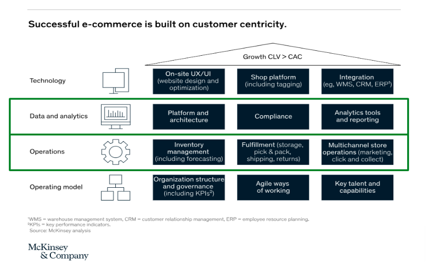
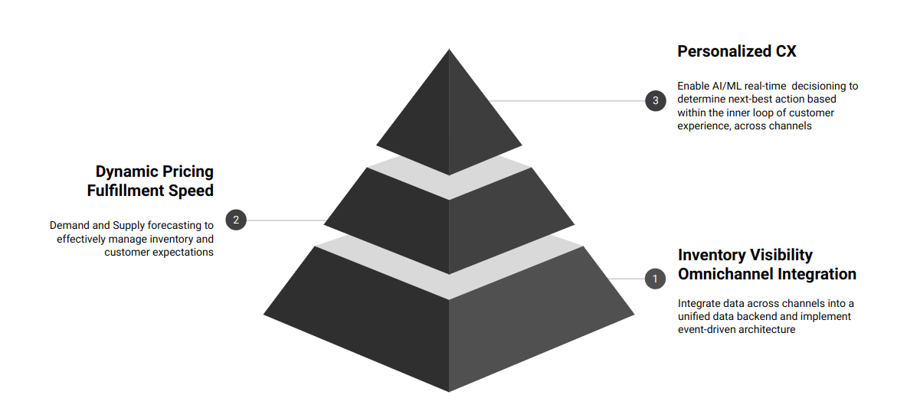
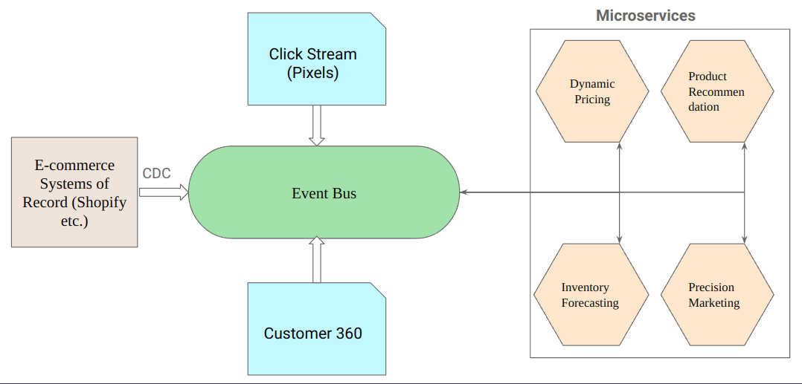

# Introduction

Retail industry is one of the fastest growing sector in terms of data and analytics. According to the recent study from [Fortune Business Insights](https://www.fortunebusinessinsights.com/industry-reports/retail-analytics-market-101273), the global retail analytics market size was valued at USD 7.56 billion in 2023 and is projected to grow to USD 31.08 billion by 2032, exhibiting a CAGR of 17.2%.

Although, a lot of money is pumped into analytics only a few selected companies like Walmart, Amazon etc. hold the majority of the market share. The reason being they are equipped to make many important decisions based on an ever-growing supply of _real-time_ and historical data while most of their competitors still use very basic tools that are far better able at tracking where they’ve *been* than where they should be *going*. During the pandemic, [McKinsey estimates](https://www.mckinsey.com/industries/retail/our-insights/jumpstarting-value-creation-with-data-and-analytics-in-fashion-and-luxury), the 25 top-performing retailers — most of whom are digital leaders — were 83% more profitable than laggards and took home more than 90% of the sector’s gains in market capitalization.

# Why Real time data is important in Retail?

Retail customers are generally fickle, and their preferences can change in an instant. Each moment is a point in time when a customer interacts with a brand to get what they want immediately and in context. Real-time data allows retailers to respond swiftly to changes in customer behaviour, offering personalized experiences that can significantly enhance customer satisfaction. For example, Amazon’s recommendation engine, accounts for an impressive 35% of their total revenue. Amazon has achieved a substantial increase in ROI through customized homepage displays, advanced analysis of browsing and purchase history tied to the customer’s Amazon account, and strategic email marketing campaigns,



By leveraging real-time analytics, companies can optimize inventory management, reduce stockouts, and improve the efficiency of supply chain operations. This not only boosts sales and reduce Customer Acquisition Costs (CAC) but also helps in retaining customer loyalty. A study by IDC highlights that retailers harnessing real-time data analytics can slash their inventory costs by up to 15% and increase their sales by up to 10%. Providing a seamless and personalized shopping experience across channels in real-time contributes to increasing Customer Lifetime Value (CLV).

# Maslow’s Hierarchy of data management in Retail



Top 5 Foundational Capabilities for Managing Data in Retail Leading Up to Direct Impact on Customer Experience

## 1. Inventory Visibility

Achieving end-to-end supply chain visibility involves having real-time insights into the entire journey of products. According to CSCMP's [2023 State of Logistics Report](https://cscmp.org/CSCMP/Resources/Reports_and_Surveys/State_of_Logistics_Report/CSCMP/Educate/State_of_Logistics_Report.aspx?hkey=bdfd8da6-e34f-434c-b39c-d3219dd4a6a2), in 2022, the U.S. Business Logistics Cost went up as much as 19.6%, the largest increase to date, of which 52% was due to an increase in inventory carrying costs. In this economic climate, stocking shelves inadequately, letting down consumers and misjudging demand can lead to catastrophic consequences

Inventory visibility is crucial for managing stock levels effectively and ensuring that products are available when customers need them. Logging in orders and sales data through various tools allows retailers to react quicker based on the data. This leads to optimized inventory levels, improved customer satisfaction, and reduced costs associated with excess inventory, stockouts, and rush shipments.

## 2. Omnichannel Integration

Shoppers now have more flexibility and can chose different formats for both shopping and fulfilment. Some shoppers tend to go online in search of information, and then actually conclude the transaction in a physical store. Others might go to a store or a showroom to do research, and then they go online to make their purchase. Retailers today have to understand and enable this flexibility and seamless movement across channels

Therefore, a seamless data integration across multiple operational channels, such as online stores, physical shops, and mobile apps is paramount. By synchronizing data across all channels, retailers can provide a consistent and unified shopping experience for customers. This integration helps in managing inventory, customer preferences, and sales data more effectively, leading to better customer experiences.

## 3. Dynamic Pricing

Dynamic pricing makes sense for staying relevant in retail where competition is ever-growing because it allows retailers to adjust prices in real-time based on a variety of factors such as customer buying behaviour, seasonal trends, competitor pricing, and product performance. This flexibility ensures that prices remain competitive and appealing to customers, helping to maximize sales and profitability. In a market where consumer preferences and competitive landscapes can change rapidly, dynamic pricing helps retailers react swiftly to these changes, offering the right price at the right time to attract and retain customers.

## 4. Fulfillment Speed

Fulfillment speed is a critical factor in customer satisfaction. Retailers can improve fulfillment speed through dynamic routing based on weather, traffic conditions, and automation. Real-time tracking of orders ensures that customers are informed about the status of their purchases, leading to a better shopping experience. Faster fulfillment also reduces the likelihood of abandoned carts and enhances customer loyalty.

Accurately forecasting demand and supply enables retailers to manage inventory more efficiently, ensuring that popular products are stocked and ready for quick dispatch. Effective demand and supply forecasting also allows for better workforce planning and allocation of resources, leading to faster order processing and quicker delivery times.

## 5. Deep Personalization

Deep personalization is the ultimate goal in retail because it directly impacts customer satisfaction, loyalty, and ultimately, the bottom line. By providing highly personalized experiences, retailers can create deeper emotional connections with their customers, making them feel valued and understood.

The ability to dynamically adjust content, offers, and recommendations based on real-time data ensures that customers receive the most relevant information at any given moment, which is critical for maintaining customer engagement. Utilizing sophisticated algorithms and machine learning models helps in accurately predicting customer preferences and behaviors, leading to more effective personalization strategies.

# Barebone Streaming Architecture in Retail



In today's fast-paced retail environment, leveraging real-time data architecture is crucial for staying ahead of the competition. Here are the key components of real-time data architecture in retail:

## Data Sources

The first step in building a real-time data architecture is identifying and integrating various data sources. These can include point-of-sale (POS) systems, e-commerce platforms (clickstream etc), social media feeds, CDP etc. Capabilities to collect data across both physical and digital stores is an important requirement.

## Event Bus

A centralized event bus is essential for managing the flow of data between different systems and components. It serves as a backbone for real-time data pipelines, ensuring efficient data transfer and integration.

**Apache Kafka** is an ideal choice for this purpose. It allows for high-throughput, low-latency data streaming and can handle large volumes of events in real-time. This capability is particularly critical for retailers who need to quickly respond to changes in customer behaviour, manage inventory in real-time, and provide dynamic pricing updates. Kafka also supports a wide range of connectors for external systems enabling effective data ingress and egress capabilities.

## Stream Processing Layer

Real-time data processing is crucial for extracting actionable insights. Technologies like Apache Flink, Kafka Streams, and Storm enable continuous data processing. Ingested data can be transformed, filtered and aggregated on the fly for downstream processing services. Data can be enriched with historical information through joins which might be relevant for further processing.

Additionally, Real time predictions can be captured for the processed data points and stored in a database for retrieval. Real-time predictions allow for instant decision-making based on the most recent data realising maximum data impact value.

## Decision-making Microservices

Intelligent decision-making microservices are the brain of the real-time data architecture. These microservices use the processed data to make real-time decisions that can significantly impact retail operations. For example, a pricing microservice can dynamically adjust product prices based on current demand, competitor pricing, and inventory levels. Similarly, a recommendation microservice can provide personalized product suggestions to customers based on their browsing and purchase history.

A decision-making microservice can range from a simple rule based service to deep learning models. These microservices are designed to learn and improve over time, becoming increasingly intelligent and effective through the usage of real time features. A maturity lifecycle for a microservice can include the following steps,

- CEP/Rule-driven
- Supervised Learning models
- Ensemble models
- Deep Learning models

## Data Analytics and Visualization

The final component is data analytics and visualization, which provides a centralized dashboard for analyzing customer behavior in real-time. This dashboard allows retailers to monitor key performance indicators (KPIs), track trends, and gain insights into customer preferences and market dynamics. Retailers can also use these tools to track customer engagement across various channels, allowing them to tailor marketing strategies and improve customer experiences. Real-time visualization tools help in making data-driven decisions quickly and effectively.

# Example implementation

Let’s see an example on how to implement the mentioned Real time data architecture. [Link](https://github.com/Platformatory/real-time-retail) for the the Github repository.

## Objective:

Based on the Shopify inventory changes and clickstream data dynamically predict the price and the sell through date for the available products in real time.

## Prerequisites:

- Shopify Store
- Docker
- ngrok

## Details:

- Kafka Broker will be used as the Event bus for the inventory and clickstream data
- Kafka connect will be used to source the data from the data sources and get the predictions from the microservices
- KSQL will be used to perform ETL on the source data for downstream predictions
- Flask APIs will be used to expose endpoints to talk to prediction microservices

## Setup the infrastructure:

1. We will run all the required components as docker containers locally. Following is the `docker-compose.yaml` for the required services.

```yaml
---
version: "2"
services:
  broker:
    image: confluentinc/cp-kafka:7.5.0
    hostname: broker
    container_name: broker
    ports:
      - "9092:9092"
      - "9101:9101"
    environment:
      KAFKA_NODE_ID: 1
      KAFKA_LISTENER_SECURITY_PROTOCOL_MAP: "CONTROLLER:PLAINTEXT,PLAINTEXT:PLAINTEXT,PLAINTEXT_HOST:PLAINTEXT"
      KAFKA_ADVERTISED_LISTENERS: "PLAINTEXT://broker:29092,PLAINTEXT_HOST://localhost:9092"
      #KAFKA_METRIC_REPORTERS: io.confluent.metrics.reporter.ConfluentMetricsReporter
      #KAFKA_CONFLUENT_METRICS_REPORTER_BOOTSTRAP_SERVERS: 'broker:9092'
      KAFKA_OFFSETS_TOPIC_REPLICATION_FACTOR: 1
      KAFKA_GROUP_INITIAL_REBALANCE_DELAY_MS: 0
      KAFKA_TRANSACTION_STATE_LOG_MIN_ISR: 1
      KAFKA_TRANSACTION_STATE_LOG_REPLICATION_FACTOR: 1
      KAFKA_JMX_PORT: 9101
      KAFKA_JMX_HOSTNAME: localhost
      KAFKA_PROCESS_ROLES: "broker,controller"
      KAFKA_CONTROLLER_QUORUM_VOTERS: "1@broker:29093"
      KAFKA_LISTENERS: "PLAINTEXT://broker:29092,CONTROLLER://broker:29093,PLAINTEXT_HOST://0.0.0.0:9092"
      KAFKA_INTER_BROKER_LISTENER_NAME: "PLAINTEXT"
      KAFKA_CONTROLLER_LISTENER_NAMES: "CONTROLLER"
      KAFKA_LOG_DIRS: "/tmp/kraft-combined-logs"
      # Replace CLUSTER_ID with a unique base64 UUID using "bin/kafka-storage.sh random-uuid"
      # See https://docs.confluent.io/kafka/operations-tools/kafka-tools.html#kafka-storage-sh
      CLUSTER_ID: "41PmKs1mQiGJK0U_Ul45OA"

  connect:
    build:
      context: .
      dockerfile: Dockerfile
    hostname: connect
    container_name: connect
    ports:
      - 8083:8083
      - 8000:8000
    depends_on:
      - broker
      - api
    environment:
      CONNECT_BOOTSTRAP_SERVERS: "broker:29092"
      CONNECT_REST_ADVERTISED_HOST_NAME: connect
      CONNECT_GROUP_ID: compose-connect-group
      CONNECT_CONFIG_STORAGE_TOPIC: docker-connect-configs
      CONNECT_CONFIG_STORAGE_REPLICATION_FACTOR: 1
      CONNECT_OFFSET_FLUSH_INTERVAL_MS: 10000
      CONNECT_OFFSET_STORAGE_TOPIC: docker-connect-offsets
      CONNECT_OFFSET_STORAGE_REPLICATION_FACTOR: 1
      CONNECT_STATUS_STORAGE_TOPIC: docker-connect-status
      CONNECT_STATUS_STORAGE_REPLICATION_FACTOR: 1
      CONNECT_KEY_CONVERTER: org.apache.kafka.connect.storage.StringConverter
      CONNECT_VALUE_CONVERTER: org.apache.kafka.connect.json.JsonConverter
      # CLASSPATH required due to CC-2422
      CLASSPATH: /usr/share/java/monitoring-interceptors/monitoring-interceptors-7.5.0.jar
      CONNECT_PRODUCER_INTERCEPTOR_CLASSES: "io.confluent.monitoring.clients.interceptor.MonitoringProducerInterceptor"
      CONNECT_CONSUMER_INTERCEPTOR_CLASSES: "io.confluent.monitoring.clients.interceptor.MonitoringConsumerInterceptor"
      CONNECT_PLUGIN_PATH: "/usr/share/java,/usr/share/confluent-hub-components"
      CONNECT_LOG4J_LOGGERS: org.apache.zookeeper=ERROR,org.I0Itec.zkclient=ERROR,org.reflections=ERROR
    volumes:
      - ./retail_clickstream_schema.avro:/home/appuser/retail_clickstream_schema.avro

  ksqldb-server:
    image: confluentinc/cp-ksqldb-server:7.5.0
    hostname: ksqldb-server
    container_name: ksqldb-server
    depends_on:
      - broker
      - connect
    ports:
      - "8088:8088"
    environment:
      KSQL_CONFIG_DIR: "/etc/ksql"
      KSQL_BOOTSTRAP_SERVERS: "broker:29092"
      KSQL_HOST_NAME: ksqldb-server
      KSQL_LISTENERS: "http://0.0.0.0:8088"
      KSQL_CACHE_MAX_BYTES_BUFFERING: 0
      KSQL_PRODUCER_INTERCEPTOR_CLASSES: "io.confluent.monitoring.clients.interceptor.MonitoringProducerInterceptor"
      KSQL_CONSUMER_INTERCEPTOR_CLASSES: "io.confluent.monitoring.clients.interceptor.MonitoringConsumerInterceptor"
      KSQL_KSQL_CONNECT_URL: "http://connect:8083"
      KSQL_KSQL_LOGGING_PROCESSING_TOPIC_REPLICATION_FACTOR: 1
      KSQL_KSQL_LOGGING_PROCESSING_TOPIC_AUTO_CREATE: "true"
      KSQL_KSQL_LOGGING_PROCESSING_STREAM_AUTO_CREATE: "true"
      # KSQL_KSQL_QUERIES_FILE: /home/appuser/ksql_queries.sql
    volumes:
      - ./ksql_queries.sql:/home/appuser/ksql_queries.sql

  ksqldb-cli:
    image: confluentinc/cp-ksqldb-cli:7.5.0
    container_name: ksqldb-cli
    depends_on:
      - broker
      - connect
      - ksqldb-server
    entrypoint: /bin/sh
    tty: true

  api:
    build:
      context: ./api
      dockerfile: Dockerfile
    hostname: api
    container_name: api
    ports:
      - 5000:5000
```

1. Create a `ShopifyWebhookConnector` to fetch the inventory changes from Shopify. Since the setup is local, we need to expose the endpoint publicly using `ngrok` so that Shopify can send data on updates in the Store.

```bash
export NGROK_PUBLIC_URL=`curl -s localhost:4040/api/tunnels | jq -r '.tunnels[0].public_url'`
```

```json
{
  "name": "$CONNECTOR_NAME",
  "config": {
    "connector.class": "com.platformatory.kafka.connect.ShopifyWebhookConnector",
    "tasks.max": 1,
    "topic.default": "webhook",
    "topic.header": "X-Shopify-Topic",
    "topic.prefix": "plf_",
    "key.json.path": "$.id",
    "schema.infer": false,
    "validator.class": "com.platformatory.kafka.connect.ShopifyRequestValidator",
    "port": 8000,
    "shopify.access.token": "$SHOPIFY_ACCESS_TOKEN",
    "shopify.webhook.create": true,
    "shopify.store.name": "$SHOPIFY_STORE_NAME",
    "shopify.webhook.topics": "products/update",
    "shopify.apisecret": "$SHOPIFY_API_SECRET",
    "shopify.connector.hostname": "$NGROK_PUBLIC_URL"
  }
}
```

1. We will use mock data for the clickstream data. This mock data will be generated using the `DatagenConnector` with a pre-defined schema type.

```bash
{
  "name": "$CONNECTOR_NAME",
  "config": {
    "connector.class": "io.confluent.kafka.connect.datagen.DatagenConnector",
    "tasks.max": "1",
    "kafka.topic": "shopify_clickstream",
    "schema.filename": "/home/appuser/retail_clickstream_schema.avro",
    "schema.keyfield": "activity",
    "topic.creation.default.partitions": 6,
    "topic.creation.default.replication.factor": 1,
    "key.converter": "org.apache.kafka.connect.storage.StringConverter",
    "value.converter": "org.apache.kafka.connect.json.JsonConverter",
    "value.converter.schemas.enable": "false"
  }
}
```

1. Load both the shopify inventory data and clickstream data as STREAMS in KSQL

```sql
CREATE OR REPLACE STREAM PRODUCTS_UPDATE_STREAM
    (PAYLOAD STRUCT<
        id BIGINT,
        created_at STRING,
        inventory_management STRING,
        title STRING,
        vendor STRING,
        variants Array<
            Struct<
                id BIGINT,
                created_at STRING,
                title STRING,
                inventory_item_id BIGINT,
                inventory_quantity BIGINT,
                old_inventory_quantity BIGINT,
                sku STRING,
                price STRING,
                product_id BIGINT
                >
            >
        >
    ) WITH (KAFKA_TOPIC='plf_products_update', KEY_FORMAT='KAFKA', VALUE_FORMAT='JSON');

CREATE OR REPLACE STREAM CLICKSTREAM_STREAM (
    time STRING,
    user_id BIGINT,
    product_variant_id BIGINT,
    activity STRING,
    ip STRING
) WITH (KAFKA_TOPIC='shopify_clickstream', KEY_FORMAT='KAFKA', VALUE_FORMAT='JSON');
```

1. Create a transformed inventory stream called `PRODUCTS_UPDATES` with only with the required information

```sql
CREATE OR REPLACE STREAM PRODUCTS_UPDATES
    WITH (KAFKA_TOPIC='ksql_product_updates', PARTITIONS=6, REPLICAS=1) AS SELECT
        PAYLOAD->id id,
        PAYLOAD->created_at created_at,
        PAYLOAD->inventory_management inventory_management,
        PAYLOAD->title title,
        PAYLOAD->vendor vendor,
        EXPLODE(PAYLOAD->variants) variant
    FROM PRODUCTS_UPDATE_STREAM
    EMIT CHANGES;
```

1. For every product variant in clickstream, aggregate the number of product views and create a `KTable`

```sql
CREATE OR REPLACE TABLE CLICKSTREAM_ACTIVITY
WITH (KAFKA_TOPIC='ksql_clickstream_activity', PARTITIONS=6, REPLICAS=1, KEY_FORMAT='JSON')
AS
SELECT
    product_variant_id product_variant_id,
    COUNT(activity) activity_count
FROM CLICKSTREAM_STREAM
WHERE activity='contentView'
GROUP BY product_variant_id
EMIT CHANGES;
```

1. Join the aggregated clickstream data and inventory data for each product variant and write to a output topic

```sql
CREATE OR REPLACE STREAM PRODUCT_CLICKSTREAM
WITH (KAFKA_TOPIC='ksql_product_clickstream', PARTITIONS=6, REPLICAS=1)
AS
SELECT p.id product_id,
    p.created_at product_created_at,
    p.inventory_management inventory_management,
    p.title product_title,
    p.vendor product_vendor,
    p.variant->created_at variant_created_at,
    p.variant->inventory_item_id variant_inventory_item_id,
    p.variant->old_inventory_quantity old_inventory_quantity,
    p.variant->inventory_quantity inventory_quantity,
    p.variant->sku variant_sku,
    p.variant->price price,
    c.product_variant_id variant_id,
    c.activity_count activity_count
FROM PRODUCTS_UPDATES p INNER JOIN CLICKSTREAM_ACTIVITY c ON ((p.variant->id = c.product_variant_id)) EMIT CHANGES;
```

1. Sample microservices which returns predictions for price and sell through date will be exposed via Flask APIs. Microservices are just dummy functions for this example implementation.

```python
from flask import Flask,request,jsonify
from datetime import timedelta,datetime,date
from random import randrange
import ast

app = Flask(__name__)

@app.route('/')
def index():
  return 'Index Page'

@app.route('/user', methods=["POST"])
def get_user(): 
      data = request.get_json()
      username = data['username']
      password = data['password']
      print({username, password })
      return {"username":username, password: password}

def predict_sell_through(inventory_data):
    average_daily_sales = inventory_data['total_sales'] / inventory_data['total_days']
    days_until_sell_through = inventory_data['quantity_on_hand'] / average_daily_sales
    sell_through_date = datetime.now() + timedelta(days=days_until_sell_through)
    inventory_doh = inventory_data['quantity_on_hand'] / average_daily_sales
    return sell_through_date, inventory_doh

@app.route('/stores/<store_name>/inventory_forecast/predict', methods=["POST"])
def show_post(store_name):
  try:
    inventory_data = request.json
    if not inventory_data:
        return jsonify({'error': 'No data provided'}), 400


    sell_through_date, inventory_doh = predict_sell_through(inventory_data)
    print(sell_through_date, inventory_doh, inventory_data)
    return jsonify({
        'sell_through_date': sell_through_date.strftime('%Y-%m-%d'),
        'inventory_doh': int(inventory_doh)
    })
  except Exception as e:
      return jsonify({"error": str(e)})

@app.route('/dynamic-pricing', methods=['POST'])
def dynamic_pricing():
    try:
        data = request.get_json()[0]
        print(data)
        if data["ACTIVITY_COUNT"]>3:
            data["dynamic_price"] = float(data["PRICE"])*1.1
        else:
            data["dynamic_price"] = float(data["PRICE"])*1.01

        return data, 200

    except Exception as e:
        # Handle any exceptions
        print(f"Error processing request: {str(e)}")
        return jsonify({'error': 'An error occurred'}), 500

@app.route('/sell-through', methods=['POST'])
def sell_through_date():
    try:
        data = request.get_json()[0]
        print(data)
        # date + random days (5-10)
        data["sell_through_date"] = datetime.now() + timedelta(days=randrange(10))

        return data, 200

    except Exception as e:
        # Handle any exceptions
        print(f"Error processing request: {str(e)}")
        return jsonify({'error': 'An error occurred'}), 500

if __name__ == "__main__":
    app.run(host='0.0.0.0', port=5000)

# curl -X POST http://localhost:5000/stores/acme/inventory_forecast/predict -H 'Content-Type:application/json' -d '{"total_sales":453,"total_days":32,"quantity_on_hand":98,"current_date":"2024-04-10T15:17"}'
```

1. Create 2 `HttpSinkConnector` which will get the price and sell through predictions for each enriched data from the KSQL output topic and write it to respective success topics.

```json
## Dynamic pricing
{
  "name": "$CONNECTOR_NAME",
  "config": {
    "connector.class": "io.confluent.connect.http.HttpSinkConnector",
    "tasks.max":1,
    "http.api.url":"http://api:5000/dynamic-pricing",
    "headers":"Content-Type:application/json|Accept:application/json",
    "request.body.format": "json",
    "reporter.result.topic.replication.factor":1,
    "reporter.error.topic.replication.factor":1,
    "reporter.bootstrap.servers": "broker:29092",
    "confluent.topic.bootstrap.servers": "broker:29092",
    "confluent.topic.replication.factor": "1",
    "topics": "ksql_product_clickstream",
    "key.converter": "org.apache.kafka.connect.storage.StringConverter",
    "value.converter": "org.apache.kafka.connect.json.JsonConverter",
    "value.converter.schemas.enable": "false"
  }
}

## Sell through date
{
  "name": "$CONNECTOR_NAME",
  "config": {
    "connector.class": "io.confluent.connect.http.HttpSinkConnector",
    "tasks.max":1,
    "http.api.url":"http://api:5000/sell-through",
    "headers":"Content-Type:application/json|Accept:application/json",
    "request.body.format": "json",
    "reporter.result.topic.replication.factor":1,
    "reporter.error.topic.replication.factor":1,
    "reporter.bootstrap.servers": "broker:29092",
    "confluent.topic.bootstrap.servers": "broker:29092",
    "confluent.topic.replication.factor": "1",
    "topics": "ksql_product_clickstream",
    "key.converter": "org.apache.kafka.connect.storage.StringConverter",
    "value.converter": "org.apache.kafka.connect.json.JsonConverter",
    "value.converter.schemas.enable": "false"
  }
}
```

In this example, we were able to demonstrate a sample real time data pipeline for a retail use case where we are predicting price and sell through date based on product inventory and clickstream activity.

# Conclusion

The implementation of a real-time data architecture in retail is essential for gaining a competitive edge in today's fast-paced market. By leveraging real-time data, retailers can enhance customer satisfaction through dynamic routing, accurate demand forecasting, and deep personalization. As the retail landscape continues to evolve, investing in real-time data capabilities will be crucial for optimizing operations, improving customer experiences, and driving business growth.
