# **OAuth2: Essential Insights You Should Know**

In the digital age, securing access to sensitive data and resources is paramount. Traditional authentication methods often require users to share their long-term credentials with third-party applications, posing significant security risks. Enter OAuth 2.0, a powerful authorization framework designed to address these concerns by allowing users to grant third-party websites or applications access to their protected resources without revealing their long-term credentials or identity.

OAuth 2.0 introduces an innovative authorization layer that separates the role of the client (the application requesting access) from the resource owner (the user). In this framework, the client requests access to resources controlled by the resource owner and hosted by the resource server. Instead of using the resource owner's credentials, the client is issued an Access Token— a string that defines the specific scope, lifetime, and other access attributes. This token is issued by an authorization server with the user's approval, enabling the client to access the protected resources on the resource server securely.

Platforms like Auth0 further enhance this process by generating access tokens in JSON Web Token (JWT) format for API authorization scenarios. The permissions associated with these access tokens, known as scopes, define the level of access granted to the application. When an application authenticates with Auth0, it specifies the desired scopes. If these scopes are authorized by the user, the access token will represent these authorized permissions, ensuring secure and granular access control.

In this blog post, we will discuss how configuring identity providers on Confluent Cloud allows you to manage application access without depending on user accounts. This section covers various aspects of configuring and managing identity providers for OAuth/OIDC.

# **Pros and Cons of Using OAuth**

## **Pros**

**Security:**
- Reduces the risk associated with sharing long-term credentials.
- Limits the access granted to third-party applications, minimizing potential damage from compromised tokens.

**Granular Access Control:**
- Users can grant specific permissions (scopes) to third-party applications.
- Tokens can have limited lifetimes and scopes, offering fine-grained control over access.

**User Experience:**
- Simplifies the process of granting access to third-party applications.
- Users authenticate with a trusted authorization server, improving confidence in the security of their credentials.

## **Cons**

**Complexity:**
- Setting up OAuth can be complex, especially if you’re not familiar with it.
- The configuration involves multiple components such as authorization servers, scopes, tokens, and client credentials, which can be challenging to manage without prior experience.

**Dependency:**
- OAuth relies on an identity provider for authentication.
- This dependency introduces additional points of failure. If the identity provider experiences downtime or issues, it can affect the entire authentication flow. This identity provider could be any service, not necessarily Okta, and the reliance on this external service adds a layer of dependency that needs to be managed carefully.

## **When to Use OAuth**
- When you require secure, token-based authentication to manage access to resources.
- If you are using Confluent Cloud in an enterprise setting where centralized identity management is important, and you need to ensure that access control is streamlined and consistent across multiple systems and applications.
- When integrating with systems that support OAuth for seamless interoperability and access control.

# **Let's Dive into Configuring Okta!**

## **Step 1 : Application integration in Okta**

By setting up an application in Okta, you configure the authentication methods, such as OpenID Connect (OIDC), that will be used to secure the connection to your Confluent Cloud cluster. This ensures that only authorized clients can access the resources.The setup process in Okta generates a Client ID and Client Secret, which are essential for authenticating your application with Confluent Cloud. These credentials are used to request access tokens, which are then used to access Confluent Cloud resources securely.

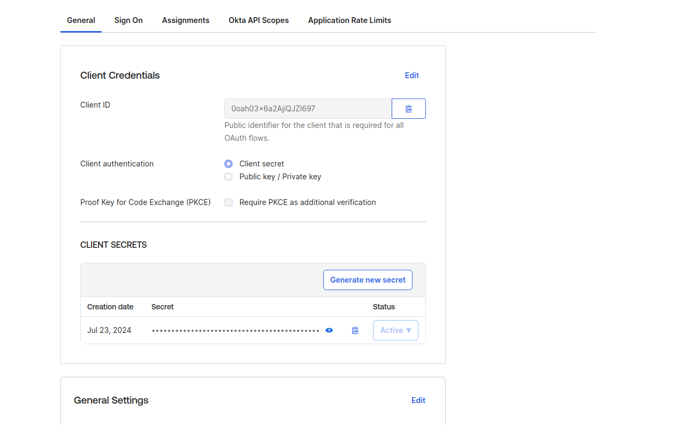

 **How to Set Up Application Integration in Okta?**

1. Log in to Okta Admin Console  Access your Okta Admin Console at https://{yourOktaDomain}/admin.
2. Navigate to Applications: From the left-hand menu, click on "Applications" and then select "Applications" again.
3. Create a New Application Integration: Click on "Create App Integration."
4. Choose Application Type: Select "**OIDC - OpenID Connect**" for applications using OAuth 2.0 or OpenID Connect, then click "Next."
5. Configure Application Settings: Enter a descriptive name for your application (e.g., Kafka Client) and choose "Client Credentials" as the sign-on method.
6. Set Additional Options: Ensure "Client Credentials Grant" is selected. Configure or leave "Redirect URIs" and "Logout Redirect URIs" as needed.
7. Complete the Setup: Click "Save" to finalize the configuration.
8. Obtain Client Credentials: After saving, go to the application's "General" tab to find and record the Client ID and Client Secret.

## **Step 2: Configure the Authorization Server**

 An authorization server is a key component in the OAuth 2.0 and OpenID Connect (OIDC) frameworks. Its primary function is to issue tokens that control access to protected resources and enable user authentication. By providing tokens like access tokens and ID tokens, the authorization server manages and secures access to various services. It enforces access policies to determine which resources can be accessed and under what conditions. Each authorization server has a unique issuer URI and a specific signing key to ensure the security and integrity of the tokens it issues. This setup helps maintain clear security boundaries and enhances overall protection.

**In Okta, configuring the authorization server allows you to:**

- **Create Access Policies**: Set rules to define who can access which resources and under what conditions.
- **Create Rules for Each Access Policy**: Specify detailed rules that determine how access policies are enforced.
- **Create Scopes**: Define the permissions that applications can request, specifying the level of access they are granted.
- **Create Claims**: Specify the attributes included in tokens, such as user roles or email addresses, to provide essential information for authorization decisions.

 By configuring these elements, you ensure that tokens are aligned with your security policies and access requirements, allowing for effective control over resource access.

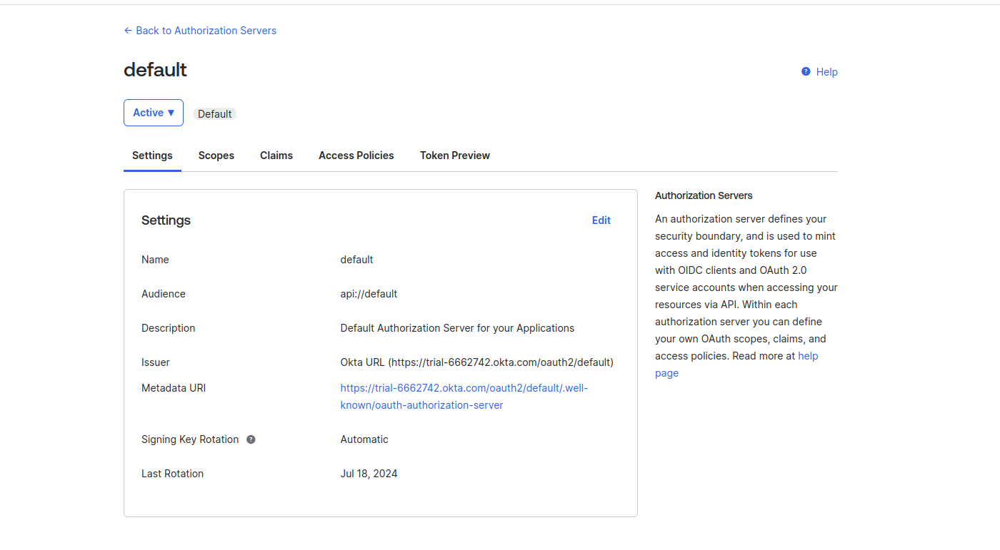

# **Integrating Okta with Confluent Cloud: A Configuration Walkthrough**

 **Steps to Configure an Okta Identity Provider in Confluent Cloud**

To configure Confluent Cloud we have to first register the IdP.
Go to Accounts & access from the menu in the top right, and select the Identity providers tab.

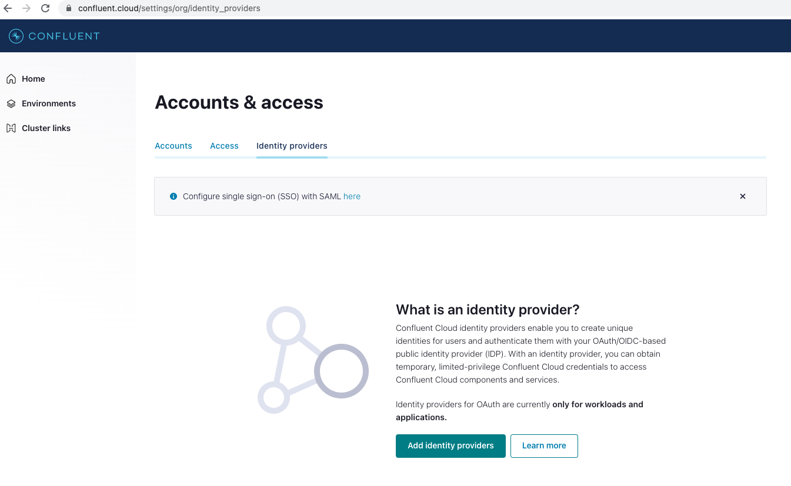

Select the **Add Identity Providers** button and choose Okta, then press **Next**.

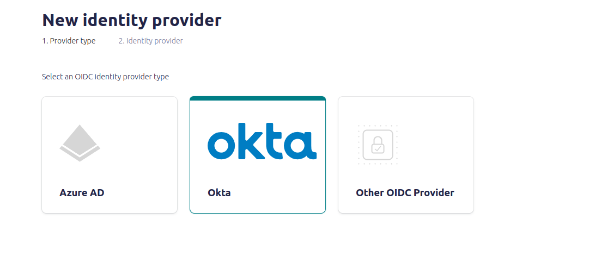

In next screen enter the details for the okta :

- **Name**: Enter a meaningful name for your Okta identity provider.
- **Description**: Provide relevant information for managing this provider.
- **Authorization Server**: Enter the identifier for your Okta authorization server. The default is "default," but this can be modified if needed.
- **Domain**: Enter the domain for your Okta instance. The default is {yourDomain}.okta.com. Replace {yourDomain} with your actual Okta domain name.
- **OIDC Discovery URL**: Click to import metadata required for configuring your OIDC provider. This action will populate the JWKS URI and Issuer URI fields automatically.
- **JWKS URI**: Enter the URI for the JSON Web Key Set (JWKS).
- Example: https://mycompany.okta.com/oauth2/default/v1/keys
- **Issuer URI**: Enter the issuer URI for your Okta identity provider.
- Example: https://mycompany.okta.com/oauth2/default

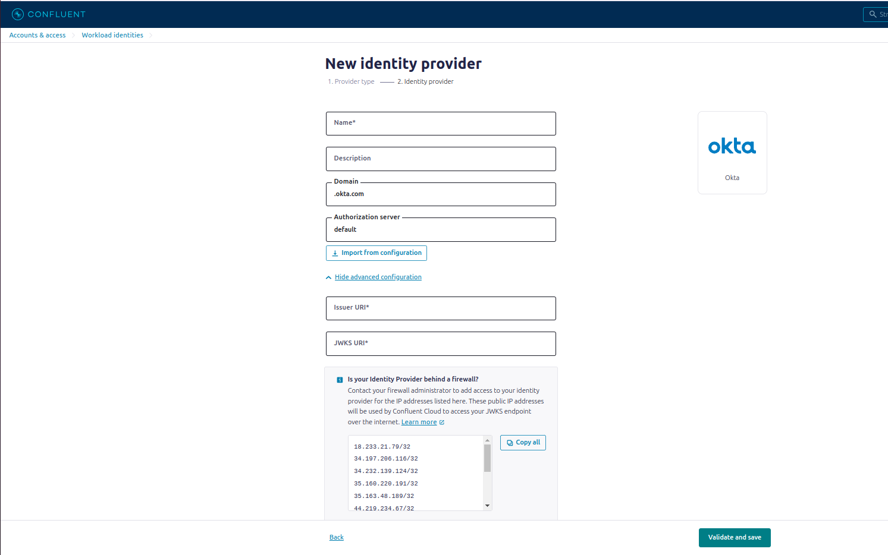

This creates the provider, but we still have to configure identity pools. Do this by clicking the identity provider link.From this screen, we can create a new identity pool by pressing the **Add pool** button.

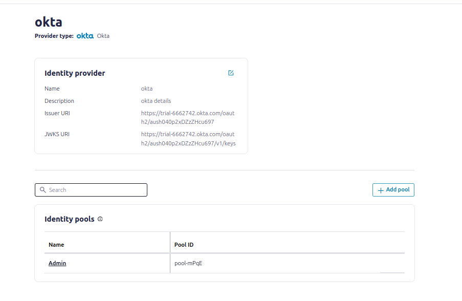

**Configure your identity pool and access policy.**

- An *identity pool* is a group of external identities that are assigned a certain level of access based on policy. \
For details, see [Use Identity Pools with Your OAuth/OIDC Identity Provider on Confluent Cloud](https://docs.confluent.io/cloud/current/security/authenticate/workload-identities/identity-providers/oauth/identity-pools.html#add-oauth-identity-pools).

- In the example below, we are assigning the Cluster Admin role to the identity pool pool-mPqE. This means that users accessing this cluster through the pool will have full Admin permissions and will be able to create, delete, and edit any resources.

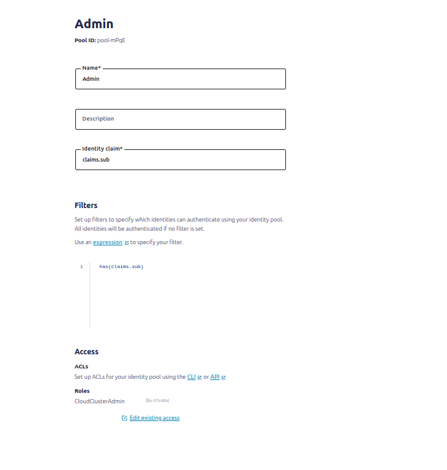

# **Configuring Your Kafka Client**

##  **Set Client ID and Client Secret**

Use the Client ID and Client Secret from Okta to configure your Kafka client.

## **Client Configuration in Kafka**

Update your Kafka client configuration to include these settings: \
properties

```
bootstrap.servers=<your-kafka-broker>
security.protocol=SASL_SSL
sasl.mechanism=OAUTHBEARER
sasl.oauthbearer.token.endpoint.url=https://{yourOktaDomain}/oauth2/default/v1/token
sasl.jaas.config= \
org.apache.kafka.common.security.oauthbearer.OAuthBearerLoginModule required \
clientId='<Your-Client-ID>' \
clientSecret='<Your-Client-Secret>' \
scope='openid' \
  extension_logicalCluster='<your-logical-cluster>' \
    extension_identityPoolId='<your-identity-pool-id>';

```

## **Request a JSON Web Token (JWT)**

**Authenticate using Client Credentials:**

Use the Client ID and Client Secret to request a JWT from Okta via the OAuth 2.0 Client Credentials Grant.The response will contain an access_token which is a JWT.

```
curl --request POST \
  --url https://{yourOktaDomain}/oauth2/default/v1/token \
  --header 'Content-Type: application/x-www-form-urlencoded' \
  --data 'grant_type=client_credentials&client_id=<Your-Client-ID>&client_secret=<Your-Client-Secret>&scope=openid'

```
Example:

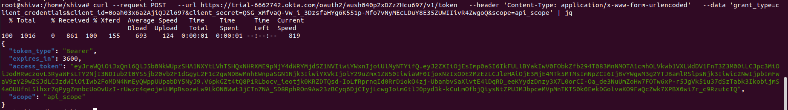

 
# **Role-Based Testing**

- **Cluster Administrator**
Set up the Cluster Admin role for the cluster in Confluent Cloud. With this role, I am able to create and delete topics.

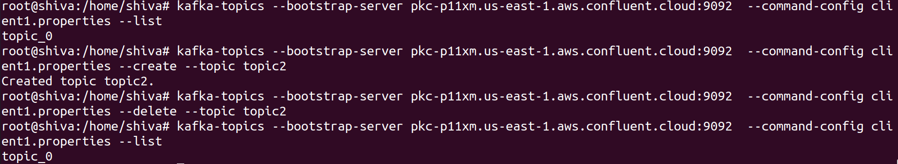

- **Operator**
Set up the Operator role. This role allows you to view and describe topics but does not grant permissions to create or delete them.

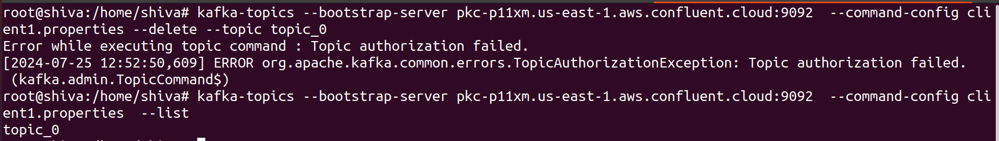

# **Breaking Down the OAuth 2.0 Flow**

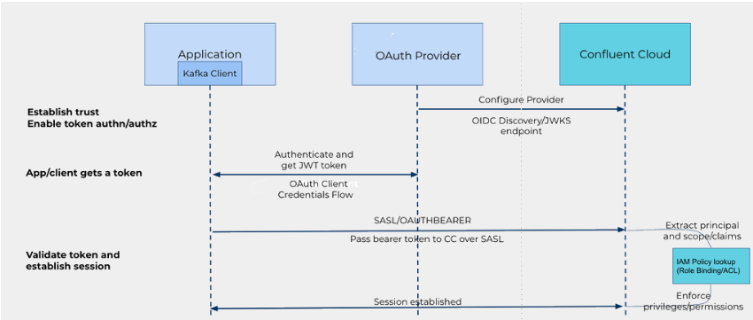

Confluent OAuth uses the OAuth 2.0 protocol for authentication and authorization. OAuth is a widely-used standard that provides temporary access tokens to clients. These tokens allow clients to access and use Confluent Cloud resources and data on behalf of a user or application.

## **Establish Trust Between Confluent and Your Identity Provider**

**Add the Identity Provider:**

- Ensure that the identity provider (e.g., Okta) is registered with Confluent Cloud. This usually involves providing some configuration details to Confluent Cloud.

**Define the Type of Identity Provider:**

- Specify whether the identity provider is OAuth 2.0 or OIDC (OpenID Connect). Each provider might have specific requirements for integration.

**Create a Trust Relationship:**

- This involves configuring Confluent Cloud to trust tokens issued by your identity provider. You might need to upload or specify the public keys or JWKS (JSON Web Key Set) URL from your identity provider.

**Add Claims for Authentication and Authorization:**

- Define which claims from the JWT will be used for authentication and authorization. Common claims include sub (subject), aud (audience), and custom claims like user roles or groups.

## **Configure Your Identity Pool and Access Policy**

**Identity Pool:**

- Create an identity pool in Confluent Cloud, which groups external identities and assigns them access based on policies. You might need to configure mappings to ensure the correct access levels.

**Access Policy:**

- Define what resources the identities in the pool can access and what actions they can perform.

## **Configure Clients**

**Client ID and Client Secret:**

- Obtain these from your identity provider. They are used to authenticate the client (Kafka producer/consumer) with the identity provider.

**Client Credentials Grant:**

- The client uses the Client ID and Client Secret to request an access token (JWT) from the identity provider.

**Producer/Consumer Configuration Example:**

Use the following Kafka client settings for OAuth 2.0 authentication:

```
log4j.logger.org.apache.kafka=TRACE
bootstrap.servers=pkc-p11xm.us-east-1.aws.confluent.cloud:9092
security.protocol=SASL_SSL
sasl.oauthbearer.token.endpoint.url=https://trial-6662742.okta.com/oauth2/aush040p2xDZzZHcu697/v1/token
sasl.login.callback.handler.class=org.apache.kafka.common.security.oauthbearer.secured.OAuthBearerLoginCallbackHandler
sasl.mechanism=OAUTHBEARER
sasl.jaas.config= \
  org.apache.kafka.common.security.oauthbearer.OAuthBearerLoginModule required \
    clientId='0oah03x6a2AjiQJZl697' \
    scope='api_scope' \
  clientSecret='QSG_xMfvaQ-Vw_i_3DzsfaHYg6K551p-Mfo7vNyMEcLDuY8E35ZUWIIivR4ZwgoQ' \
    extension_logicalCluster='lkc-37vn0o' \
    extension_identityPoolId='pool-mPqE';
```
 \
## **Validate the Token**

**Confluent Cloud Token Validation:**

Confluent Cloud validates the JWT received from the Kafka client. It checks the token against the trusted JWKS and verifies the claims to map to the appropriate authorization policy.

**JSON Web Token (JWT) Example:**

```
{
  "ver": 1,
  "jti": "AT.8p0wrTPUIm8yBHqgiKDrnJQ_32_MNc_FlkuqOjq8VCQ",
  "iss": "https://trial-6662742.okta.com/oauth2/aush040p2xDZzZHcu697",
  "aud": "confluent",
  "iat": 1721739387,
  "exp": 1721742987,
  "cid": "0oah03x6a2AjiQJZl697",
  "scp": [
    "api_scope"
  ],
  "sub": "0oah03x6a2AjiQJZl697"
}
```
The JWT includes claims such as sub for the user ID, aud for the audience, and groups for any group memberships, which Confluent Cloud uses to determine access rights.

# **Conclusion**

OAuth 2.0 and Okta together offer a robust framework for managing secure and efficient access to your resources. By integrating Okta as your identity provider, you simplify the authentication process and enhance security, allowing you to control access through OAuth tokens and scopes. Configuring Okta with Confluent Cloud and your Kafka client ensures that your systems are protected from unauthorized access while maintaining smooth and manageable workflows. Embracing this setup not only strengthens your security measures but also optimizes the overall efficiency of your access management, providing a seamless experience for both administrators and users.

# References

- [https://developer.okta.com/docs/guides/authorization/](https://developer.okta.com/docs/guides/authorization/)
- [https://help.okta.com/en-us/content/topics/security/api_access.htm](https://help.okta.com/en-us/content/topics/security/api_access.htm)
- [https://confluent/idp](https://www.confluent.io/blog/configuring-azure-ad-ds-with-oauth-for-confluent/?_ga=2.45404768.551716354.1721102650-2109976434.1715347071&_gac=1.153683402.1721276426.CjwKCAjw1920BhA3EiwAJT3lSYsLUrc8CdJ17pl0KiBPfRTXVwM5AX8-ts-2V4-f-s1NnVp94tJETBoCE5AQAvD_BwE&_gl=1*rgtxzr*_gcl_aw*R0NMLjE3MjEyNzY0MjcuQ2p3S0NBancxOTIwQmhBM0Vpd0FKVDNsU1lzTFVyYzhDZEoxN3BsMEtpQlBmUlRYVndNNUFYOC10cy0yVjQtZi1zMU5uVnA5NHRKRVRCb0NFNUFRQXZEX0J3RQ..*_gcl_au*MjExOTgwMjgxNi4xNzE1MzQ3MDcx*_ga*MjEwOTk3NjQzNC4xNzE1MzQ3MDcx*_ga_D2D3EGKSGD*MTcyMTI5NDI4Mi4yNi4xLjE3MjEyOTgyMzUuMzcuMC4w#setting-up-azure-ad-as-an-idp)
- [https://docs.confluent.io/cloud/current/security/authenticate/workload-identities/identity-providers/oauth/overview.html#oauth-overview](https://docs.confluent.io/cloud/current/security/authenticate/workload-identities/identity-providers/oauth/overview.html#oauth-overview)
