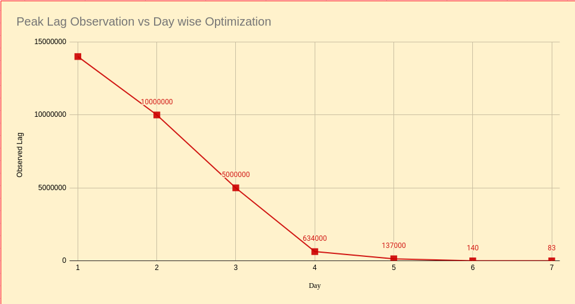
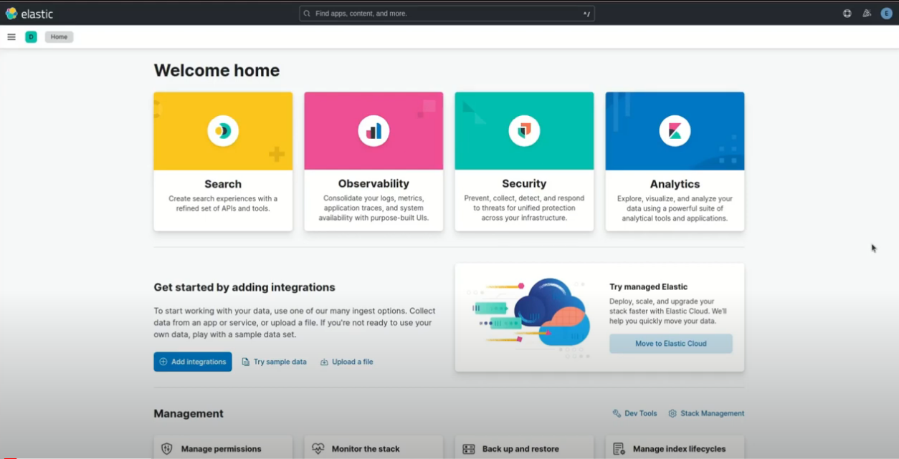
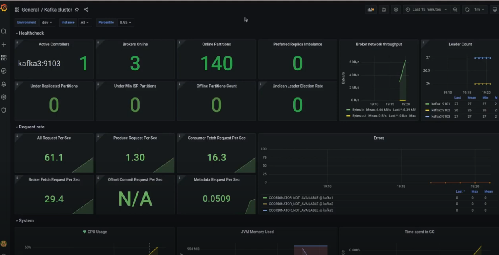
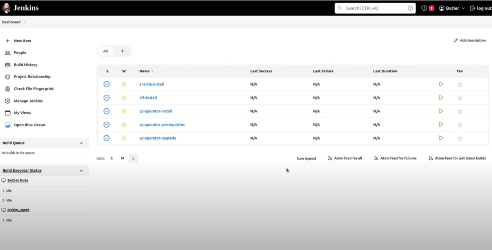

# **Introduction**

In today’s digital economy, data is the lifeblood of business operations. Companies rely on real-time data processing to make informed decisions, optimize operations, and enhance customer experiences. Apache Kafka has emerged as a critical component in this ecosystem, enabling the efficient handling of vast amounts of data. However, running Kafka at scale for mission-critical customers presents unique challenges and opportunities.

In our experience, we managed clients in the fintech domain with Kafka clusters on-premises, spread across more than 30 servers, in a highly controlled environment with stringent security requirements. Access to these systems was restricted to screen sharing, adding complexity to operations.

This article explores the challenges faced, steps followed to mitigate them, and lessons learned from deploying and managing Kafka clusters at scale, focusing on tooling, processes, and best practices to ensure reliability, performance, and customer satisfaction.


# **Understanding the Kafka Ecosystem**

Before diving into our experience, it's crucial to understand the Kafka ecosystem. Apache Kafka is not just a message broker; it’s a distributed streaming platform that consists of several key components:


* **Producers:** Applications that publish messages to Kafka topics.
* **Consumers:** Applications that subscribe to topics and process messages.
* **Brokers:** Servers that store and manage data streams.
* **ZooKeeper:** A distributed coordination service that manages Kafka brokers.
* **Connector**: Seamlessly connect data with Kafka. 


## **General Cluster Architecture:**


**Clusters in Primary Site:** Handling the core operational data processing, ensuring high availability and performance for critical business functions.

**Clusters in Backup Site:** Acting as a backup to the Primary clusters, ready to take over in case of failures, with real-time data replication ensuring consistency and reliability.

**Clusters in PreProd:** Focusing on testing, development, and non-functional requirements, allowing for safe experimentation and feature validation without impacting production workloads.


# **Challenges Faced:**


## **Periodic Broker Failure:**

One of the first issues we encountered was the periodic failure of a broker within a particular Kafka cluster. The broker logs clearly indicated that the failures were caused by a _"Too Many Files Open"_ error, which implied that the file descriptor limit was being reached, preventing the broker from opening new files and thus leading to failure. It's important to understand that each client connection uses a file descriptor, and each segment file also consumes one.

The initial hotfix for this issue was to restart the affected server, which temporarily resolved the problem. However, the issue would reoccur in the same cluster after a few days, so it was crucial to identify the root cause of the open file leak.

We observed that the client was deleting all topics at the end of each day and recreating them for the next day. This process created temporary open files, leading to zombie file descriptors accumulating over time.

To resolve the issue permanently, we increased the open file descriptor limit to a much larger number than required for the Kafka cluster's workload. This higher limit accommodated the zombie file descriptors until Kafka itself cleaned them up after the retention period.


## **A Problem Isn't a Problem Until It Becomes a Business Problem:**

One of the main observations we had with this customer was that issues were initially not brought to our attention because the customer was unaware of them, as they weren’t yet affecting their production application, although they had the potential to do so. Since we didn’t have direct access to the customer environment and were dependent on the customer to screen share and grant us access, we came up with the idea of conducting periodic health checks of the Kafka clusters in the client environment. In fact, we identified so many potential issues during these checks that the client requested us to perform a health check every day before the start of business hours.


### **Major Issues Discovered:**


#### **Failed Replicators in Backup Site:**

Our client had a process of deleting and recreating topics after processing all the messages within them. This approach led to an issue with the Replicator, which was responsible for copying data from the Kafka clusters in the production site to the backup site.

Due to the client’s reliance on topic whitelists, there was a potential risk of replication failure if these whitelisted topics were missing from the primary site during cleanup activities.

The client initially overlooked this failed replication because it did not affect their active application. However, it posed a significant risk of data loss if there was ever a need to failover to the backup site.

This issue was identified and mitigated by advising the client to pause the replicator before initiating the cleanup process and only restart it after all topics were deleted and recreated in the primary site.


#### **Connect log not being captured:**

We encountered an issue where the Connect worker logs were not being written after a few days in the Kafka cluster with the highest usage. This problem was first noticed when one of the  connector tasks failed.

It was observed that the volume of transactions was so high that the logs generated quickly filled up the servers disk space, causing the log-writing task to fail. It's important to note that Replicators use memory for replication instead of disk space allowing them to function as expected. Since Logs are of paramount importance for troubleshooting if any issue happens and this issue was taken on priority by us.


Though increasing disk space was a straightforward solution, it wasn’t feasible for all servers. Instead, we implemented a solution using Kafka-CP-LogMonitor, which aggregates logs for Kafka components in one location and backs up older log files in a data warehouse. Once Kafka-CP-Logmonitor was set up a cron job was run on the server to automatically delete older log files, ensuring there was always sufficient disk space available for new logs.


#### **Replicator failure due to OOM Exception:**

We once encountered a peculiar issue where the replicator failed with an Out of Memory (OOM) Exception, despite the fact that no messages were being replicated at the time, and there was plenty of free space available on the server.

The root cause of this issue was that the JVM memory allocated to the replicator exceeded the available memory on the server. This occurred because the infrastructure team had reduced the server's memory allocation, assuming it would be sufficient.


#### **Missing Connect Cluster:**

Early one morning, we received an urgent call informing us that the entire Connect cluster was missing from one of the Kafka clusters in the Backup Site. This was a critical issue because the absence of the Connect cluster meant that no data replication to the Backup Site was occurring.

Logs revealed an issue with the embedded Jetty server which was not starting, likely due to a corrupt JAR file. This was perplexing because no changes had been made to the server by us or any other team, as all server modifications were typically performed over the weekend, and this occurred mid-week.

During  troubleshooting, we discovered that a team had performed some Java-related patching a few days earlier. When the server restarted on this particular day, the Connect worker failed to start because the embedded Jetty server couldn't initialize due to the corrupt JAR file.

Further investigation revealed that this issue also affected other Kafka servers in the Backup Site. We resolved the problem by uninstalling OpenJDK and any conflicting packages, followed by reinstalling the correct version of OpenJDK on all the affected servers using the following commands:


```bash
# Uninstall OpenJDK
rpm -qa | grep openjdk | xargs yum -y remove yum remove java

# Remove conflicting packages
yum remove <package-name>

# Reinstall correct OpenJDK
rpm -Uvh --force openjdk-rpm/*.rpm
```


#### **Data Replication Lag:**

There used to be a huge replication lag (~15 Million) in one of the kafka clusters in Backup SIte during peak business hours. This issue primarily arose due configuration within this cluster, where topics were set to have only one partition, preventing them from utilizing Kafka's parallel processing capabilities. This configuration was necessary to maintain message ordering, as the client was not using message keys.

We advised the client to increase the partition count of the topics and use an instrument ID from the messages as a key. This approach would ensure that messages with the same instrument ID would be routed to the same partition, thereby maintaining order. However, this change required load testing in the PreProd environment before implementation in the production environment.

As a temporary hotfix, we performed stepwise optimizations on the replicator configuration, with periodic monitoring of the lag to evaluate the effectiveness of the changes. The following configurations were adjusted:


```bash
src.consumer.max.poll.records = incremental changes from 100000 to 800000
src.consumer.fetch.min.bytes = incremental changes from 100000 to 800000
producer.override.batch.size = incremental changes from 100000 to 800000
```


As a result of these optimizations, the replication lag was reduced from approximately 15 million messages to fewer than 100 messages during peak hours within a week, as illustrated in the shared graph.




#### **Time consuming Post Kafka consumption Process:**

One of the teams was experiencing delays in processing messages after consuming them from Kafka, due to time-consuming filtering and join operations before sending the processed data to the database. They were performing join operations by fetching data from a local cache, which significantly slowed down the process.

 \
A work around to this was suggested, i.e to load data from the local cache into a Kafka topic via a source connector, and perform the join and filtering operations within the Kafka cluster using KSQL. Finally, use Kafka connectors to load the processed data into the database. This solution streamlined the workflow, making it nearly real-time.


#### **Ansible Inventory files not found:**

While setting up the operational tool CP-JMX-Monitor (explained in detail later), one of the requirements was to enable Kafka components to expose JMX metrics in a format readable by Prometheus.

Since all Kafka clusters were configured using Ansible, we needed to update the Ansible inventory file with the following configuration and perform a rolling update:


```bash
all:
  vars:
     # ...
     jmxexporter_enabled: true
     jmxexporter_url_remote: false
     jmxexporter_jar_url:jmx_prometheus_javaagent-0.12.0.jar
```
 

Unfortunately, the Ansible inventory file used to set up the Kafka cluster was missing from the client environment.

To mitigate this issue, we considered the following options:


1. Manually Expose JMX Metrics from Each Kafka Component:
    * This approach was cumbersome and prone to human error, making it impractical.
2. Rewrite the Ansible Inventory File Manually:
    * This option was risky, as any discrepancies in the inventory file could lead to undesired changes in the Kafka cluster.
3. Run [Ansible discovery Scripts](https://github.com/confluentinc/cp-discovery):
    * These scripts would check the Kafka cluster and automatically rewrite the inventory file. The only requirement was a host.yml file.

Given these options, we chose the third option to recreate the lost inventory files using the ansible discovery scripts.


# **Custom Tooling for Kafka Management :**

It is well known that prevention is better than mitigation. Therefore, early detection and resolution of anomalies in a Kafka cluster is crucial. With this in mind, we designed and implemented operational tools for managing, monitoring, and securing Kafka clusters.

Below are the custom tooling solutions we developed specifically for this customer:


## **Kafka-CP-Log-Monitor**

**"Kafka-cp-log-monitor"** is a specialized tool designed to monitor and analyze Kafka component logs in one place. It leverages the ELK stack (Elasticsearch, Logstash, and Kibana) with Filebeat configured on each component to collect and push logs to Logstash. The logs are then parsed according to predefined configurations and made available in the Kibana UI for users to view and analyze.

This tool addresses several challenges commonly faced when analyzing Kafka component logs:


* **Access Permissions:** Sufficient permissions were required to SSH into component servers to access logs. "kafka-cp-log-monitor" eliminated this need by aggregating logs in a centralized location.
* **Time Overhead:** Fetching or viewing logs spread across multiple servers can be time-consuming. This tool reduced the overhead by providing a unified interface to access logs from different servers.
* **Log Searchability:** Searching for errors using `grep` in large log files is cumbersome. With "kafka-cp-log-monitor," logs are searchable based on component type, hostname, log level, and more, significantly speeding up the triage process.

Here is a demo of [Kafka-CP-Log-Monitor](https://www.youtube.com/watch?v=rWhrKLZ8jSg). 

[](https://www.youtube.com/watch?v=rWhrKLZ8jSg)

## **Kafka-cp-jmx-monitor**

**"kafka-cp-jmx-monitor"** is a comprehensive monitoring tool designed to capture and visualize Kafka's JMX metrics, providing insights into the health and performance of Kafka clusters. This tool enables us to:


* **Capture JMX Metrics:** Kafka exposes a wealth of JMX metrics critical for smooth cluster operations. "kafka-cp-jmx-monitor" captures these metrics and renders them as meaningful graphs in customizable dashboards.
* **Prometheus and Grafana Integration:** Prometheus scrapes the exposed JMX metrics, and Grafana builds dashboards by querying the Prometheus database. Grafana also supports configuring alerts on the queried metrics.
* **Advanced Alerting:** The tool supports advanced alerting based on anomaly detection, rate of change, etc., enabling proactive issue identification. It provides an in-depth view of trend analysis, capacity planning, and potential issue detection.
* **System Metrics Monitoring:** In addition to Kafka JMX metrics, the tool also monitors system metrics of different Kafka component servers by deploying a node-exporter service on the servers.

The implementation of "kafka-cp-jmx-monitor" gave us a comprehensive understanding of the cluster's operational health, enabling us to predict and address potential issues before they escalated into significant problems. By visualizing trends and patterns in Kafka's performance, we gained valuable insights for capacity planning and resource allocation. Additionally, we configured alerts to detect anomalies at both the cluster and individual node levels, allowing us to avoid many major potential issues and drastically reduce the occurrence of problems across the cluster.

Here is a demo of [Kafka-cp-jmx-dashboard](https://www.youtube.com/watch?v=1Mr2iy2RkA8).

[](https://www.youtube.com/watch?v=1Mr2iy2RkA8)


## **Kafka-cp-deploy-manager**

Efficient deployment and configuration management are fundamental to running Kafka at scale. Automating these processes reduces human error and accelerates the time-to-market for new features and updates.

**"kafka-cp-deploy-manager"** automates Kafka cluster lifecycle management, handling version upgrades, configuration changes, and scaling operations seamlessly. Key features include:


* **State Management:** The tool maintains the state of the Kafka cluster at any point, enabling automated deployments to achieve the desired state.
* **Version Control:** State files of the Kafka cluster are maintained in a GitHub-like version control system, allowing easy rollbacks in case of issues.
* **Continuous Deployment with Jenkins:** Jenkins handles continuous deployment on state changes, abstracting deployment complexity with simplified configurable variables in an interactive UI.

**Deployment Benefits:**


* **Consistent and Reproducible Pipelines:** Ensures uniformity in deployment processes.
* **Error Mitigation:** Reduces human errors during deployment.
* **Smooth Upgrades and Rollbacks:** Facilitates versioned changes to state files, ensuring stability.
* **Privilege Isolation:** Segregates write and execute privileges, allowing admins to manage state files while developers handle deployments.

With "kafka-cp-deploy-manager," we achieved consistent deployment pipelines, minimizing errors and ensuring efficient version upgrades and rollbacks. The tool's integration with Jenkins allowed us to streamline the deployment process, enabling faster response times to changes and ensuring the clusters remained aligned with business needs.

Here is a demo of [Kafka-cp-deploy-manager](https://www.youtube.com/watch?v=oRAipiWWIDg).

[](https://www.youtube.com/watch?v=oRAipiWWIDg)


# **Conclusion**

Running Kafka at scale for mission-critical customers is both complex and rewarding. By mastering the Kafka ecosystem and adhering to best practices in sizing, tooling, deployment, and performance optimization, organizations can fully leverage Kafka’s potential. Since inception, we have maintained 100% cluster availability, a feat made possible by our dedicated team and the deployment of custom tooling solutions. These tools have significantly enhanced our monitoring and management capabilities, contributing to a more efficient and reliable data streaming infrastructure.