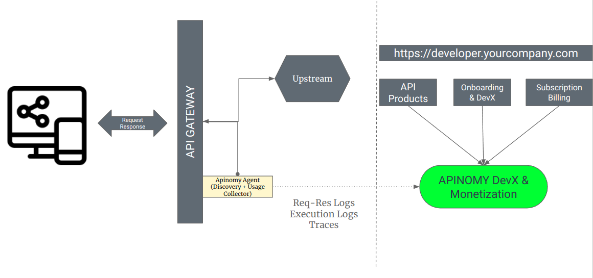
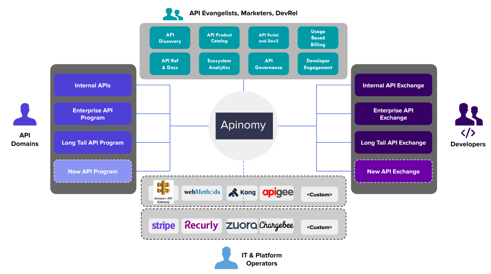

# Introduction

APIs (Application Programming Interfaces) have become one of the most important components of modern digital applications. They allow developers to quickly and easily integrate different services into their applications, making them more powerful and efficient. In a constantly evolving digital economy, APIs are necessary to continuously enable new services, but the need for digital-first strategies have made APIs more of a priority than ever before. Every organization is confronted by the need to make changes fast and adapt to new ways of conducting their business. APIs streamline this process of transformation. 

# APIs Beyond Plain Old Integration

In the early days, APIs (Application Programming Interfaces) served a straightforward purpose: to enable communication between frontend and backend systems or to facilitate information exchange between internal services. However, as technology has advanced and businesses have evolved, so too have APIs. Today, they are the backbone of complex interactions across distributed systems, supporting real-time data processing, microservices architectures, and seamless connectivity with third-party services and platforms. This evolution has transformed APIs from simple integration tools into critical enablers of digital transformation.

## The Natural Evolution of APIs: From Endpoints to Marketplaces

The journey of APIs can be mapped out in four distinct stages:

1. **Endpoints**: Initially, APIs were mere endpoints—interfaces that allowed different software applications to communicate. 
2. **Products**: As the benefits of APIs became more apparent, they began to be developed as products. These productized APIs were designed with a focus on usability, documentation, and developer support. Companies started to offer APIs as standalone products that could be consumed by external developers to build new applications and services.
3. **Platforms**: The next stage in the evolution saw APIs becoming integral to platform-based business models. Companies like Amazon, Google, and Facebook built extensive ecosystems around their APIs, enabling third-party developers to create applications that extended the functionality of their platforms. This shift transformed APIs into powerful tools for ecosystem building and innovation.
4. **Marketplaces**: Today, APIs are at the heart of digital marketplaces. These marketplaces provide a centralized location where developers can discover, evaluate, and purchase APIs from various providers. By monetizing their APIs, companies can generate new revenue streams and foster a thriving developer community.

## Company as a Service

In the current digital landscape, companies are leveraging APIs to offer their core capabilities as services. This "company as a service" (CAAS) model allows businesses to expose their internal processes and data to external developers, partners, and customers through APIs. By doing so, they can create new business opportunities, improve operational efficiency, and drive innovation.

For instance, a logistics company might expose its shipment tracking API to e-commerce platforms, enabling real-time tracking for customers. Similarly, a financial institution could offer APIs for payment processing, account management, and fraud detection, allowing fintech startups to build innovative solutions on top of their infrastructure.

## The API Economy: High Valuations and Strategic Acquisitions

The evolution of the API economy is evident in the high valuations of companies like Stripe and Solarisbank. These companies have built their success on the strength of their APIs, offering robust and reliable services that are easy to integrate and use. Stripe's APIs, for example, have revolutionized online payments, making it simple for businesses of all sizes to accept payments over the internet.

Established companies in major economic sectors, particularly fintech, are also recognizing the power of APIs. They are either building platform-based business models that leverage APIs to become leaders in their space or acquiring third-party companies to expand their API-based services. This strategic approach enables them to drive innovation, enhance customer experiences, and stay competitive in a rapidly changing market.

# The Federated Future of API Management

While HTTP-based APIs have traditionally dominated the conversation, the reality is that APIs are not restricted to a single protocol. Data APIs, along with various other protocols and interfaces, have become widespread, reflecting the diversity and complexity of the systems they serve. As data emerges as the most valuable asset for organizations, managing these APIs has become both more critical and more challenging.

## The Expanding Universe of APIs

APIs today are not just about HTTP. They encompass a wide range of protocols and interfaces, each serving specific purposes and optimizing different aspects of data and service interaction. Here are a few examples:

- **gRPC**: An open-source remote procedure call (RPC) system that allows clients and servers to communicate transparently.
- **WebSockets**: A protocol providing full-duplex communication channels over a single TCP connection, ideal for real-time applications.
- **PostgreSQL**: Not just a database but also a protocol for managing relational data.
- **S3**: Amazon's Simple Storage Service, which has its own API for object storage.
- **HDFS**: The Hadoop Distributed File System, essential for managing large-scale data storage across clusters.
- **Cassandra**: A distributed NoSQL database with its own API for handling large amounts of unstructured data.

## The Heterogeneous Interface Landscape

The interface for exposing services has become highly heterogeneous. This diversity is not limited to the protocols mentioned above but extends across various deployment environments:

- **Public Clouds**: Services hosted on platforms like AWS, Azure, and Google Cloud.
- **Private Clouds**: Dedicated cloud infrastructure managed by organizations.
- **On-Premises**: Traditional data centers still play a crucial role in many industries.
- **Edge Computing**: Computing resources located closer to the data source to reduce latency and improve performance.

This heterogeneity in interfaces and deployment environments presents a significant challenge: managing this sprawling landscape with a single, monolithic API management system is impractical and inefficient.

## Beyond Monolithic API Management

The classic approach to API management, which often revolves around HTTP proxies and centralized cataloging, is increasingly inadequate for today's needs. Here’s why a federated approach is essential:

1. **Decentralized Control**: In a federated system, each API can be managed independently, allowing for greater flexibility and responsiveness. This is particularly important in hybrid environments where services may span public clouds, private clouds, and on-premises infrastructure.
2. **Protocol Agnosticism**: A federated system can support a wide range of protocols, ensuring that the most appropriate and efficient protocol is used for each specific case. This avoids the one-size-fits-all approach of traditional systems.
3. **Scalability**: Managing APIs in a decentralized manner allows organizations to scale their API infrastructure organically. Each service or application can be scaled independently, optimizing resource usage and performance.
4. **Resilience and Redundancy**: A federated approach enhances system resilience by avoiding single points of failure. If one API endpoint or management system goes down, others can continue to operate unaffected.

## Embracing the Sprawl

Given the decentralized nature of modern API ecosystems, the concept of a central catalog is becoming outdated. Instead, organizations should focus on creating interconnected catalogs and discovery mechanisms that can operate across diverse environments. This can be achieved through:

- **Service Meshes**: Tools like Istio or Linkerd that manage microservices communication, providing visibility and control over diverse API traffic.
- **API Gateways**: Deploying multiple API gateways closer to where the services reside, whether in the cloud, on-premises, or at the edge.
- **Federated Catalogs**: Implementing catalogs that can sync and interoperate, providing a comprehensive view of APIs without centralization.

# Unlocking the Full Potential of Your API Program

The technical aspects of API development are well understood but the business potential of APIs remains underexploited. According to a 2023 Kong Customer Survey, 46% of developers say senior leadership lacks a strong understanding of the value of APIs. This divide can have implications for organizations striving to harness the full potential of APIs by embracing an [API-first approach](https://konghq.com/resources/reports/unlocking-the-api-first-operating-model). It's time to elevate API productization and monetization to a first-class feature of API offerings.

## Revenue: The Ultimate Measure of API Success

When evaluating the success of an API program, **revenue** stands out as the most definitive metric. In the business world, Profit and Loss (P&L) is the language that speaks volumes about the effectiveness of any initiative. For API programs, revenue generation should be a central focus, not an afterthought. However, most API management platforms currently overlook this crucial aspect.

## The Overlooked Aspects in API Management Platforms

API management platforms provide tools for API creation, deployment, and monitoring but often fall short in offering robust features for productizing and monetizing APIs. To bridge this gap, API product managers need a comprehensive approach that considers the following factors:

### 1. A Unified View Across Your API Real Estate

To effectively productize APIs, it's essential to have a holistic view of your entire API ecosystem. This includes discovering and cataloging all available APIs, understanding their usage patterns, and identifying opportunities for monetization. A comprehensive API inventory is the first step towards a successful monetization strategy.

### 2. A First-Class POV on Developer Experience (DevX)

Developer Experience (DevX) is a critical factor in the success of any API product. A positive DevX ensures that developers can easily discover, understand, and integrate APIs into their applications. This involves providing clear documentation, robust SDKs, and responsive support. Investing in DevX not only attracts more developers but also increases the likelihood of successful API adoption and monetization.

### 3. Empirical Product Market Fit: Will People Even Use It?

Before monetizing an API, it's crucial to validate its product-market fit. This involves conducting market research to understand the needs and pain points of potential users. By gathering empirical data and feedback from developers, API product managers can refine their offerings to better meet market demands. Understanding whether there is a genuine need for your API is a prerequisite for successful productization.

### 4. Price Discovery: Will People Pay for It?

Once product-market fit is established, the next challenge is price discovery. Determining the right pricing model for your API is critical to maximizing revenue. This could involve usage-based pricing, subscription models, or tiered pricing plans. Conducting market research and competitive analysis can help identify the optimal pricing strategy. Additionally, offering flexible pricing options can cater to different segments of your target audience, increasing the likelihood of monetization success.

## The Growing Market for API Monetization Platforms

The importance of API monetization is underscored by the impressive growth projections for the API monetization platform market. [FMI](https://www.futuremarketinsights.com/reports/api-monetization-platform-market) predict a compound annual growth rate (CAGR) of 28.1% during the forecast period 2023-2033, with the industry expected to generate US$ 6.1 billion in 2023 and exceed US$ 72.6 billion by 2033. This rapid growth reflects the increasing reliance on APIs by large companies, with approximately 40% of them using hundreds of APIs in their daily operations. Furthermore, an estimated 71% of developers plan to leverage APIs to a greater extent in the coming years.

According to [Kong API Impact Report](https://konghq.com/resources/reports/economic-impact-of-apis), **by 2027, APIs are projected to contribute a staggering $14.2 trillion to the global economy.** That’s a projected $3.3 trillion growth in market size from 2023 — a difference greater than the current GDP of the United Kingdom or France.

# API Monetization: Key Considerations for Success

Here are key considerations for effectively monetizing your API:

## Metering Layer

The API layer can capture and collect data on API usage, performance metrics, and error handling for monitoring, analytics, generating insights about API usage patterns, identifying bottlenecks, or optimizing system performance. So, an API layer remains the most ideal place to record and meter transactions. Ensuring accurate and asynchronous recording of metrics is crucial. This allows for precise tracking of usage, which is essential for billing and analyzing customer behaviour.

## Choosing the Right Usage Metric

Selecting the appropriate usage metric is vital for aligning your API's value with customer needs. The business capability delivered by the API should be quantified in terms that are meaningful and self-evident to the user. Instead of focusing solely on API call volumes, maybe consider metrics such as:

- **Transaction volume:** Number of transactions processed.
- **Data volume:** Gigabytes of data sent or received.
- **Unique users:** Number of distinct users accessing the API.

Imagine this: billing based on the number of sequences stored in an email marketing tool might not be logical. Why? Customers might keep deleting sequences after sending them. A smarter approach? Gauge the number of unique contacts emailed every month or the total emails sent out.

The choice of metric should depend on the specific product or service offered and the typical behaviour of your customers.

## Billing Model: Prepaid vs. Postpaid

Choosing between prepaid and postpaid billing models involves understanding your customers' preferences and cash flow considerations.

- **Prepaid:** Customers pay upfront for a set amount of usage. This model is straightforward and ensures immediate revenue, but may require customers to estimate their usage accurately.
- **Postpaid:** Customers are billed based on actual usage after the fact. This can be more flexible and attractive to customers, but poses a risk of delayed payments and bad debt.

## Pricing Strategy: Tiered Pricing vs. Pay As You Go

A well-thought-out pricing strategy can significantly impact your API's adoption and profitability.

- **Tiered Pricing:** Offers different pricing tiers based on usage levels. This model can cater to a wide range of customers, from small startups to large enterprises. It provides predictability and scalability. But sometimes, the price doesn't resonate with what your customers feel they're getting. Too many tiers? They might just freeze, unsure of which to pick.
- **Pay As You Go (Usage based billing):** Charges customers based on actual usage. This model is highly flexible and can be appealing to businesses that prefer to pay for only what they use. It can also encourage more usage as there are no upfront commitments.

## Invoice Methods: Recurring Invoicing vs. Threshold-Based Invoicing

Invoicing methods should align with your billing strategy and customer preferences.

- **Recurring Invoicing:** Bills customers at regular intervals (e.g., monthly, quarterly). This method is predictable and can simplify budgeting for both the provider and the customer.
- **Threshold-Based Invoicing:** Bills customers once they reach a certain usage threshold. This can be effective for usage-based models, ensuring that customers are only billed when they have consumed a significant amount of the service.

## Focus on Business problems rather than technical problems

A common challenge for SaaS and PaaS companies is focusing on building metering and billing systems, often at the expense of identifying and pricing their API products effectively.

- **Focus on Core Strengths:** Rather than developing complex metering and billing UIs, leverage third-party solutions that specialize in these areas. This allows your team to focus on refining the API products themselves.
- **Market-Driven Solutions:** Allow the market to choose the best experience layer, rather than trying to build a one-size-fits-all solution. This can lead to better user experiences and more robust solutions. Don’t cannibalize the customers.
- **Economy of Scale:** By focusing on your core strengths and leveraging specialized providers for billing and metering, you can achieve better economy of scale and allocate resources more efficiently.

# Apinomy - API (Data) Monetization at Scale

**Apinomy** enables direct monetization of your APIs and Data, at scale. Helps you in enabling internal, external and 3rd party developers to subscribe to your APIs and Data, with unlimited flexible plans, designed by you. 

Apinomy is not an API management platform by itself, but it supports the majority of API platform providers, including Kong, Apigee, Envoy, AWS API Gateway and more. It is simple enough for anyone to build a gateway plugin, based on the capabilities of the gateway.

Apinomy works by integrating with your gateway to do the following things:

1. Discover APIs (that is endpoints: hosts, routes, even upstream services and event OpenAPI specs, based on support)
2. Then, it allows you to bundle these APIs into meaningful products.
3. Then, you can create attractive usage based billing models. General models include tiered pricing based on API call volumes, but Apinomy also allows you to define your custom service units. For example, you could define an API plan to be billed against a custom metric, such as SMS API to be billed against number of messages sent, or a payment transaction to be billed against the value of the transaction.
4. Your users can either subscribe to these products through the available rate plans from the default portal that Apinomy provisions, or can also be integrated with your own portal. Rate plans can be prepaid for a licensed usage quota as well.
5. Apinomy, collects logs from the gateway in near real-time and aggregates these in real-time to generate usage reports as well as billing to the bound of a minute.
6. Apinomy seamlessly integrates with the billing solution of your choice: Stripe, Chargebee etc.

Infact, this is only a fraction of what you can achieve with Apinomy. Over and above this, you can also use Apinomy as an ecosystem platform, to organize your APIs into multiple domains, products and to govern your ecosystem at large.

To know more about how Apinomy works, take a look the [demo](https://www.youtube.com/watch?v=elNCHQDMn0E) video.

We believe Apinomy will be useful for a variety of data & API monetization use-cases at large, but it also usable for other concerns such as,

- **SaaS usage based billing** - Bill tenants based on API calls. Simplify Fin-ops with tenant level insights on usage against revenue
- **Chargeback for Internal Platforms** - Gain insight into BU + charge-code level usage for shared services SaaS and COTS platforms
- **API Marketplace** - Run your own API Marketplace with API producers, developers (internal, external, partners) as constituents enabling various monetization models

Future versions of Apinomy will also support data monetization around the Postgres protocol. We will have more exciting news. But for now, Apinomy provides very exciting opportunities in real-time billing for APIs and is the only multi-gateway, multi-cloud usage billing product. This enables creating a comprehensive monetization and revenue plane for your APIs.

# Conclusion

Real-time API monetization is critical for organizations looking to unlock new revenue streams and drive innovation. With tools like **Apinomy,** businesses can effectively manage, productize, and monetize their APIs across multiple platforms and environments. By focusing on meaningful metrics, flexible billing models, and a strong developer experience, companies can harness the full potential of their API programs and stay competitive in a rapidly evolving market. As the API economy continues to grow, businesses that embrace real-time monetization will be well-positioned to capitalize on emerging opportunities and sustain long-term success.
