# Configuring OAuth/OIDC for Confluent Cloud using Auth0

In the early days of the internet, sharing information between services was straightforward but risky. Users often had to share their usernames and passwords, exposing their credentials to potential misuse. Today, we have secure standards like OAuth 2.0 and OpenID Connect (OIDC) that make this process safer and more efficient.

The popularity of OAuth and OIDC for authentication and authorization says a lot about the importance of the technology. If you see a login page online on a modern website, it is most likely configured using OAuth 2.0 and OpenID Connect (OIDC). These protocols have become the standard for secure, robust authentication and authorization across various applications and services.


## The Problem with Sharing Credentials<a id="the-problem-with-sharing-credentials"></a>

Back in the day, if you wanted a service to access your information on another platform, you had to share your username and password. This practice was insecure for several reasons:

- No guarantee that the service would keep your credentials safe.

- No control over how much of your personal information the service could access.

Thankfully, standards like OAuth 2.0 have been developed to address these security concerns.


## Understanding OAuth and OIDC: A Simple Example<a id="understanding-oauth-and-oidc-a-simple-example"></a>

OAuth and OIDC work together to make secure logins easy and seamless. Imagine you want to log in to a new app using your Google account. When you click "Log in with Google," OAuth handles the authorization by asking Google for permission to share your info with the new app. If you agree, OIDC comes into play, providing the app with your identity details, such as your name and email address, so you can log in without creating a new account. This way, OAuth ensures your data stays secure, and OIDC confirms your identity.

<!-- 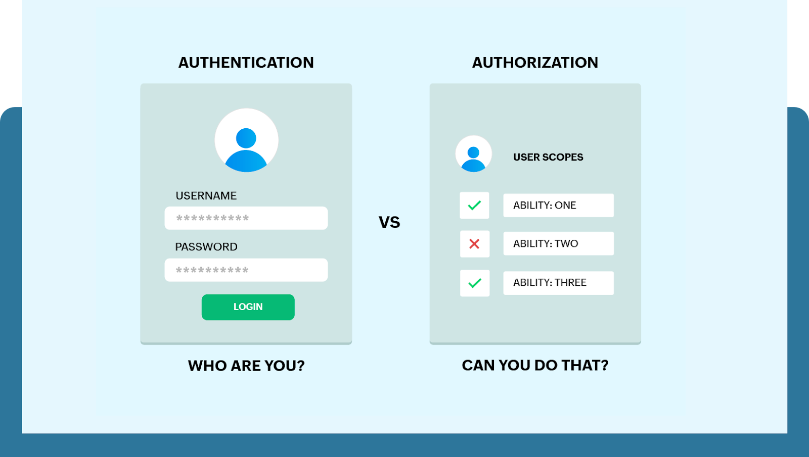 -->
<div style="text-align: center;">
    
</div>


For more information on OAuth and OIDC go through this beautifully explained blog post from Okta: [An Illustrated Guide to OAuth and OpenID Connect](https://developer.okta.com/blog/2019/10/21/illustrated-guide-to-oauth-and-oidc)


## Scope of this blog<a id="scope-of-this-blog"></a>

In this blog post, we will walk through the steps of configuring Auth0 as an identity provider for Confluent Cloud. Auth0 is a flexible, drop-in solution to add authentication and authorization services to your applications. Confluent Cloud is a fully managed event streaming platform based on Apache Kafka. By integrating Auth0 with Confluent Cloud, you can enhance the security of your Kafka clusters and streamline the user authentication process.


## Configuring Auth0 as an identity provider in Confluent Cloud<a id="configuring-auth0-as-an-identity-provider-in-confluent-cloud"></a>

### Prerequisites:<a id="prerequisites"></a>

1. A Confluent Cloud account.

2. An Auth0 account.

3. Administrative access to both platforms.


### Steps:<a id="steps"></a>

#### 1. Create a New Application in Auth0<a id="1-create-a-new-application-in-auth0"></a>

1. ##### Log in to Auth0:<a id="log-in-to-auth0"></a>

   1. Go to your Auth0 dashboard.

2. ##### Create a New Application:<a id="create-a-new-application"></a>

   1. You can see a Create Application button on the getting started page as shows in this picture or alternatively you can go to the application section on the left side of the screen and create an application from there

      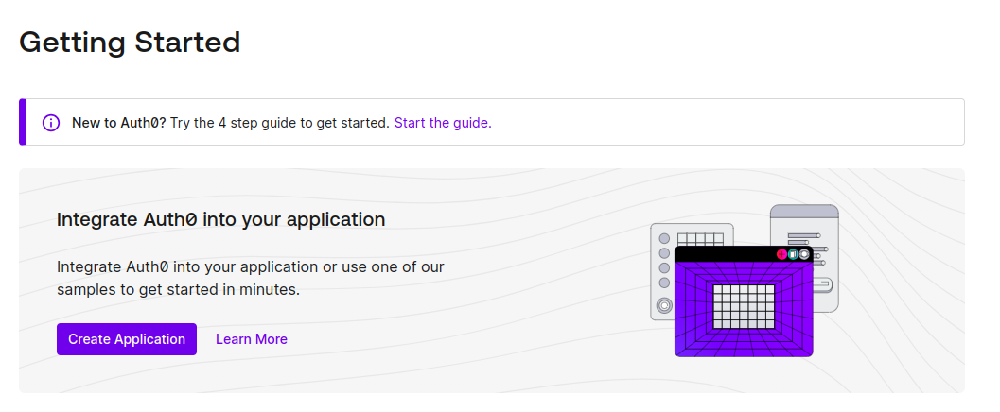

2. Both options should land you in this page where you give your application details. Here you give your application name, and select Machine to Machine under application type. 

3. Below this there is an option to select an API. I will be selecting the default Auth0 Management API in this example. But you can create your own API using the APIs section from the menu.

    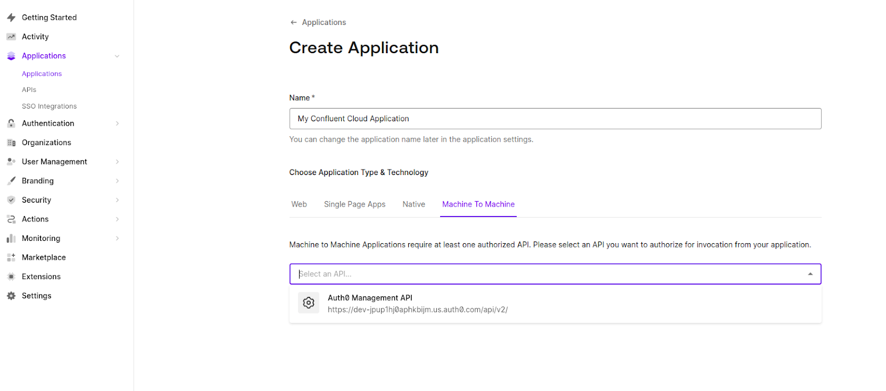    

4. Once we've selected the API, now we can select the permissions (scopes) we want this API to use. In this case, I am selecting all permissions.

5. Click on continue to successfully create the Application

    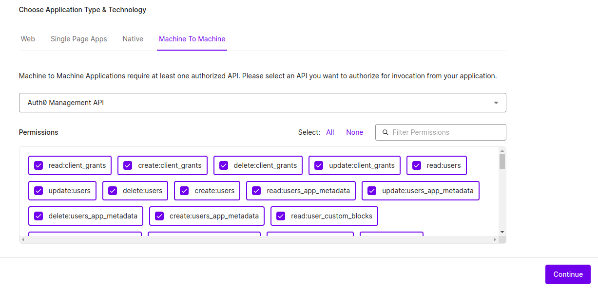 

3. ##### Check Application Settings:<a id="check-application-settings"></a>

   1. In the application settings, take note of the Client ID and Client Secret.

      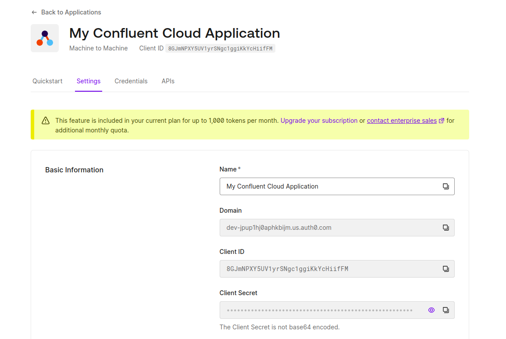 


#### 2. Configure Auth0 as an Identity Provider in Confluent Cloud<a id="2-configure-auth0-as-an-identity-provider-in-confluent-cloud"></a>

1. ##### Log in to Confluent Cloud:<a id="log-in-to-confluent-cloud"></a>

   1. Go to your Confluent Cloud dashboard.

2. ##### Navigate to Identity Providers:<a id="navigate-to-identity-providers"></a>

   1. Go to the Accounts and access section

   2. Navigate to the Workload Identities tab

      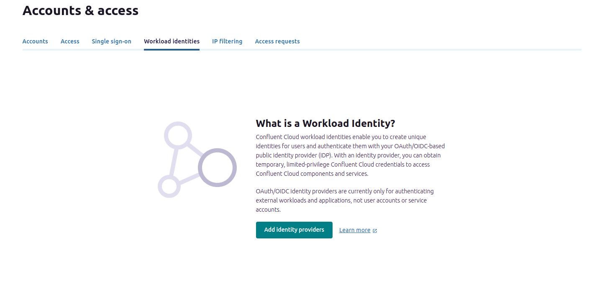 

3. ##### Add a New Identity Provider:<a id="add-a-new-identity-provider"></a>

   1. Click on Add Identity Providers.

   2. Choose Other OIDC Provider as the provider type.

      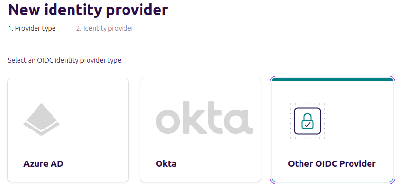 

4. ##### Fill in the Identity Provider Details:<a id="fill-in-the-identity-provider-details"></a>

   1. Fill in the Name, Description, OIDC Discovery URL, Issuer URI, JWKS URI as shown in the picture below.

       

2. You might be wondering where to find these details. Well, the OIDC Discovery URL can be found under your application settings mentioned as Domain

3. The issuer URI and and JWKS URI can be found in the OpenID Connect (OIDC) discovery documents found here: [`https://{yourDomain}/.well-known/openid-configuration`](about:blank)

   1. In my case, it looks something like the image shown below

      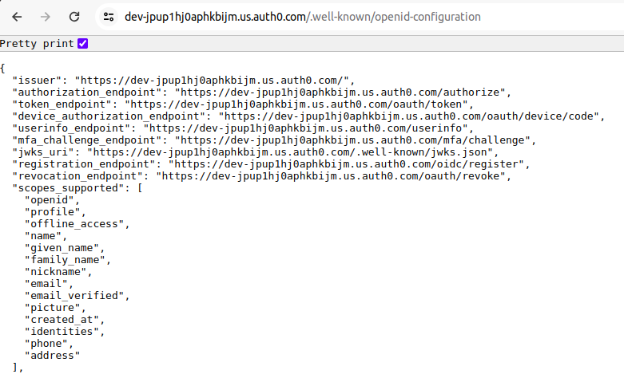 

4. Once this is filled, click on Validate and Save

5) **Add Identity Pool**:

   1. Once the Identity provider is created, we need to create an Identity pool. Cick on Add Identity Pool button as shown below

      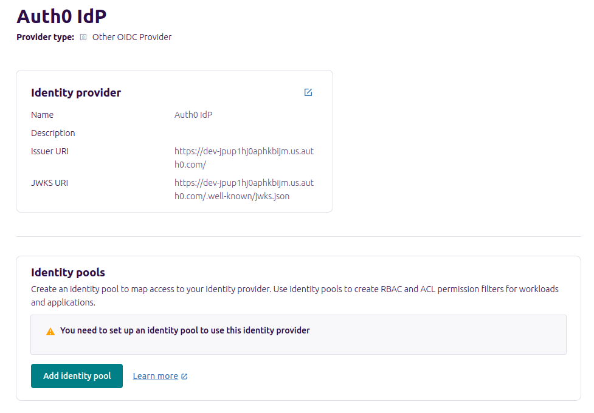 

   2. Fill in the details as per your requirement. I have filled it as shown in the picture.

      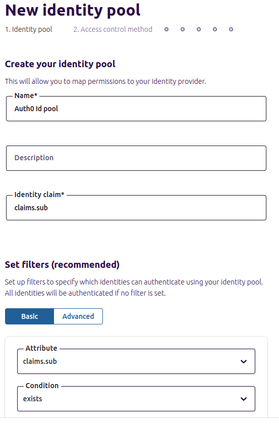
  
   3. You can use an identity pool to provide granular control over access of your applications to your Confluent Cloud resources. An identity pool is a group of external application identities that are assigned a certain level of access based on a claims-based policy
  
        For details on identity pool and how to use it, Check out [Use Identity Pools with Your OAuth/OIDC Identity Provider on Confluent Cloud](https://docs.confluent.io/cloud/current/security/authenticate/workload-identities/identity-providers/oauth/identity-pools.html#add-oauth-identity-pools).


   4. Click next once you are done with populating the fields.

   5. Since we are creating everything from scratch we will select Add new permissions as shown below and hit next.

      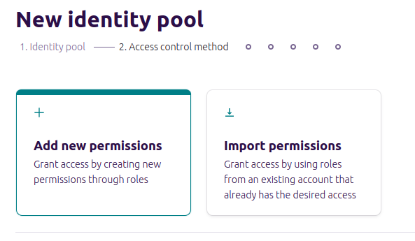

   6. On the next page, select the cluster you want to and give the permissions required and finish the setup.

#### 3. Configuring Kafka Client<a id="3-configuring-kafka-client"></a>

1. Open your terminal from where you are trying to access the confluent cloud and where your client is present.

2. Create a client configuration, in my case I have named it client.properties

3. Use the following template to fill in your details 

```
# Kafka Broker Connection
bootstrap.servers=YOUR_BOOTSTRAP_SERVER

# Security Protocol
security.protocol=SASL_SSL

# OAuth2 Token Endpoint URL
sasl.oauthbearer.token.endpoint.url=YOUR_TOKEN_ENDPOINT_URL

# Login Callback Handler Class
sasl.login.callback.handler.class=org.apache.kafka.common.security.oauthbearer.secured.OAuthBearerLoginCallbackHandler

# SASL Mechanism
sasl.mechanism=OAUTHBEARER

# JAAS Configuration
sasl.jaas.config= \
  org.apache.kafka.common.security.oauthbearer.OAuthBearerLoginModule required \
    clientId='YOUR_CLIENT_ID' \
    clientSecret='YOUR_CLIENT_SECRET' \
    extension_logicalCluster='YOUR_LOGICAL_CLUSTER' \
    extension_identityPoolId='YOUR_IDENTITY_POOL_ID' \
    scope='YOUR_SCOPES' \
    audience='YOUR_API_IDENTIFIER';
```

4. In my case, I have used the following config

```
bootstrap.servers=pkc-p11xm.us-east-1.aws.confluent.cloud:9092
security.protocol=SASL_SSL
sasl.oauthbearer.token.endpoint.url=https://dev-jpup1hj0aphkbijm.us.auth0.com/oauth/token
sasl.login.callback.handler.class=org.apache.kafka.common.security.oauthbearer.secured.OAuthBearerLoginCallbackHandler
sasl.mechanism=OAUTHBEARER
sasl.jaas.config= \
  org.apache.kafka.common.security.oauthbearer.OAuthBearerLoginModule required \
    clientId='8GJmNPXY5UV1yrSNgc1ggiKkYcHiifFM' \
    clientSecret='wSQzDaI-MRB80w2HyzKbV-JjPS4Ijd5zUu10LdisgEDR7_LRoC98ruBGgnLd_Lha' \
    extension_logicalCluster='lkc-37vn0o' \
    extension_identityPoolId='pool-AXqR' \
    scope='read:users';
```

_Note that, you should never share your client details, especially the client secret. I have deleted all instances of my application, hence I haven't redacted the client secret._

5. Here we can add as many permissions as we want to access under the scope parameter. But this can be done only if we have allowed the access in the identity pool.

6. We can use this client.properties to access the kafka cluster depending on the amount of permissions we have.


## Conclusion<a id="conclusion"></a>

In conclusion, integrating Auth0 as an identity provider for Confluent Cloud significantly enhances the security and efficiency of your Kafka clusters. By leveraging the power of OAuth 2.0 and OpenID Connect, you can ensure that user credentials are protected, and access is precisely controlled. This setup not only streamlines the authentication process but also provides a robust framework for managing permissions and identities. As you follow the steps outlined in this guide, you'll find that configuring Auth0 with Confluent Cloud is straightforward and highly beneficial for maintaining a secure, scalable, and user-friendly environment for your event streaming applications.
