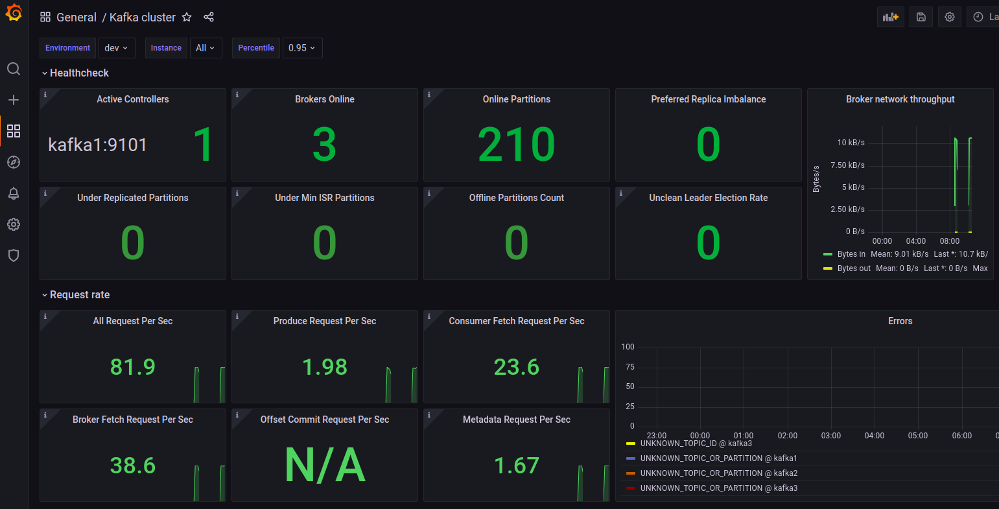
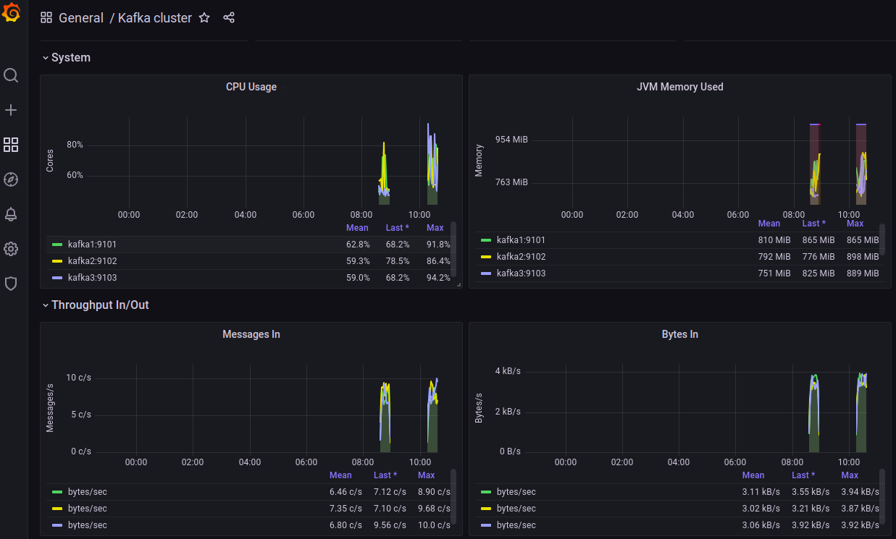

# Introduction:

In the realm of data streaming and event-driven architectures, hands-on experience and real-time troubleshooting is invaluable. This blog aims to provide an in-depth guide to setting up and using a local Kafka environment using Docker-compose, by leveraging a sandbox setup, you can experiment, test, and debug Kafka configurations in an isolated environment that mimics a cloud setup, why use an environment that mimics a cloud setup you ask? We have a blog on the exact thing and it explains why having a local kafka setup is very essential. Make sure to check it out too [Unlocking the Potential of Local Kafka.](https://platformatory.io/blog/Unlocking-the-Potential-of-Local-Kafka/)

A sandbox is an isolated environment that allows developers to safely test and troubleshoot without impacting the production environment. This makes it an essential tool for ensuring that code changes and configurations work correctly before deployment. In this blog, we will introduce the Confluent Platform Sandbox and Confluent Platform Ansible Sandbox, powerful tools that simplify the process of setting up and managing Kafka clusters locally using Docker Compose.

We will guide you through the step-by-step process of setting up the CP Sandbox, show how it can be used for testing and debugging, and delve into various troubleshooting scenarios. Additionally, we will cover the integration of monitoring tools like Prometheus and Grafana for enhanced observability and debugging. Finally, we will introduce the CP Ansible Sandbox, which automates the deployment and management of Kafka clusters, further streamlining your development workflow.


# The CP Sandbox- Usage and Setup:

The CP Sandbox is built using Docker Compose, which allows us to define and run multi-container Docker applications seamlessly. This setup includes a comprehensive environment with Confluent Kafka and its essential components, making it ideal for simulating a production-like setup on local machines. Here’s a detailed look into its setup and components:

**Configuration Mounting**: The Docker Compose file mounts configuration files (properties files) into the containers. These properties files are critical as they allow customization of each component’s settings, ensuring the environment behaves just like it would on VMs or bare-metal servers to a certain extent.

**Simulating Production Environments**

The environment simulates running Confluent Platform on VMs or bare-metal servers but leverages Docker containers for convenience and portability. This simulation is achieved by:

**Properties Files**: Using properties files to configure Kafka and its components, mirroring how configurations would be managed in a non-containerized setup. This approach ensures that the transition from development to production is smooth, as the configurations remain consistent.

**Docker Containers**: Docker containers encapsulate each service, providing isolation and consistency. This means you can run the same environment on any machine with Docker installed, ensuring that your setup behaves predictably across different development and testing environments.

**Troubleshooting Scenarios**

The CP Sandbox repository includes various branches, each containing different troubleshooting scenarios. These scenarios are designed for Kafka administrators to practice handling production-like issues. Some examples include:

**Topic Access Issues**: Simulate the inability to produce or consume from a newly created topic. This helps administrators practice checking and configuring ACLs, verifying user permissions, and ensuring network connectivity.

**Missing Broker Metrics:** Address issues where broker metrics are not captured in the control center despite setting up Confluent Metrics Reporter. This scenario helps in verifying configuration settings and connectivity between brokers and the control center.

**Platform Migration Issues**: Simulate issues following a lift-and-shift migration to different machines, such as SSL handshake failures or configuration mismatches. Administrators can practice resolving these problems by examining error logs and reconfiguring components.

These scenarios provide hands-on experience in diagnosing and resolving issues, making administrators better prepared for real-world challenges.


## Here is a step by step guide on setting up the CP Sandbox:

Clone the Repository: Start by cloning the repository containing the Docker Compose file and configuration files, you can access the repository via this [link](https://github.com/Platformatory/cp-sandbox.git).

```bash
git clone git@github.com:Platformatory/cp-sandbox.git
```

```bash
cd cp-sandbox
```

Start the Services: Use Docker Compose to start all the services defined in the docker-compose.yml file.

```bash
docker-compose up -d
```

This command will bring up a three-node Kafka cluster with security enabled, along with other components like Zookeeper, Schema Registry, Kafka Connect, Control Center, Prometheus, Grafana, and OpenLDAP.

NOTE: Be sure to update or extend the validity of the SSL certificates for the Kafka brokers. Expired certificates can cause broker containers to go down  due to authentication errors resulting from invalid certificates. Use the blog post [here](https://www.golinuxcloud.com/renew-self-signed-certificate-openssl/) for a guide on how to renew an expired SSL certificate.

Use the below command to inspect the keystore and check the validity of the certificate.

```bash
keytool -list -v -keystore <<path_to_the_keystore_file>>  
```

(The keystore file, kafka.server.keystore.jks is located in the broker folder for each broker)

Check Service Status: Verify that all services are up and running.

```bash
docker-compose ps -a
```

Ensure there are no exited services and all containers have the status Up.

If any of the containers have gone down, examine the logs of the respective containers as shown below to get a better understanding of the  issue for troubleshooting.

Logging: Check the logs of the respective service by its container name.

```bash
docker logs <<container_name>>
```

Monitoring: For monitoring, Prometheus and Grafana are configured to visualize JMX metrics.

Using the Kafka Client: To interact with the Kafka cluster, you can use the Kafka client container.

```bash
docker exec -it kfkclient bash
```

The Kafka client container contains the Kafka CLI and other tools necessary for troubleshooting Kafka. It also includes a properties file mounted to /opt/client that can be used to define client properties for communicating with Kafka.

Restarting Services: If needed, you can restart a particular service. 

```bash
docker-compose restart <<service_name>>
```

Alternatively, you can force recreate the service.

```bash
docker-compose up -d --force-recreate <<service_name>>
```

Below is a part of the docker-compose  file from the repository  which sets up the Confluent Kafka and Zookeeper resources with JMX metrics exposed, using Docker containers.

```yaml
---

version: '3.7'
services:
  zookeeper1:
    image: confluentinc/cp-zookeeper:7.4.0
    hostname: zookeeper1
    container_name: zookeeper1
    ports:
      - "2181:2181"
    command: zookeeper-server-start /etc/kafka/zookeeper.properties
    environment:
      EXTRA_ARGS: -javaagent:/usr/share/jmx-exporter/jmx_prometheus_javaagent-0.20.0.jar=9103:/usr/share/jmx-exporter/zookeeper.yml
    volumes:
    - ./zookeeper1:/etc/kafka
    - ./jmx-exporter:/usr/share/jmx-exporter
    deploy:
      resources:
        limits:
          cpus: "1"
          memory: 512M

  kafka1:
    image: confluentinc/cp-server:7.4.0
    hostname: kafka1
    container_name: kafka1
    depends_on:
      - zookeeper1
    command: kafka-server-start /etc/kafka/server.properties
    environment:
      EXTRA_ARGS: -javaagent:/usr/share/jmx-exporter/jmx_prometheus_javaagent-0.20.0.jar=9101:/usr/share/jmx-exporter/kafka_broker.yml
    volumes:
    - ./kafka1:/etc/kafka
    - ./jmx-exporter:/usr/share/jmx-exporter
    deploy:
      resources:
        limits:
          cpus: "1.5"
          memory: 1536M
```

The current setup uses Confluent Platform version 7.4.0 as specified by the image confluentinc/cp-server:7.4.0 in the above code, this version is compatible with the 3.4 version of Apache Kafka (Refer [here ](https://docs.confluent.io/platform/current/installation/versions-interoperability.html)for Supported Versions and Interoperability for Confluent Platform)

Visit the [Confluent Docker Hub](https://hub.docker.com/u/confluentinc) to find the latest version of the Confluent Kafka images and use the image for upgrading to the latest version.


# Troubleshooting using the Platformatory Kafka Sandbox:

The sandbox includes 12 distinct troubleshooting scenarios, selected from key Kafka concepts and potential production issues. Each scenario is available on a different branch of the repository, allowing you to switch between branches to practice and resolve various Kafka-related challenges.

Below are a few scenarios from the repository:

**Scenario 1**

**Problem Statement**

The client has created a new topic europe_payments but is unable to produce/consume from the topic from the host kfkclient using the user kafkaclient1 using the following commands -

```bash
kafka-console-producer --bootstrap-server kafka1:19092 --producer.config /opt/client/client.properties --topic europe_payments
```

```bash
kafka-console-consumer --bootstrap-server kafka1:19092 --consumer.config /opt/client/client.properties --from-beginning --topic europe_payments
```

The client is using SASL/PLAIN over PLAINTEXT with the user kafkaclient1

The error message seen in the console producer and consumer for europe_payments -

```bash
[2023-07-26 12:18:20,309] WARN [Producer clientId=console-producer] Error while fetching metadata with correlation id 4 : {europe_payments=TOPIC_AUTHORIZATION_FAILED} (org.apache.kafka.clients.NetworkClient)

[2023-07-26 12:18:20,409] ERROR [Producer clientId=console-producer] Topic authorization failed for topics [europe_payments] (org.apache.kafka.clients.Metadata)

[2023-07-26 12:18:20,411] ERROR Error when sending message to topic europe_payments with key: null, value: 6 bytes with error: (org.apache.kafka.clients.producer.internals.ErrorLoggingCallback)

org.apache.kafka.common.errors.TopicAuthorizationException: Not authorized to access topics: [europe_payments]      
```

**Scenario 2:**

**Problem Statement**

There are no broker metrics captured in the control center. The control center has a message - Please set up Confluent Metrics Reporter to view broker metrics. The customer has setup Confluent Metrics Reporter but is still unable to view broker metrics

**Scenario 3**

**Problem Statement**

The client just performed a lift and shift on their entire platform to different machines. The brokers and several other components are down.

The brokers have the following error log -

```bash
java.lang.RuntimeException: Received a fatal error while waiting for all of the authorizer futures to be completed.
	at kafka.server.KafkaServer.startup(KafkaServer.scala:950)
	at kafka.Kafka$.main(Kafka.scala:114)
	at kafka.Kafka.main(Kafka.scala)

Caused by: java.util.concurrent.CompletionException: org.apache.kafka.common.errors.SslAuthenticationException: SSL handshake failed
	at java.base/java.util.concurrent.CompletableFuture.encodeRelay(CompletableFuture.java:367)
	at java.base/java.util.concurrent.CompletableFuture.completeRelay(CompletableFuture.java:376)
	at java.base/java.util.concurrent.CompletableFuture$AnyOf.tryFire(CompletableFuture.java:1663)
	at java.base/java.util.concurrent.CompletableFuture.postComplete(CompletableFuture.java:506)
	at java.base/java.util.concurrent.CompletableFuture.completeExceptionally(CompletableFuture.java:2088)
	at io.confluent.security.auth.provider.ConfluentProvider.lambda$null$10(ConfluentProvider.java:543)
	at java.base/java.util.concurrent.CompletableFuture.uniExceptionally(CompletableFuture.java:986)
	at java.base/java.util.concurrent.CompletableFuture$UniExceptionally.tryFire(CompletableFuture.java:970)
	at java.base/java.util.concurrent.CompletableFuture.postComplete(CompletableFuture.java:506)
	at java.base/java.util.concurrent.CompletableFuture.completeExceptionally(CompletableFuture.java:2088)
	at io.confluent.security.store.kafka.clients.KafkaReader.lambda$start$1(KafkaReader.java:102)
	at java.base/java.util.concurrent.Executors$RunnableAdapter.call(Executors.java:515)
	at java.base/java.util.concurrent.FutureTask.run(FutureTask.java:264)
	at java.base/java.util.concurrent.ThreadPoolExecutor.runWorker(ThreadPoolExecutor.java:1128)
	at java.base/java.util.concurrent.ThreadPoolExecutor$Worker.run(ThreadPoolExecutor.java:628)
	at java.base/java.lang.Thread.run(Thread.java:829)
```

Each of the scenarios are  presented in a similar way with a problem statement, detailing the issue the user is encountering, the commands attempted while facing the issue, and the error message received that can be used for troubleshooting the issue.


# Monitoring and Metrics:

Each Kafka and Zookeeper instance is configured with a JMX exporter, which exposes metrics in a format that Prometheus can scrape, prometheus scrapes these metrics from the JMX exporters at regular intervals. Grafana queries Prometheus for the stored metrics and presents them in various visual formats, such as graphs, charts, and tables. 

```yaml
 EXTRA_ARGS: -javaagent:/usr/share/jmx-exporter/jmx_prometheus_javaagent-0.20.0.jar=9101:/usr/share/jmx-exporter/kafka_broker.yml
```

In the above code snippet taken from the Docker Compose configuration, the EXTRA_ARGS environment variable is used to enable JMX (Java Management Extensions) monitoring by specifying a Java agent. This agent collects metrics and exposes them in a format that can be scrapped by Prometheus. 

**Accessing the Grafana Dashboard:**

Open your browser and go to http://localhost:3000. The default login credentials are admin for both the username and password. You can change these after the first login for security purposes.

**Explore Dashboards:**

Once logged in, navigate to the pre-configured dashboards to start monitoring the Kafka cluster. You can create additional dashboards and visualizations as needed.

Below are a couple of snapshots from the Kafka Cluster Dashboard.








This dashboard houses some of the key metrics for the Cluster monitoring such as Basic Broker Metrics, Request Rate Metrics and System Metrics such as CPU Usage and JVM Memory Usage.

Another resource we use here at Platformatory is CP-Ansible Sandbox, This sandbox provides an automated way to set up and manage Kafka environments using Ansible playbooks, making the deployment process fully automated.


# Introduction to the CP-Ansible Sandbox

The CP-Ansible sandbox can be used for automated deployment and management of Confluent Platform clusters. This sandbox environment allows us to simulate and manage our Kafka infrastructure efficiently using Ansible playbooks within a Dockerized setup. This provides a seamless and consistent environment for testing, deploying, and managing Kafka clusters.

The CP-Ansible sandbox is designed to run within a Docker environment. It includes a control node container and multiple inventory nodes, all managed through systemd and SSH. This setup enables us to execute Ansible playbooks to manage the Kafka clusters from a central control node.

The Cluster contains the following resources deployed:


* Ansible Control Node
* 3 Zookeeper
* 3 Kafka Brokers
* Control Center


# Setting Up the CP-Ansible Sandbox

**Cloning the Repository**:  Start by cloning the repository, you can access the repository via the [link](https://github.com/Platformatory/cp-ansible-sandbox.git).

```bash
 Git clone git@github.com:Platformatory/cp-ansible-sandbox.git
```

```bash
git submodule update --init --recursive
```

**Starting the Docker Environment:** 

```bash
docker compose up -d
```

**Verifying Containers:**

```bash
docker compose ps -a
```

**Setting Up SSH Keys:**

```bash
./setup-ssh-keys.sh
```

**Accessing the Ansible Control Node:**

```bash
docker compose exec -it ansible-control bash
```

Once the environment is set up, the control node can manage all inventory nodes via SSH. The Ansible playbooks can be executed from this control node to deploy and manage the Confluent Platform.

**Verifying SSH Connectivity**

Inside the Ansible control node, verify the SSH connectivity with other nodes:

```bash
ssh root@zookeeper1
```

# Running the CP-Ansible Playbook

Install the Confluent Platform playbook:

Run the below command inside the Ansible Control Node Container

```bash
ansible-playbook confluent.platform.all
```

This assumes the inventory file is located at /ansible/inventories/ansible-inventory.yml.

Below is the inventory script for setting up the cluster.

```yaml
---

all:
  vars:
    ansible_connection: ssh
    ansible_user: root
    ansible_become: true
    ansible_ssh_private_key_file: <private_key_path>

zookeeper:
  hosts:
    zookeeper1:
    zookeeper2:
    zookeeper3:

kafka_broker:
  hosts:
    kafka1:
    kafka2:
    kafka3:

control_center:
  hosts:
    control-center:
```

**Custom Inventory Files**

To use a custom inventory file:

```bash
ansible-playbook -i /path/to/custom/inventory-file confluent.platform.all
```

**Managing the Inventory**

The inventory files are located in the inventories directory and are mounted to /ansible/inventories/ on the control node container. You can create new inventory files or update existing ones locally, and these changes will be reflected on the control node.

**Additional Files**

Any additional files needed for the Ansible playbooks can be added to the share directory locally. These files will be available in /usr/share/cp-ansible-sandbox on the Ansible control node.


# Conclusion

By using the CP Sandbox and CP-Ansible Sandbox, developers and administrators can effectively set up, manage, and troubleshoot Kafka clusters in a controlled, isolated environment. These sandboxes offer a hands-on approach to learning, testing, and debugging Kafka configurations, mimicking a production setup without the associated risks. The CP Sandbox provides an environment built with Docker Compose, allowing for easy setup and management of multi-container applications, while the CP-Ansible Sandbox automates the deployment process using Ansible playbooks, ensuring consistency and efficiency.

Whether you're a seasoned Kafka administrator looking to sharpen your troubleshooting skills or a developer wanting to experiment with Kafka configurations, these sandboxes provide the tools and scenarios necessary for mastering Kafka management. Through practical exercises and real-world scenarios, you'll gain invaluable experience in diagnosing and resolving issues, ultimately preparing you for the complexities of managing Kafka in a production environment.

So, dive into the CP Sandbox and CP-Ansible Sandbox, explore the various troubleshooting scenarios, and harness the power of these tools to enhance your Kafka expertise. Happy Kafkaing!
