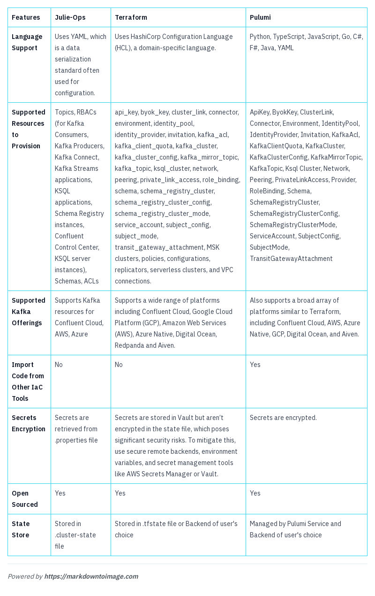

# **Introduction**

In today’s tech landscape, managing and scaling infrastructure efficiently is essential. Infrastructure as Code (IaC) tools like Julie Ops, Terraform and Pulumi offer a streamlined way to automate infrastructure provisioning, ensuring consistency and reducing human error.

Apache Kafka, a robust real-time data streaming platform, powers many modern data architectures but managing its components—brokers, topics, connectors—can be complex. This blog will show you how IaC simplifies Kafka infrastructure management. We’ll highlight key Kafka components and explore how tools like Julie Ops, Terraform, and Pulumi can make configuring and maintaining Kafka resources easier. Whether you’re a developer seeking more control or an organization looking for efficient infrastructure management, this guide offers valuable insights into leveraging IaC for Kafka.


# **Why Infrastructure as Code (IaC)?**

Infrastructure as Code (IaC) is crucial for organizations because it simplifies the creation and management of resources needed for your applications. As your infrastructure grows, IaC can save engineers time and effort by automating the provisioning and configuration of resources, allowing them to focus on more complex tasks.

So, **what exactly is IaC?** It means defining your infrastructure through code. Whenever you need to make changes or add new resources, you modify the code, and the IaC tool will handle the configuration and deployment of those resources automatically.


## **How Infrastructure as Code (IaC) Solves Key Challenges**

### **Challenges**

Manual provisioning often leads to errors, and managing resources across multiple environments can be complex. Keeping configurations accurate and up-to-date is challenging.

### **The Solution: Infrastructure as Code (IaC)**

IaC resolves these issues by using code to manage and provision infrastructure consistently. It offers several advantages:

- **Faster Provisioning:** Automates setup and configuration, accelerating the process.
- **Reduced Human Error:** Minimizes manual work, decreasing the likelihood of mistakes.
- **Idempotency:** Ensures consistent infrastructure setup, even if the code is executed multiple times.
- **Fewer Configuration Steps:** Consolidates all configuration tasks into code, reducing manual setup and errors.
- **Elimination of Configuration Drift:** Maintains consistency across environments and prevents discrepancies.

Tools like Terraform, Pulumi, and JulieOps are popular for automating these tasks, simplifying infrastructure management.

# **IaC Tools for Kafka**

Using IaC tools to configure and manage Kafka infrastructure can significantly simplify the process. Tools like Julie Ops, Terraform, and Pulumi can be used to automate the setup of Kafka components such as topics, connectors, and more. Here’s how they help:

- **Julie Ops:** Focuses on managing Kafka configurations using GitOps principles.
- **Terraform:** Provides a declarative approach to infrastructure management, allowing you to define Kafka resources in code.
- **Pulumi:** Uses programming languages like TypeScript/JavaScript, Python, Go, C#/.NET, and Java to define and manage infrastructure, offering flexibility in configuring Kafka components.

## **JulieOps**

JulieOps, formally known as Kafka Topology Builder, is an open source project licensed under MIT License. It has over 400+ stars on github. It simplifies the configuration of topics, role-based access control (RBAC), Schema Registry, and other components listed in the Features of IaC Tools section. JulieOps is based on declarative programming principles, which means that developers can specify what is needed, and the tool takes care of the implementation details. The interface of JulieOps is a YAML file, which is user friendly and easy to create/update. With JulieOps, developers can easily describe their configuration requirements and delegate the rest of the work to the tool.

[julie-ops](https://julieops.readthedocs.io/en/latest/#) tool helps us to provision Kafka-related tasks in Cloud Infrastructure as a code. The related tasks are usually [Topics](https://julieops.readthedocs.io/en/latest/futures/what-topic-management.html), [Access Control](https://julieops.readthedocs.io/en/latest/futures/what-acl-management.html), [Handling schemas](https://julieops.readthedocs.io/en/latest/futures/what-schema-management.html), [ksql artifacts](https://julieops.readthedocs.io/en/latest/futures/what-ksql-management.html) etc. All these tasks are configured as [topologies](https://julieops.readthedocs.io/en/latest/the-descriptor-files.html?highlight=topology) in julie-ops.

**Pre-Requisites**

- Before using JulieOps to manage your Kafka configuration, ensure that JulieOps is installed locally or running in Docker. You can find the installation instructions in the [JulieOps documentation](https://julieops.readthedocs.io/en/3.x/how-to-run-it.html#).

**Topology File in JulieOps**

- Here’s an example of a YAML file for defining a project-level topology with topics, schemas, KSQL artifacts, managed connectors, and principals

```
  context: "contextOrg"
projects:
  - name: "projectA"
    topics:
      - name: "topic1"
        config:
          replication.factor: "3"
          num.partitions: "6"
      - name: "topic2"
        config:
          replication.factor: "3"
          num.partitions: "6"
    schemas:
      - name: "schema1"
        type: "avro"
      - name: "schema2"
        type: "json"
    ksql:
      - name: "ksqlApp1"
        config:
          queries:
            - "CREATE STREAM stream1 (field1 STRING, field2 INT) WITH (KAFKA_TOPIC='topic1', VALUE_FORMAT='AVRO');"
            - "CREATE TABLE table1 AS SELECT field1, COUNT(*) FROM stream1 GROUP BY field1;"
    connectors:
      - name: "connector1"
        type: "sink"
        config:
          topics:
            - "topic1"
          tasks.max: "2"
          flush.size: "1000"
    principals:
      - type: "producer"
        name: "producer1"
        permissions:
          - "topic1:write"
      - type: "consumer"
        name: "consumer1"
        permissions:
          - "topic1:read"
```
**Kafka Client Configurations**
  
  - In this section, we’ll configure the necessary properties to connect to a Kafka cluster and Schema Registry using the provided credentials and settings. This setup is crucial for using tools like JulieOps to manage and interact with Kafka resources effectively. The following configuration file, named Kafka-client.properties, will set up the connection parameters for Kafka and Schema Registry, ensuring secure and authenticated communication. 
  
```
  bootstrap.servers="<BOOTSTRAP_SERVER_URL>"
  security.protocol=SASL_SSL
  sasl.jaas.config=org.apache.kafka.common.security.plain.PlainLoginModule   required username="<SASL_USERNAME>"   password="<SASL_PASSWORD>";
  ssl.endpoint.identification.algorithm=https
  sasl.mechanism=PLAIN
  # Required for correctness in Apache Kafka clients prior to 2.6
  client.dns.lookup=use_all_dns_ips
  # Schema Registry
  schema.registry.url="<SCHEMA_REGISTRY_URL>"
  basic.auth.credentials.source=USER_INFO
schema.registry.basic.auth.user.info="<SCHEMA_REGISTRY_API_KEY>":"<SCHEMA_REGISTRY_API_SECRET>"

```
**How to run**

- The julie-ops command is used to manage Kafka resources based on a specified topology. Here’s a breakdown of the command and how to run it:

**Command Explanation**

- --broker <BROKERS>: Specifies the Kafka brokers to which Julie-Ops should connect. Replace <BROKERS> with the actual broker addresses or connection strings. This tells Julie-Ops where your Kafka cluster is located.
- --clientConfig <PROPERTIES_FILE>: Indicates the path to the client configuration file. This file contains the connection properties and credentials required for Julie-Ops to interact with - your Kafka cluster. Replace <PROPERTIES_FILE> with the path to your actual configuration file.
- --topology <TOPOLOGY_FILE>: Defines the path to the topology file. This file contains the definitions for the Kafka topics, schemas, connectors, and other resources you want to manage. Replace <TOPOLOGY_FILE> with the path to your actual topology file.

```
julie-ops --broker <BROKERS> --clientConfig <PROPERTIES_FILE> --topology <TOPOLOGY_FILE>
```
Once the run is completed without any errors a successful run will look like

```
log4j:WARN No appenders could be found for logger (org.apache.kafka.clients.admin.AdminClientConfig).
log4j:WARN Please initialize the log4j system properly.
log4j:WARN See http://logging.apache.org/log4j/1.2/faq.html#noconfig for more info.
List of Topics:
<topics that are created>
List of ACLs:
<acls that are created>
List of Principles:
List of Connectors:
List of KSQL Artifacts:
Kafka Topology updated
```
**Where to Run**
You should run this command in an environment where Julie-Ops is installed and configured. This typically includes:
- Local Machine: If you have Julie-Ops installed on your local machine, you can run the command from your terminal or command prompt.
- CI/CD Pipeline: You can include this command in your CI/CD pipeline scripts to automate the deployment of Kafka resources as part of your build and deployment processes.
- Server or VM: If you're using a dedicated server or virtual machine for managing Kafka resources, you can run the command there, ensuring that the environment has access to both Julie-Ops and the Kafka brokers.
 
Want a quick start? checkout our sample JulieOps repo in [here](https://github.com/Platformatory/kafka-cd-julie).

## **Pulumi for Infrastructure as Code**

Choosing the right Infrastructure as Code (IaC) tool is essential, as each offers distinct benefits. While this section focuses on using Pulumi with Confluent Cloud to provision and manage Kafka Topics, Pulumi’s flexibility extends beyond cloud environments. It can be used to manage Kubernetes clusters, which can handle workloads on any infrastructure, including on-premise. Thus, while Pulumi doesn’t directly manage on-premise infrastructure like it does with cloud resources, it enables management of on-premise workloads through Kubernetes.

Pulumi supports multiple programming languages, including Python, TypeScript/JavaScript, Go, C#, Java, and YAML which is a data serialization format used for configuration files. For this blog post, we’ll use TypeScript. Pulumi enables automation of the deployment process, leading to faster and more reliable infrastructure provisioning. The Pulumi provider we use is based on the official Terraform Provider from Confluent Inc., ensuring broad compatibility across various languages and platforms.

Although we're focusing on Confluent Cloud here, Pulumi's capabilities are versatile, allowing you to apply similar processes to other cloud platforms like AWS, Azure, GCP, Digital Ocean, and Aiven, as well as indirectly managing on-premise workloads through Kubernetes. Essentially, Pulumi’s on-premise management capabilities are achieved through Kubernetes rather than direct interaction with on-premise infrastructure.


**Provisioning Kafka Topics**

To provision Kafka topics with Pulumi, follow these steps:

**Define Cluster Arguments**: Specify the Kafka cluster where the topics will be provisioned. \


```
let clusterArgs: KafkaTopicKafkaCluster = {
  id: cluster_id,
};
```
**Set Kafka Credentials**: Provide the API key and secret for authentication. \


```
let clusterCredentials: KafkaTopicCredentials = {
  key: kafka_api_key,
  secret: kafka_api_secret,
};
```


**Configure Topics**: Define the configurations for your Kafka topics, such as retention policies and partition count.

```
let topic_args: KafkaTopicArgs = {
  kafkaCluster: clusterArgs,
  topicName: topicName.toLowerCase(),
  restEndpoint: rest_endpoint,
  credentials: clusterCredentials,
  config: {
    ["retention.ms"]: "-1",
    ["retention.bytes"]: "-1",
    ["num.partitions"]: "6",
  },
};
```


**Create Topics**: Instantiate and create the Kafka topics. \


```
const topics = new confluent.KafkaTopic(
    topicNames[i].toLowerCase(),
    topic_args
);
```
**Run Pulumi**: Save your code to index.ts, set the Confluent Cloud credentials, and run the following commands:

```
pulumi config set confluentcloud:cloudApiKey <cloud api key> --secret
pulumi config set confluentcloud:cloudApiSecret <cloud api secret> --secret
pulumi up
```

## **Terraform for Infrastructure as Code**

Terraform is a popular IaC tool that supports a wide range of cloud, datacenter, and service providers, including Azure, AWS, Oracle, Google Cloud, Digital Ocean, Redpanda, Aiven, and Kubernetes. It uses HashiCorp Configuration Language (HCL) to describe and provision infrastructure.

**Provisioning Kafka cluster and topics with Terraform**

To provision Kafka clusters and topics using Terraform, follow these steps to set up your infrastructure in Confluent Cloud. 

**Initialize the Provider**

Start by specifying the Confluent provider in your Terraform configuration: 

```
terraform {
  required_providers {
    confluent = {
      source  = "confluentinc/confluent"
      version = "1.13.0"
    }
  }
}
```
This installs the Confluent Cloud provider.

**Configure Confluent Secrets** 

Set up your Confluent credentials by adding the following to your Terraform configuration. Note that sensitive information, such as API keys and secrets, should be handled securely. These credentials should not be stored directly in your version control system. Instead, consider using a secret management tool or environment variables to manage sensitive information securely.

Set up your Confluent credentials: 

```
provider "confluent" {
  cloud_api_key    = var.confluent_cloud_api_key    # Optionally, use CONFLUENT_CLOUD_API_KEY env var
  cloud_api_secret = var.confluent_cloud_api_secret # Optionally, use CONFLUENT_CLOUD_API_SECRET env var
}
```
**Create a Kafka Cluster**

Define the Kafka cluster where the topics will be provisioned. This cluster will be created in Confluent Cloud:

```
  resource "confluent_kafka_cluster" "basic" {
  display_name = "basic_kafka_cluster"
  availability = "SINGLE_ZONE"
  cloud        = "AWS"
  region       = "us-east-2"
  basic {}

  environment {
    id = var.environment_id
  }

  lifecycle {
    prevent_destroy = true
  }
}


```

**Define Kafka Topics**

Configure the Kafka topics in your Terraform configuration file:

```
resource "confluent_kafka_topic" "dev_topics" {
  kafka_cluster {
    id = var.cluster_id
  }
  for_each         = toset(var.topics)
  topic_name       = each.value
  rest_endpoint    = data.confluent_kafka_cluster.dev_cluster.rest_endpoint
  partitions_count = 6
  config = {
    "retention.ms" = "604800000"
  }
  credentials {
    key    = var.api_key
    secret = var.api_secret
  }
}
```
**Run Terraform Commands**

To create and manage the infrastructure:

**Initialize Terraform**: This command installs the necessary providers and prepares your Terraform working directory.

```
terraform init
```
**Apply Terraform Configuration**: This command provisions the Kafka cluster and topics as specified in your Terraform configuration. It creates the infrastructure in Confluent Cloud based on the configurations provided.

```
  terraform apply
```

# **Features of IaC Tools: JulieOps, Terraform, and Pulumi**



# **Conclusion**

Choosing the right Infrastructure as Code (IaC) tool depends on your specific needs. Terraform is known for its stability and extensive resource support, making it a reliable choice for many. Pulumi offers ease of use and supports multiple programming languages, appealing to those with coding experience. JulieOps focuses on managing Kafka resources within Cloud. Each tool has its unique strengths, offering effective solutions for managing infrastructure code.
