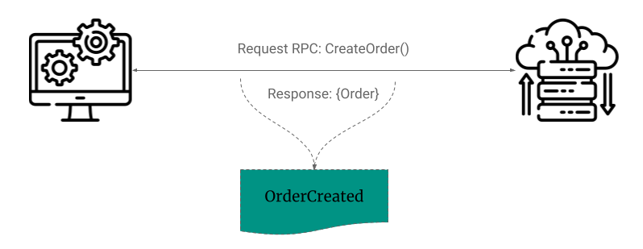
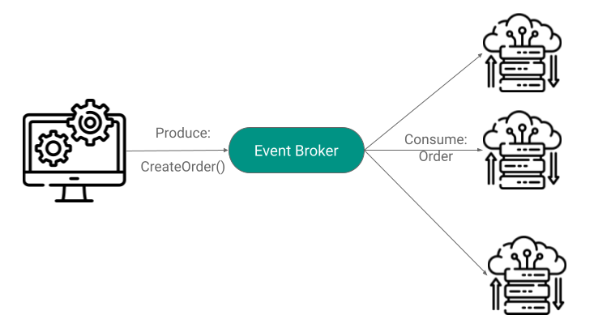
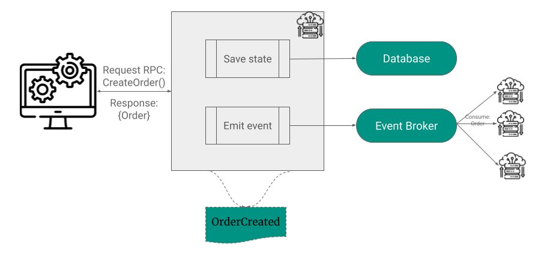
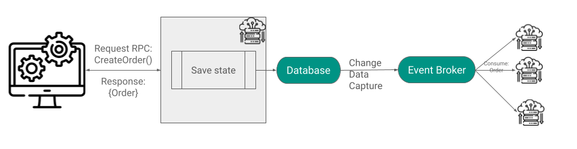
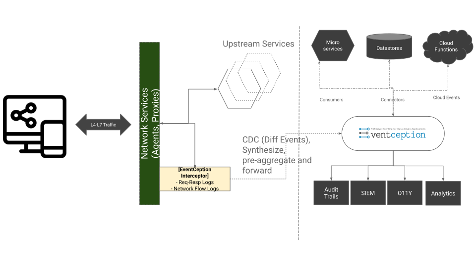

# How to turn your legacy architecture to an event-driven system

In the world of microservices and real-time applications, event-driven architecture is widely adopted for building loosely coupled systems. As a result of this, multiple patterns have emerged, such as Event Notifications, Event Sourcing, CQRS, etc. All of these patterns depend on the system’s ability to produce events and react to events in a timely manner. But what are these events, and why are they important?

An event is a statement of something happening, implying a change in state. Events are indicative of something happening in real life, such as an order being placed, a customer signing up, etc., or events can be a system change as well. Adopting an event-based architecture has immense benefits, including the ability to build loosely coupled, independently scalable services, and immutable events help as a source of truth over time. Adopting event-driven architecture comes with its fair share of challenges and increased complexity.

### Request-Response

When an event occurs, there will be multiple stakeholders interested in consuming and acting upon those events. Most popular APIs are today built on the request-response paradigm. These are implemented using HTTP and work well, but only for a client-server model. There are requests that mutate the state of a resource, i.e., in a REST context, POST, PUT, and DELETE requests. For example, when an order is created, the payment is processed, a bank transaction is made, etc. These requests have to update transactional databases, sometimes multiple databases. This is a time-consuming orchestration and makes these types of APIs difficult to scale sub-linearly with increased load.

### Messaging

In contrast to a request-response approach, a messaging-driven approach can solve for scale. In this approach, services send events to  a high-performance message or event broker like Apache Kafka, which then fans them out to multiple subscribed services. This scales well because it is not dependent on the consuming service for a response. The message broker acts as a buffer for increased loads and allows multiple interested parties to consume. However, this lacks transactional semantics and is often difficult to implement.

### Request-Response + Messaging

An ideal solution for most use cases may require a combination of both approaches. This implies that the service receiving the request performs a dual write to the database and to a message broker. Another approach is to propagate changes made to the database through a message broker using techniques such as Change Data Capture (CDC). 

These approaches, however, suffer from one of the two limitations

1. Dual writes are complicated to achieve and require sensitive code changes. Many times, these may be legacy applications or outside our domain of control.
2. Approaches such as CDC capture row-level changes, but piecing back domain objects from tables and row-level changes requires a lot of complex stream processing.

## Eventception - Reflexive events at scale

And this is specifically what Eventception solves for. It does this by treating the API history as a transactional log. It integrates directly with most API platforms, gateways, and proxies in near real time and allows you to synthesize these into self-evident events using an interactive model or declarative annotations embedded directly in your interface description, such as in your OpenAPI3 specification.

The result is what we call **reflexive events** consumable through the Kafka protocol, Kafka connectors, or webhooks that call your endpoints.

All this requires zero code changes in your application. And unlike CDC, your APIs target the fully formed domain object as a resource, so therefore there are minimal processing overheads.

Here’s how Eventception works with an API Gateway to generate events -

1. Eventception integrates with the most popular API gateways, such as Kong, AWS API Gateway, and Istio (Envoy), to discover APIs.
2. API logs are then collected, either through a push mechanism to Eventception’s Kafka or pull from an existing log source such as Kafka, S3, or ElasticSearch.
3. The processors for defining the criteria and shape of the desired events are defined using CEL and JSONata that are embedded in the OpenAPI specification, which is then uploaded to Eventception.
4. Eventception parses these processor rules and processes the raw API logs into streams of desired events. Change Data Capture can be enabled on these streams.
5. Finally, the streams can be consumed through various consumers - Kafka consumers, S3 connectors, database connectors, or webhook calls.

To know more about how Eventception works, take a look at the [demo](https://youtu.be/3NL2ctqglfo){:target="\_blank"} video.

### Use cases

#### Resource Topics and Changelogs (CDC) at the API level

Eventception allows creation of a resource topic per domain resource at an endpoint level, along with schema inference using the OpenAPI specification. Furthermore, change data for each resource can be captured at the API level. For example, a resource topic can be created for “orders” by creating a _stream_ for the “/orders” endpoint and enabling Change Data Capture for the _stream_.

#### Transactional Processing Multi-resource sagas

A typical transaction spans across multiple services, affecting multiple databases / resources. Eventception allows building processing workflows (sagas) for such multi-resource transactions by acting as an event store and generating events in a desired format to a desired sink. For example, when an order is placed or updated, the order resource and several line items are affected. The two services need to be correlated for a particular order ID, and a workflow needs to be executed. Eventception helps with achieving this by presenting the two events in a desired format after all processing and in a common sink.

#### Generic Event Processing and fan-out to services

Another common use case for Eventception is to parse, pre-aggregate, and filter data using an idiomatic DSL (including IDL level integration for different API styles) so as to summarize, roll-up, and efficiently manage massive volumes of data over time. For data-intensive applications, it could be used primarily as a data exchange and fanout mechanism between systems. It could be used to send operational data to real-time analytical databases or to data lakes and warehouses. This is achieved through connectors, consumers, and webhooks in Eventception. 

#### Hydrate an Event-Store = Aggregates, Event-sourcing, CQRS

Eventception is an ideal platform for Event sourcing and CQRS in a polyglot world. It could be used to source events directly through a proxy data plane such as Envoy and automatically sync synthesized events to an event store through a connector. It can also potentially perform processing to go build projections, Materialized Views, or even warm caches.

#### Stand to audit

Eventception can be used to ingest events from common L4-L7 proxies, network logging appliances, or existing syslog agents. This acts as an audit of events that have happened over time and can be sent to stores such as DuckDB for fast querying. Eventception also acts as an audit trail of API events, including changes made to API resources over time using CDC.

#### Accelerate the API

In several scenarios, the API service might have to perform complex processing or depend on asynchronous requests for processing the API. In such cases, Eventception can be used to implement request-reply / reply-later / async-await / webhooks patterns, where the response is sent asynchronously through webhook calls or through a Kafka message, all without any custom code.

## Conclusion

Evolving to event-driven architecture can be challenging, but Eventception vastly simplifies this by providing an external layer for generating and processing events without having to write custom code.    Eventception also provides you a rich set of metrics as well as APIs to process dead letter channels. 
