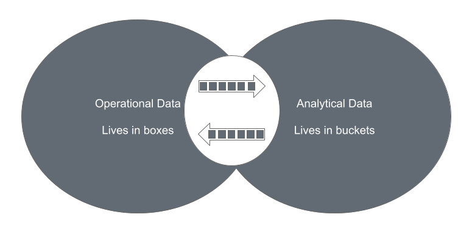
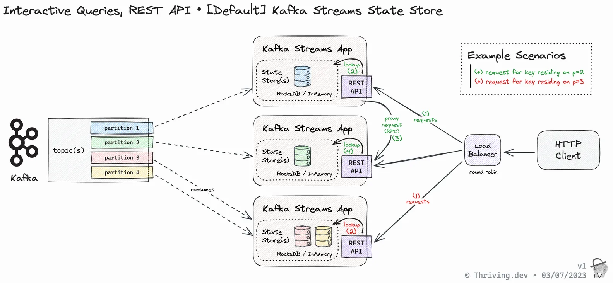
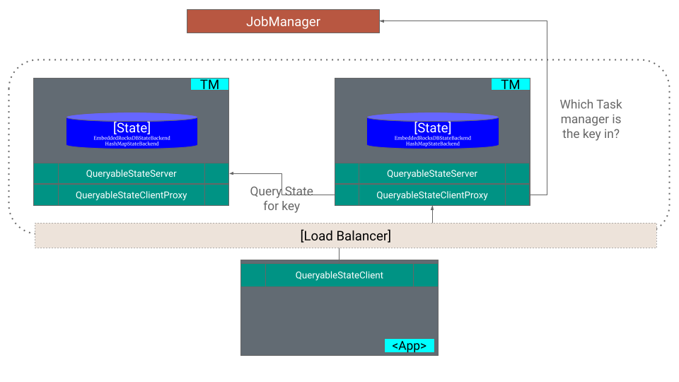

## Background

Traditionally, there are 2 categories of data inside most organizations. The Operational Data that the systems use for running the business is stored in databases, and the Analytical Data that the systems use for generating insights is stored in buckets. The data from the operational estate is moved over to the analytical estate with some data engineering techniques, either in batches or through streams in real time while processing and transforming the data. These worlds of Operational and Analytical data intersect but are largely independent and maintained by separate teams.





However, in recent times, there has been a lot of convergence between the two data world views. For example, if a SaaS application uses Machine Learning to generate an insight based on the user activity and provide this to the user, it involves data in both the data estates since it involves solving for the business use case and generating analytics. This is a common pattern emerging, where the data moves only from the Operational plane to the Analytical plane but in the other direction as well. This can be a result of machine learning models or real-time data processing in general. Stream processing systems such as Kafka Streams or Apache Flink fit in this kind of architecture.

Stream processing works on data in motion, and therefore it is perennially in transit. Stream processing probably is in both data world views, i.e., in the Operational estate and the Analytical estate, depending on the context. If the stream processor computes an aggregate for an user and does event sourcing, or CQRS, it can be labeled as Operational data. But if that data is ingested into an RTOLAP database or running stream processing jobs to generate insights, it can be classified as Analytical data, where it has no immediate business impact. 

Another interesting worldview that has emerged recently is the concept of a streaming data plane. This implies the state of the data as when it is in transit and potentially being processed. Most stream processing systems do not allow to talk directly to the stream processing system because the notion of consistency in stream processing is different from the database world. The stream processor would write the results to a sink after processing, which is where the data is accessible. This is the streaming data plane, where the streaming data plane talks to you and not the other way around.


## Querying the stream processing system

Thus began the idea of being able to talk to the stream processing system directly instead of having an additional hop of an external data store where the data is sinked into. This meant talking to the state backend, usually in memory or an embedded database like RocksDB. This is a popular pattern that has emerged. In Kafka Streams, one of the interesting features is the ability to interactively query the state stores. This is implemented through RPCs and knowledge of where a particular key is stored in a distributed Kafka Streams application. This essentially results in a distributed database, which can be purpose built for unique use cases. When Kafka Streams is embedded in an application, this pattern results in a distributed database embedded in the application supporting various use cases without having to use an additional system like Redis or Memcache. 




### Querying the state store in Apache Flink

Although Kafka Streams provides the ability to query the state store interactively, Kafka Streams is a library rather than a complete stream processing system that lacks a few important concerns for a stream processing system. Apache Flink has resource management as a first class concern, along with the ability to snapshot the state regularly for disaster recovery. Apache Flink is the most comprehensive unified processing system with first class streaming and batch processing. It supports a wide range of connectors while providing exactly once consistency guarantees. All of these make Flink the standard for stream processing.




Interactively querying the state store in Apache Flink involves the intersection of three different subsystems -


1. `QueryableStateClient` - The client responsible for querying the Flink state store for a particular key in a job. The `QueryableStateClient` talks to any task manager for querying the state.
2. `QueryableStateClientProxy` - A server side component that is responsible for talking to the job manager and understanding where the queried key is located since Flink is a distributed system where the state is distributed among multiple task managers. The job manager does the bookkeeping of where a particular key group lies and which task slot it is scheduled to. The `QueryableStateClientProxy` resides in all task managers.
3. `QueryableStateServer` - The QueryableStateServer is responsible for serving the query from the state store after the state store is determined by the QueryableStateClientProxy.

All of the state data is retrieved from the Flink state store without the need for the data to be sinked to an additional data store.


#### Queryable State Store in Apache Flink

By default, the state stores in Apache Flink are not queryable. The state stores need to be explicitly marked as queryable for running interactive queries on them. There are 2 approaches to doing this -


1. QueryableStateStream - A convenience object that acts as a sink and offers its incoming values as a queryable state.
2. setQueryable - `stateDescriptor.setQueryable(String queryableStateName)` makes the keyed state represented by the state descriptor, queryable.

The Flink distribution will also require the [flink-queryable-state-runtime](https://mvnrepository.com/artifact/org.apache.flink/flink-queryable-state-runtime){:target="\_blank"} dependency for querying the state stores. The property `queryable-state.enable` needs to be set to `true` in the Flink configuration.


##### Query Client Implementation

```java
QueryableStateClient client = new QueryableStateClient(tmHostname, proxyPort);
CompletableFuture<S> getKvState(
    JobID jobId,
    String queryableStateName,
    K key,
    TypeInformation<K> keyTypeInfo,
    StateDescriptor<S, V> stateDescriptor)
```


* The `getKvState` method returns a CompletableFuture eventually holding the state value for the queryable state instance identified by queryableStateName of the job with ID jobID. 
* The key is the key whose state you are interested in, and the keyTypeInfo will tell Flink how to serialize/deserialize it.
* The stateDescriptor contains the necessary information about the requested state, namely its type (Value, Reduce, etc.) and the necessary information on how to serialize/deserialize it.
* The returned future contains a value of type S, i.e., a State object containing the actual value. This can be any of the state types supported by Flink: ValueState, ReduceState, ListState, MapState, and AggregatingState.
* The client is asynchronous and can be shared by multiple threads. It needs to be shutdown via QueryableStateClient.shutdown() when unused in order to free resources.


##### Important gotchas


* These state objects do not allow modifications to the contained state. You can use them to get the actual value of the state, e.g., using valueState.get(), or iterate over the contained &lt;K, V> entries, e.g., using the mapState.entries(), but you cannot modify them. As an example, calling the add() method on a returned list state will throw an `UnsupportedOperationException`.
* When querying a state object, that object is accessed from a concurrent thread without any synchronization or copying. This is a design choice, as any of the above would lead to increased job latency, which we wanted to avoid. Since any state backend using Java heap space, e.g., HashMapStateBackend, does not work with copies when retrieving values but instead directly references the stored values, read-modify-write patterns are unsafe and may cause the queryable state server to fail due to concurrent modifications. The `EmbeddedRocksDBStateBackend` is safe from these issues.


#### Scaling

Scaling the queryable state server and client involves tuning the following configurations -


* `queryable-state.server.network-threads`: number of network (event loop) threads receiving incoming requests for the state server (0 implies the number of task slots).
* `queryable-state.server.query-threads`: number of threads handling/serving incoming requests for the state server (0 implies the number of task slots).
* `queryable-state.proxy.network-threads`: number of network (event loop) threads receiving incoming requests for the client proxy (0 implies the number of task slots).
* `queryable-state.proxy.query-threads`: number of threads handling/serving incoming requests for the client proxy (0 implies the number of task slots).


### Real world usage

New Relic uses the queryable state store in Apache Flink to replace solutions such as Redis for querying the aggregated golden signals directly from Apache Flink. Relative to using Redis for this use case, New Relic observed that the queryable state store solution was 97% cheaper at the scale New Relic operates at, which is about 71 million golden metrics per minute. The [talk](https://www.slideshare.net/slideshow/using-queryable-state-for-fun-and-profit/252482376){:target="\_blank"} from New Relic at Flink Forward 2022 discusses this in depth and the benefits they achieved.

Other scenarios where the queryable state store might be useful is for a look aside cache scenario, potentially in the gaming industry where many clients have to be handled for a bunch of metrics.


## Conclusion

The Queryable State Store feature in Apache Flink is no longer maintained due to a lack of maintainers. However, it is still available as part of new releases. This is still possible and actively maintained in Kafka Streams if that fits the bill. Another category of systems to explore is the streaming databases, which also resides in the _streaming data plane_. The main difference between streaming databases and a data flow oriented system like Flink is that Flink has control over the data flow. In the future, it is possible that many databases will provide such capabilities directly in the database, including stateful stream processing and UDF support; Aka return to materializedViews++.

For an implementation of the queryable state store, refer to the [GitHub repository](https://github.com/Platformatory/flink-queryable-state-store){:target="\_blank"} for a proof of concept. The feature is extremely useful in low latency scenarios, saving an additional hop. However, it is prone to shuffles and should usually be augmented by a caching layer. This puts Flink in the operational land but might raise concerns over managing a ton of socker connections asking for “live data”; possibly solved with a push layer.
