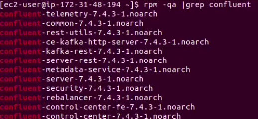
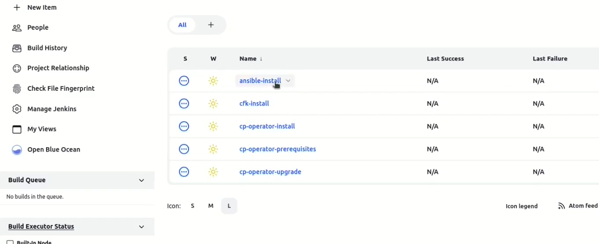
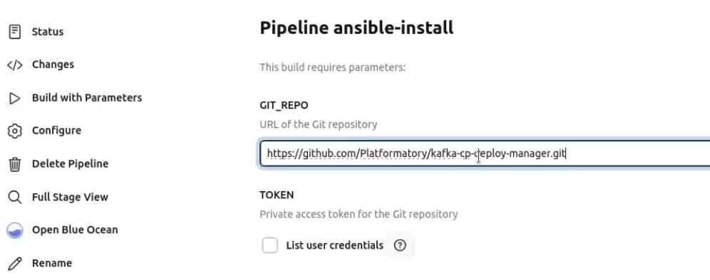
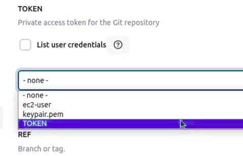
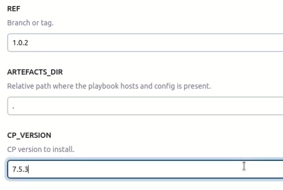
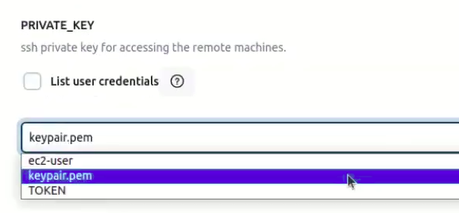
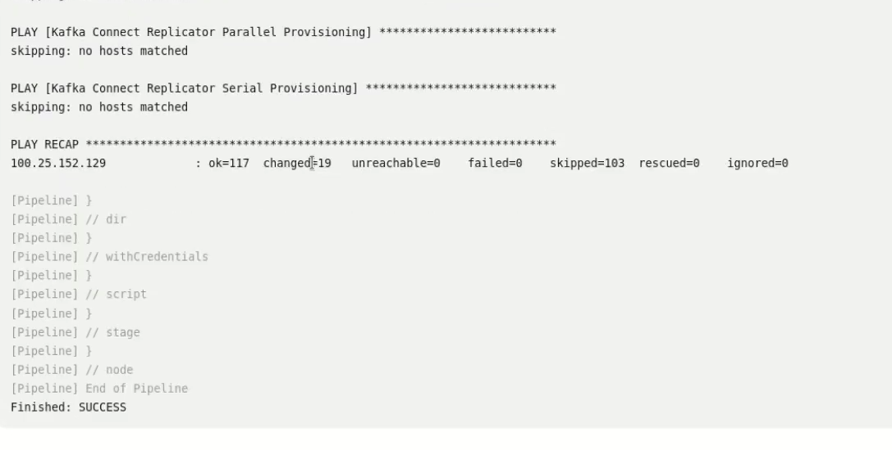
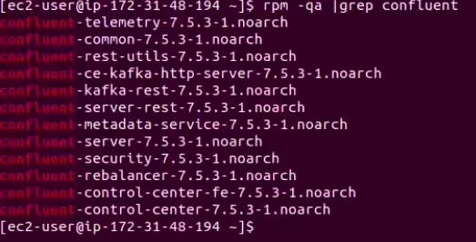

# Automating Kafka Deployments with CI/CD

Deploying Kafka, whether the open-source version or Confluent Platform, presents a myriad of challenges like managing dependencies and ensuring compatibility to handling scaling and fault tolerance, the process can be intricate and time-consuming. This blog delves into the current deployment options for Kafka, the challenges faced, and how a CI/CD implementation can revolutionize your deployment strategy.


## **Current Kafka Deployment Options**

We won't cover manual deployments since they aren't typically used in production environments. Instead, there are two main methods for deploying Kafka:

1. **Ansible**: Ansible automates Kafka deployment through the use of playbooks, which are YAML files defining the deployment process. By leveraging the Ansible you can configure, deploy, and manage Kafka clusters with minimal manual intervention. Ansible’s agentless architecture allows it to work seamlessly across different environments, making it a flexible and reliable option for managing Kafka deployments.

2. **Kubernetes**: Deploying Kafka on Kubernetes allows you to leverage container orchestration, providing scalability, fault tolerance, and ease of management. Kubernetes can manage the entire lifecycle of Kafka clusters, from deployment and scaling to upgrades and failure recovery. Tools like Strimzi or the Confluent Operator can be used to simplify the deployment and management of Kafka on Kubernetes.

Deploying Kafka or the Confluent Platform is a multifaceted process that requires careful planning, configuration, and ongoing management to ensure optimal performance and reliability. The complexity arises from the need to balance various factors such as hardware requirements, security, data management, monitoring, and scaling. Expertise and continuous attention to detail are crucial for successful deployments.


## **Challenges in Kafka Deployment**

Ansible deployed clusters

- Requires familiarity with Ansible and its configuration.

- Playbooks might need adjustments for complex or non-standard setups.

And Kubernetes,

- Requires a Kubernetes environment and knowledge of Kubernetes operations.

- Initial setup and configuration might be complex for those unfamiliar with Kubernetes.


## **How CI/CD can work for Kafka Deployment**

Implementing Continuous Integration and Continuous Deployment (CI/CD) for Kafka offers several benefits:

- **Single Source of Truth**: Centralized configuration management ensures consistency across environments.

- **Administrator-Regulated Using Version Control**: Changes are tracked, audited, and managed through version control systems like Git, enhancing security and compliance.

- **Ease of Rolling Updates**: Automated deployment pipelines facilitate seamless updates and reduce the risk of human errors.

- **One-Push Mechanism**: Simplified deployment process through a user-friendly interface, eliminating the need for in-depth Kafka expertise.


## **In comes kafka-cp-deploy-manager**

This is the solution we've devised, called `kafka-cp-deploy-manager`. It aims to address some of the limitations in existing solutions, which will be discussed later in this blog.

Managing Kafka clusters can be challenging, with tasks like version upgrades, configuration changes, and scaling to meet demand requiring careful coordination. The `kafka-cp-deploy-manager` streamlines this process by managing the state of Kafka clusters and automating deployments to reach the desired configuration.

We've built a pre-configured pipeline using Confluent’s Ansible-based deployment solution for Kafka, enhancing its usability. This tool allows us to create deployment pipelines for other methods like open-source Apache Kafka and Confluent for Kubernetes (CFK).


### **How It Works**

`kafka-cp-deploy-manager` works alongside Jenkins for continuous deployment on any state changes. Jenkins abstracts away the deployment complexity by providing simplified configurable variables in an interactive UI. This integration ensures that any state changes are deployed consistently and reproducibly, mitigating human error.


### **Sample Configuration**

To illustrate the effectiveness of `kafka-cp-deploy-manager`, let's look at a sample configuration. We can use a yaml file like this to set up custom pipelines. Here’s what you need to set up:

```
all:
  vars:
    ansible_connection: ssh
    ansible_user: root
    ansible_become: true
    ansible_ssh_private_key_file: /path/to/private-key
    git_repository_url: "artifacts_repo_url"
    git_token: "token"

  jenkins:
    hosts:
      hostname:
    vars:
      pipeline: "pipeline_name"
    environment:
      JENKINS_HOME: /data/jenkins

  jenkins_agent:
    hosts:
      hostname:
    vars:
      collections: /path/to/confluent_files.jar
```
- `artifacts_repo_url`: The repository containing the artifacts.

- `token`: To access the Git repository.

- `pipeline_name`: The pipeline that needs to be run.

- `/path/to/confluent_files.jar`: Specifies where the necessary jar files are located.

These configurations enable users to manage their Kafka clusters effectively with a simple, configurable interface without requiring an in-depth understanding of Kafka.


### **Example Scenario:**

Let us see how easily we can upgrade the confluent platform using `kafka-cp-deploy-manager`


### **Upgrading Kafka with kafka-cp-deploy-manager**

We have a Confluent Platform version 7.4.3 installed on an EC2 instance. Now, we will upgrade Kafka to version 7.5.3.

1. Check the current version of Confluent Platform

    

2. **Access the Ansible Install Pipeline**: Navigate to the pipeline dashboard.

     

3. **Add Required Parameters**:

   1. **URL of Git Repository**: Provide the repository URL.

       

   2. **Git Repo Access Token**: Input the access token.

      

   3. **Branch**: Specify the branch for the new version.

   4. **Confluent Platform Version**: Set to 7.5.3.
   
      

   5. **Private Key of EC2 Instance**: Provide the private key for the instance.
   
      

4. **Trigger the Build**: Click on 'Build' to run the pipeline.

    

5. **Monitor the Console Output**: Watch the pipeline run in the console output.

    

6. **Verify the Upgrade**: Check the Confluent Platform version in the EC2 instance to ensure it has been upgraded to 7.5.3.!

    


## Conclusion

`kafka-cp-deploy-manager` is a powerful tool that helps users manage their Kafka clusters efficiently. With its consistent and reproducible deployment pipelines, minimized human error, smooth upgrades and rollbacks, and clear separation of privileges, it simplifies Kafka cluster management. Users can achieve effective Kafka cluster management with a simple, configurable interface, making the process accessible even without deep Kafka knowledge.


### **Key Benefits**

1. **Consistent and Reproducible Deployment Pipelines**: Ensures that deployment pipelines are consistent, reducing the chances of errors and inconsistencies.

2. **Mitigates Human Error**: By automating the deployment process, it minimizes human error, making the process more reliable.

3. **Smooth Upgrades and Rollbacks**: Version changes to the state file are easily managed, ensuring smooth upgrades and rollbacks.

4. **Isolation Between Write and Execute Privileges**: Admins can create or modify state files, while developers can trigger the deployment process, ensuring clear separation of responsibilities.
