---
layout: post
title: "Monitoring: How to monitor AWS MSK Cluster"
author: Zeenia
categories: [Apache Kafka, Docker Compose, AWS MSK cluster, Prometheus, Grafana]
image: assets/blog-images/msk_monitoring/Prometheu.png
teaser: Monitoring, How to monitor AWS MSK Cluster
featured: false
hidden: false
toc: true
---

# **Monitoring: How to monitor AWS MSK Kafka Cluster**

## **Introduction**
Amazon Managed Streaming for Apache Kafka (MSK) securely streams data with a fully managed, highly available Apache Kafka service, utilizing an open-source version of Apache Kafka which allows you to focus on building and running applications. A properly running Kafka cluster can handle a significant amount of data. So, it is essential to monitor the health of your Kafka cluster to maintain reliability and performance of your Kafka cluster. 

In this blog, we’ll explore how to monitor the MSK Kafka cluster using open-source tools like Prometheus and Grafana. With the help of these tools, we can get a good understanding of our Kafka cluster’s health, identify issues, and make better decisions about resource allocation and budgeting. To keep your Kafka cluster running optimally, it is important to focus on these three things: optimizing performance, high availability, and managing costs. By monitoring load utilization, we can identify which broker is struggling due to high load, while tracking resource usage which helps optimize performance. Additionally, tracking the cost associated with specific resources, allows you for better budget planning and prioritization according to your business needs.


## **Why Do We Choose Open-Source Monitoring Over CloudWatch?**
We’re using open-source monitoring tools like Prometheus and Grafana instead of AWS CloudWatch because CloudWatch charges additional costs for monitoring various resources when you create a cluster. With basic monitoring in CloudWatch, you only get metrics related to broker and cluster. However, by using the open-source monitoring tools, you can monitor all the resources such as topics, partitions, brokers, and clients without any additional cost. This approach not only saves money but also time, as it provides detailed cost metrics per resource. In contrast, AWS Cost Explorer groups all expenses like outbound charges, data transfer within a region, and storage provisioning under the Amazon MSK category, making it a little difficult to find which resource is costing you the most. With Open-source monitoring, you can identify which resource is costing you the most and prioritize your budget and resource allocation accordingly. 

## **Process Flow for Monitoring Apache Kafka with Amazon MSK**
  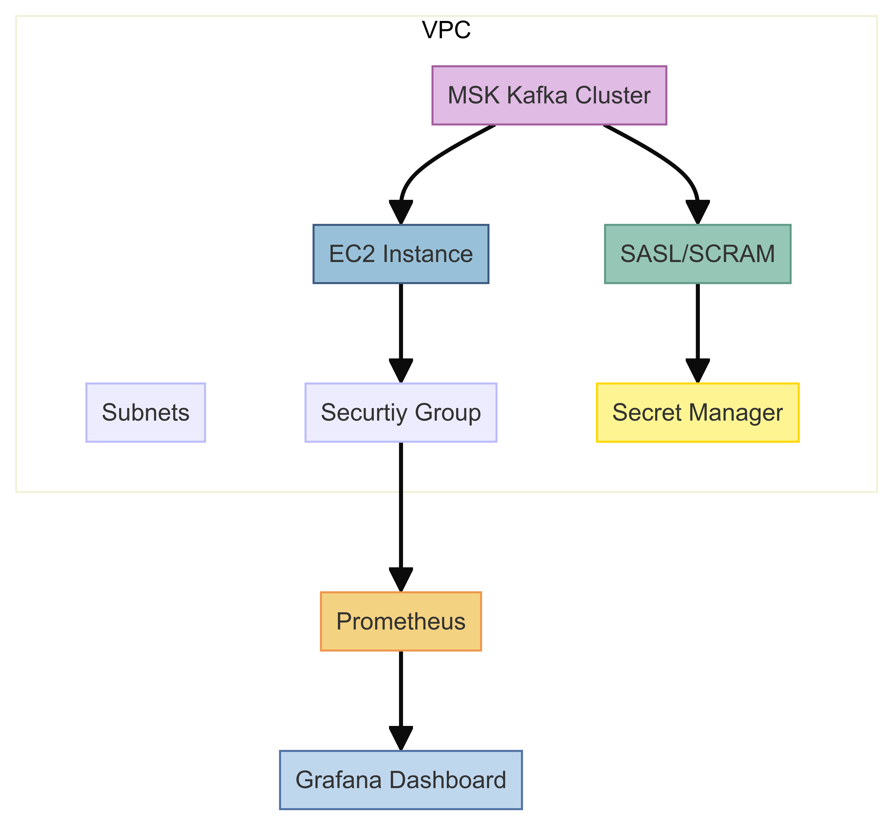

Here, we created a VPC with three subnets. The number of subnets should match the number of brokers in your cluster. We also created a security group that is attached to both the MSK Kafka cluster and the EC2 instance, so ensure that the security group is the same for both. Since we are using SASL/SCRAM authentication, you need to associate a secret with the cluster, which we will create in the Secrets Manager. Refer to the following document for instructions on creating a secret in the Secrets Manager.

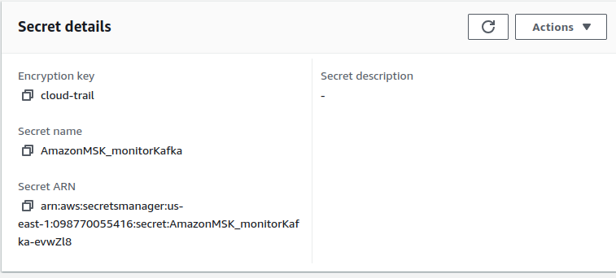

**Note:** Ensure that you enable open monitoring with Prometheus, for both the JMX and Node Exporter, when creating the MSK Kafka cluster.


Configure the following inbound rules for the security groups associated with the cluster:

- SSH Port: 22
- Prometheus Port: 9090
- Grafana Port: 3000

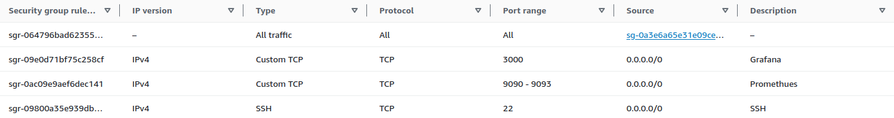

These inbound rules will allow access to the Prometheus and Grafana dashboards via your browser. We will use open-source Apache Kafka metrics instead of CloudWatch. Prometheus will collect data from the EC2 instance, and Grafana will retrieve the data from Prometheus.

## **Configuration**
### **Prometheus Configuration**
```yaml
global:

  scrape\_interval:     15s

  evaluation\_interval: 15s


scrape\_configs:

  - job\_name: 'Kafka-broker'

    file\_sd\_configs:

      - files:

        - 'targets.json'

    static\_configs:

    - labels:

        env: "dev"

    relabel\_configs:

      - source\_labels: [\_\_address\_\_]

        target\_label: instance

        regex: '([^:]+)(:[0-9]+)?'

        replacement: '${1}'

```

As we are monitoring MSK cluster for both Kafka broker as well as node, instead of writing all the broker DNS names here, we have created a “**target.json”** file in which we have included the broker DNS names and the port. Amazon MSK uses port 11001 for the JMX Exporter and port 11002 for the Node Exporter. 

**targets.json**
```
[

  {

    labels": {

      "job": "Kafka-broker",

      "env": "dev",

      "cluster": "monitoring-msk"

    },

    "targets": [

      "b-1.monitoringmsk.a2801f.c18.Kafka.us-east-1.amazonaws.com:11001",

      "b-2.monitoringmsk.a2801f.c18.Kafka.us-east-1.amazonaws.com:11001",

      "b-3.monitoringmsk.a2801f.c18.Kafka.us-east-1.amazonaws.com:11001"

    ]
  },

  {

    "labels": {

      "job": "node",

      "env": "dev",

      "cluster": "monitoring-msk"

    },

    "targets": [

      "b-1.monitoringmsk.a2801f.c18.Kafka.us-east-1.amazonaws.com:11002",

      "b-2.monitoringmsk.a2801f.c18.Kafka.us-east-1.amazonaws.com:11002",

      "b-3.monitoringmsk.a2801f.c18.Kafka.us-east-1.amazonaws.com:11002"
    ]

    }
]
```


## **Grafana Dashboards**
### **Kafka Cluster Utilization**
In this We are monitoring the Utilization of our MSK cluster such as: 
#### **Thread Utilization**
The network and request handler capacity metric group contains metrics regarding the amount of time the request handler and network process are used. Kafka networks processor threads are responsible for reading and writing the data to Kafka clients across the network. Meanwhile, the request handler threads are responsible for client requests i.e. reading and writing messages to the disk. 

The metrics available are: 

- Request Handler 

  |**Expr:** 100 - Kafka\_server\_KafkaRequestHandlerPool\_Count{name="RequestHandlerAvgIdlePercent", job="Kafka-broker", env=~"$env", instance=~"$instance"}
<br>

- Network Processor

  |**Expr:** 100 - Kafka\_network\_SocketServer\_Value{name=\"NetworkProcessorAvgIdlePercent\", job=\"Kafka-broker\", env=~\"$env\", instance=~\"$instance\"}

The Percentage of Request handler and Network processor usage is in between 0-100. If it’s 0 then all resources are used and 100 i.e. all resources are available.

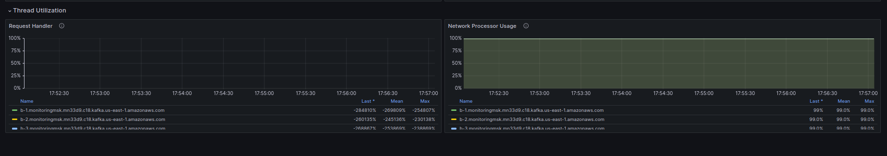

#### **System Utilization**
Here, we are monitoring the cluster or broker load, which allows us to identify which brokers are overloaded. The broker can be overloaded when partitions in the topic are given correctly. In that case, increasing the number of partitions could help the load across the Kafka brokers. Similarly, there are other scenarios where adjustments can optimize performance. This not only reduces the pressure on the request handler , but also Kafka throughput will increase

The metrics available are: . 

- Disk I/O utilization: 

  |**Expr**: (rate(node\_disk\_read\_bytes\_total{job=\"node\"}[5m]) + rate(node\_disk\_written\_bytes\_total{job=\"node\"}[5m]))/1000000000
  
  |**Percentage**: $Expr \* 100
<br>

- Memory Usage 

  |**Expr**: (sum(java\_lang\_Memory\_HeapMemoryUsage\_used{job=\"Kafka-broker\", instance=~\"$instance\", env=\"dev\"}) + sum(java\_lang\_Memory\_NonHeapMemoryUsage\_used{job=\"Kafka-broker\", instance=~\"$instance\", env=\"dev\"})) + (sum(java\_lang\_Memory\_HeapMemoryUsage\_committed{job=\"Kafka-broker\", instance=~\"$instance\", env=\"dev\"}) + sum(java\_lang\_Memory\_NonHeapMemoryUsage\_committed{job=\"Kafka-broker\", instance=~\"$instance\", env=\"dev\"})
  
  |**Percentage**: $Expr \* 100*
<br>

- CPU Usage

  |**Expr**: irate(process\_cpu\_seconds\_total{job=\"node\", env=~\"$env\", instance=~\"$instance\"}[5m])\*100

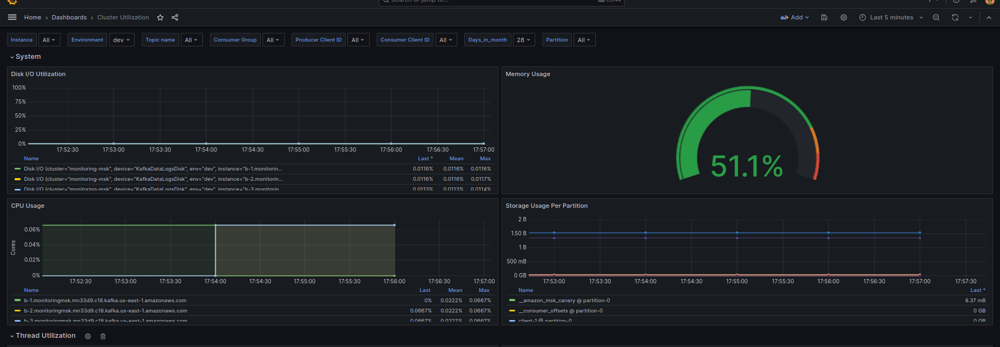

### **Resource Usage Based**
In this mode, we are calculating the storage usage by the following: 

- Topic 
- Partition 
- Instance 
- Client 

With the help of this, we can identify which resource is utilizing more storage, and understand the resource utilization pattern. 

When creating the cluster, you provision the storage according to your needs and that storage you pay for how much storage your resources have used from this provisioned storage.

By doing this,  you can see which resource is consuming how much storage. Based on this information,  you can decide whether to keep that resource or not.

Since the MSK cluster is a pay-for-what-you-use model, We can find how much storage usage per resource in GB-hours and in GB-months. This allows you to track the usage on a daily and monthly basis. Based on this information, we can plan for future capacity needs, scale our cluster, and optimize resource allocation. 

The following metrics are used: 

- Number of Clients 

  |**Expr:** count(count by(client\_id) (Kafka\_server\_Fetch\_byte\_rate{client\_id!~\"^consumer-amazon.msk.\*\"})) + count(count by(client\_id) (Kafka\_server\_Produce\_byte\_rate{client\_id!~\"^producer-.\*\"}))
<br>

- Number of Partition 
- Number of Topics 
- Number of Brokers

  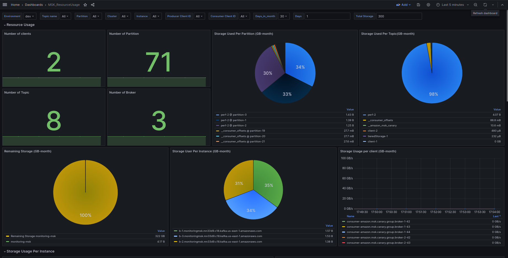

  
  |**Expr:**sum(Kafka\_controller\_KafkaController\_Value{name=\"<globalPartitionCound/globalTopicCount>\", job=\"Kafka-broker\", env=\"dev\", instance=~\"$instance\", cluster=~\"$cluster\"})


#### **Storage Used**

Monthly: 

  |**Expr:** sum by(<broker/topic/partition>) (rate(Kafka\_log\_Log\_Value{name="Size", job="Kafka-broker", env="dev", instance=~"$instance", topic=~"$topic",partition=~"$partition"}[1h])) / $convert\_to\_GB / $GB\_Month
<br>

GB-hours:

  |**Expr:** sum by(<broker/topic/partition>) (rate(Kafka\_log\_Log\_Value{name="Size", job="Kafka-broker", env="dev", instance=~"$instance", topic=~"$topic",partition=~"$partition"}[1h]))
<br>

- Partition 

  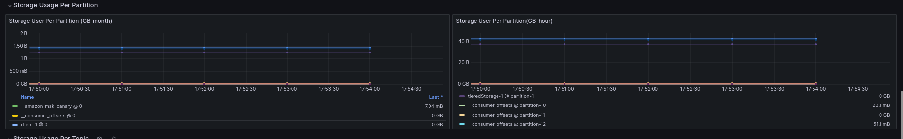

- Topic 

  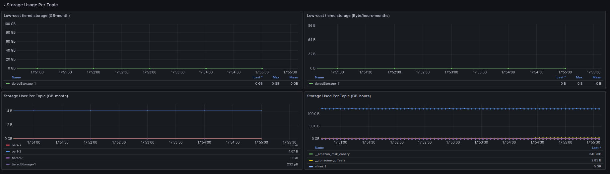

- Instance 

  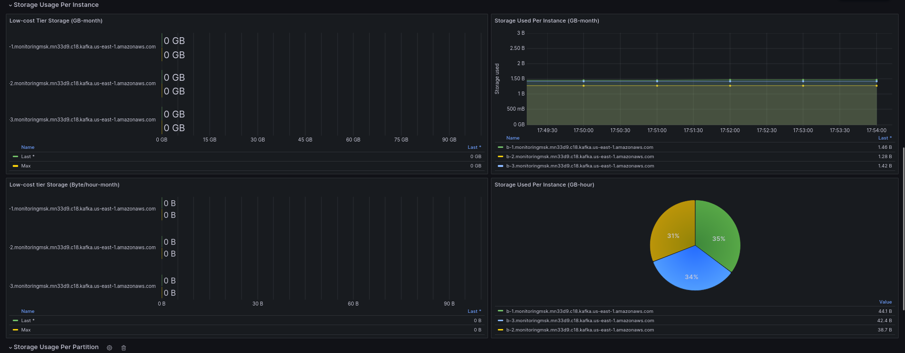

#### **Tiered Storage**
- Instance 
- Topic 

Monthly: 

  |**Expr:** sum by(<broker/topic>) (rate Kafka\_server\_BrokerTopicAggregatedMetrics\_Value{name="RemoteLogSizeBytes", job="Kafka-broker", env="dev", instance=~"$instance", cluster=~"$cluster"}[1h])) \* $GB\_Month / $convert\_to\_GB
<br>

GB-hours:

  |**Expr:** sum by(<broker/topic>) (rate(Kafka\_server\_BrokerTopicAggregatedMetrics\_Value{name="RemoteLogSizeBytes", job="Kafka-broker", env="dev", instance=~"$instance", cluster=~"$cluster"}[1h]))


### **Cost Center**
In this model, We provide an estimate how much it will cost you based on the resource usage in the previous model. We will calculate the cost based on the following resources: 

- Topic 
- Partition 
- Instance 
- Client 

The cost of the above-mentioned resources are calculated based on the observed GB-month resource usage. This model works well for the scenarios with very high Kafka cluster utilization over long periods of time. 

The following metrics are used: 

#### **Outbound Charges monthly**

  |**Expr:** sum by(instance) (rate(Kafka\_server\_BrokerTopicMetrics\_Count{name=\"BytesOutPerSec\", job=\"Kafka-broker\", env=\"$env\", cluster=\"$cluster\"}[1m])) / $convert\_to\_GB / $GB\_Month


#### **Storage Usage Cost monthly**
- Client 

  |**Expr:** sum by(client\_id) (rate(<Kafka\_server\_Produce\_byte\_rate/Kafka\_server\_Fetch\_byte\_rate>{client\_id=~\"$producer\_client\_id\", job=\"Kafka-broker\", env=\"dev\", instance=~\"$instance\"}[1h])) / $convert\_to\_GB / $GB\_Month
<br>

- Partition 

  |**Expr:** sum by(topic, partition) (rate(Kafka\_log\_Log\_Value{name=\"Size\", job=\"Kafka-broker\", env=\"dev\", instance=~\"$instance\", topic=~\"$topic\", partition=~\"$partition\"}[1h])) / $convert\_to\_GB / $GB\_Month
<br>

- Topic 

  |**Expr:** sum by(topic) (rate(Kafka\_log\_Log\_Value{name=\"Size\", job=\"Kafka-broker\", env=\"$env\", instance=~\"$instance\", topic=~\"$topic\"}[1h])) / $convert\_to\_GB / $GB\_Month

#### **Tiered Storage Cost**
- Topic 

  |**Expr:** sum by(topic) (rate(Kafka\_server\_BrokerTopicAggregatedMetrics\_Value{name=\"RemoteLogSizeBytes\", job=\"Kafka-broker\", env=\"dev\", topic=~\"$topic\", instance=~\"$instance\"}[1h])) \* $GB\_Month / $convert\_to\_GB
<br>

- Instance 

  |**Expr:** sum by(instance) (rate(Kafka\_server\_BrokerTopicAggregatedMetrics\_Value{name=\"RemoteLogSizeBytes\", job=\"Kafka-broker\", env=\"dev\", instance=~\"$instance\", cluster=~\"$cluster\"}[1h])) \* $GB\_Month / $convert\_to\_GB

#### **Instance Charges Monthly**

  |**Expr:** sum by(instance) (rate(Kafka\_log\_Log\_Value{name="Size", job="Kafka-broker", env="dev", instance=~"$instance", cluster=~"$cluster"}[1h])) / $convert\_to\_GB / $GB\_Month

  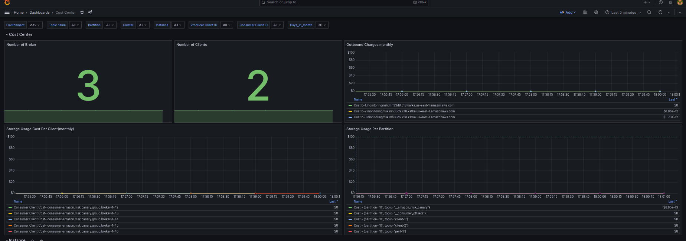

  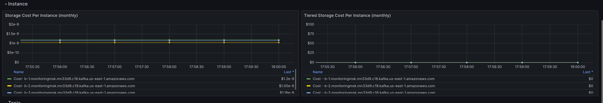

  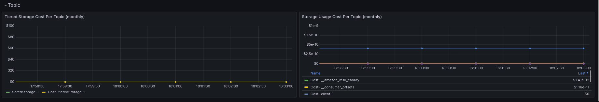


## **Conclusion**
In conclusion, With the help of MSK cluster, you don’t have to worry about your servers, you just need to take care about the storage usage and cost . Performing open monitoring on MSK clusters using prometheus and grafana without relying on cloudWatch metrics offers the cost-effective way to manage your Kafka cluster. This also encourages the usage of resources and provides detailed insights to the team, and accordingly they can plan their budget for further uses. To further improve this dashboard, you can include the cross-zone charges metrics in the cost center dashboard by creating the custom metrics for availability zone, and region. This will help you to optimize your Kafka cluster even further. 

