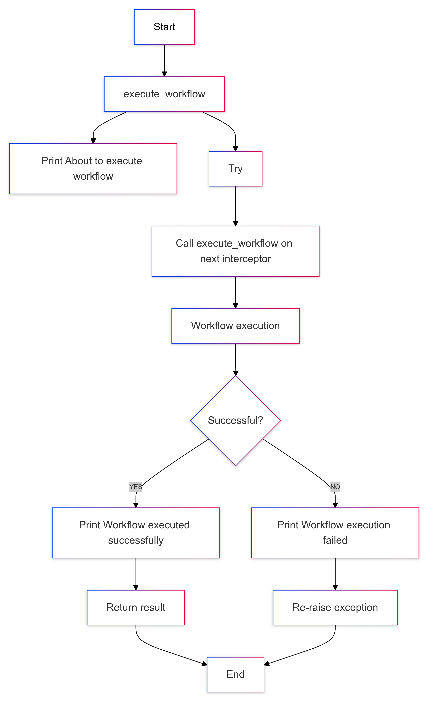

# Introduction

Temporal is an open-source platform designed for managing workflows and microservices orchestration, providing features like state persistence, task queuing, and scheduling. One of its powerful features is the ability to use interceptors, which enable you to customize and extend the behavior of workflows, activities, and other components. This blog primarily focuses on interceptors in the Temporal Python SDK, while exploring what they are, how they function, and how you can leverage them to enhance your workflow management.


# So What are Temporal Interceptors?

Interceptors in Temporal are hooks that allow developers to insert custom logic at various points in the execution of workflows and activities. They can be used to implement cross-cutting concerns such as logging, metrics collection, error handling, retries, and security checks without polluting the core business logic.


# Types of Interceptors

Temporal provides SDKs for various programming languages, and Interceptors can differ between different Temporal SDKs. For example, the Java SDK and Python SDK have different sets of interceptors and the way they are implemented and used can vary.

While each Temporal SDK has its own set of interceptors, the way they are implemented and used can vary. The types of interceptors are not inherently different across SDKs, but their implementation and usage can differ based on the language and the SDK's design.

For example, in the Java SDK, interceptors are located in the io.temporal.common.interceptors package and include types such as WorkflowOutboundCallsInterceptor, WorkflowInboundCallsInterceptor, ActivityInboundCallsInterceptor, ScheduleClientCallsInterceptor, WorkerInterceptor, WorkflowClientCallsInterceptor, and WorkflowClientInterceptor. 

In the Python SDK, the interceptors are part of the temporalio package. The Python SDK includes types such as temporalio.worker._interceptor, temporalio.contrib.opentelemetry.TracingInterceptor, temporalio.contrib.opentelemetry.TracingWorkflowInboundInterceptor, and temporalio.client.OutboundInterceptor. 

So, while both SDKs use interceptors to intercept calls within the Temporal system, the specific types and their implementations can vary between the two SDKs. This is largely due to the differences in language features and idioms, as well as the design of the SDKs themselves.

If we were to take the Python SDK as an example, there are primarily 2 types of Interceptors.

**Interceptor**: This is the base class for creating custom interceptors. It provides methods that can be overridden to intercept activities and workflows. The primary methods in this class are intercept_activity and workflow_interceptor_class.

**WorkflowInboundInterceptor**: The WorkflowInboundInterceptor class is used to intercept inbound calls to a workflow. It provides several methods that can be overridden to intercept different types of calls like init , execute_workflow, handle_signal, handle_query.

While these are only the primary Interceptor classes, there are specific implementations of these classes that extend from them.

**contrib.opentelemetry.TracingInterceptor**: This is a specific implementation of the Interceptor class. It extends Interceptor and overrides its methods to add OpenTelemetry tracing functionality.
This interceptor is used for tracing purposes. This is an OpenTelemetry tracing interceptor. It provides methods like init, intercept_activity, intercept_client, and workflow_interceptor_class. It automatically creates and propagates OpenTelemetry spans for all client calls, activities, and workflow invocations on the worker. 

**contrib.opentelemetry.TracingWorkflowInboundInterceptor**: This is another type of interceptor used for tracing. This is a specific implementation of the WorkflowInboundInterceptor class. It extends WorkflowInboundInterceptor and overrides its methods to add OpenTelemetry tracing functionality.
It provides methods like handle_query, handle_signal, handle_update_handler, and handle_update_validator. This interceptor can be used when you want to add tracing to inbound workflow calls. 

Each of these interceptors can be used in different scenarios depending on your specific use case and requirements. For example, if you want to add tracing to your application, you might use the TracingInterceptor and TracingWorkflowInboundInterceptor. If you want to add custom logic to the execution of an activity, you might use the worker.Interceptor. If you want to add custom logic to outbound calls made from within workflows, you might use the client.OutboundInterceptor.


# How Interceptors Work

Interceptors are run in a chain, and all interceptors work similarly. They accept two arguments: input and next, where next calls the next interceptor in the chain. All interceptor methods are optional—it's up to the implementer to choose which methods to intercept.

For example let us take the The WorkflowInboundInterceptor class in Temporal Python SDK, it is used to intercept inbound calls to a workflow. It provides several methods that can be overridden to intercept different types of calls. Below are the main methods provided by the WorkflowInboundInterceptor class for intercepting inbound calls to the workflow. You can find more details about the WorkflowInboundInterceptor class and its methods in the Temporal [Python SDK documentation](https://python.temporal.io/temporalio.worker.WorkflowInboundInterceptor.html).

**__init__:** This method is used to initialize a WorkflowInboundInterceptor instance. The next parameter is the next interceptor in the chain. The default implementation of all calls is to delegate to the next interceptor.

**execute_workflow:** This method is called to run the workflow. It takes an ExecuteWorkflowInput object as an argument and returns any value. The default implementation is to call execute_workflow on the next interceptor in the chain.

**handle_signal**: This method is called to handle a signal. It takes a HandleSignalInput object as an argument. The default implementation is to call handle_signal on the next interceptor in the chain.

**handle_query**: This method is called to handle a query. It takes a HandleQueryInput object as an argument and returns any value. The default implementation is to call handle_query on the next interceptor in the chain.

To get an idea of how an Interceptor will work let us look into the execute_workflow method of the WorkflowInboundInterceptor class:

The execute_workflow method is called when a workflow is about to be executed. It takes an ExecuteWorkflowInput object as an argument, which contains the information needed to execute the workflow, such as the workflow type and arguments. The method returns the result of the workflow execution.

Let's consider a simple custom logic where we print a message before and after the execution of the workflow. Here's how you might implement this in a WorkflowInboundInterceptor:


```python
class MyWorkflowInboundInterceptor(WorkflowInboundInterceptor):
    async def execute_workflow(self, input: ExecuteWorkflowInput) -> Any:
        print("About to execute workflow")
        try:
            result = await self.next.execute_workflow(input)
            print("Workflow executed successfully")
        except Exception as e:
            print("Workflow execution failed")
            raise e
        return result
```

Here’s a more detailed explanation of the execution, In this code:

* We define a new class MyWorkflowInboundInterceptor that extends the WorkflowInboundInterceptor class. This means that MyWorkflowInboundInterceptor is a type of WorkflowInboundInterceptor and can override its methods to add custom logic.

* We override the execute_workflow method. This method is called when a workflow is about to be executed. The input parameter is an ExecuteWorkflowInput object that contains the information needed to execute the workflow.

* At the start of the execute_workflow method, we add some custom pre-execution logic. In this case, we print the message "About to execute workflow". This message will be printed every time a workflow is about to be executed.

* We then call the execute_workflow method on the next interceptor in the chain. This is done using the await keyword because execute_workflow is an asynchronous method that returns a future. The await keyword pauses the execution of the current method until the future is resolved.

* If the call to execute_workflow on the next interceptor is successful, it means that the workflow was executed successfully. In this case, we add some custom post-execution logic to print the message "Workflow executed successfully".

* If the call to execute_workflow on the next interceptor throws an exception, it means that the workflow execution failed. In this case, we catch the exception, print the message "Workflow execution failed", and then re-raise the exception. This allows the exception to be propagated up the call stack.

* Finally, the execute_workflow method returns the result of the workflow execution. This result is then passed back up the chain of interceptors, allowing each interceptor to potentially modify or act upon the result before it's ultimately returned to the caller.

To give you a visual representation, here’s a flowchart of how this works:





# Implementing Interceptors in Your Temporal Application

To implement interceptors in your Temporal application using the Python SDK, you would typically follow these steps:

**Create an instance of the interceptor:** First, create your interceptor class that implements the relevant Temporal interceptor interface. This could be a Workflow or Activity interceptor depending on your needs.

Let us look at an example:

The below provided code defines two classes: Workflow_Interceptor and Test_Interceptor.

Workflow_Interceptor is a subclass of WorkflowInboundInterceptor and overrides the execute_workflow method. This method is called when a workflow is about to be executed. The input parameter is an ExecuteWorkflowInput object that contains the information needed to execute the workflow.

```python
class Workflow_Interceptor(WorkflowInboundInterceptor):
    async def execute_workflow(self, input: ExecuteWorkflowInput) -> Any:
                try:
           result = await super().execute_workflow(input)
           print("Workflow successfully executed.")
           return result
        except Exception as e:
           print("Workflow execution failed.")
           capture_exception()
           raise e

class Test_Interceptor(Interceptor):
    def workflow_interceptor_class(
        self, input: WorkflowInterceptorClassInput
    ) -> Optional[Type[WorkflowInboundInterceptor]]:
        return Workflow_Interceptor
```

When a workflow is about to be executed, Temporal calls the workflow_interceptor_class method of TestInterceptor to get the class of the workflow interceptor to use.

workflow_interceptor_class returns Workflow_Interceptor, so Temporal creates an instance of Workflow_Interceptor and calls its execute_workflow method to execute the workflow.

execute_workflow tries to execute the workflow by calling the execute_workflow method of WorkflowInboundInterceptor. If the workflow execution is successful, it prints "Workflow successfully executed." and returns the result. If an exception occurs, it prints "Workflow execution failed.", captures the exception, and re-raises the exception.

**Register the interceptor:** In Temporal's Python SDK, you can register an interceptor within the worker definition. This is done when creating a Worker instance, where you can pass your interceptor as part of the interceptors parameter. The below code is an example of a worker which is created with an interceptor that is defined in the above code snippet.

Here's the example:

```python
    # Connect to Temporal server

    client = await Client.connect("hostname:port", namespace="default")

    # Create an instance of TranslateActivities without session

    activities = TranslateActivities()

    # Create a worker with an interceptor

    worker = Worker(
        client,
        task_queue="greeting-tasks",
        workflows=[GreetSomeone],
        activities=[activities.greet_in_spanish],
        interceptors=[Test_Interceptor()],
    )
```

**Use the interceptor**: Once the interceptor is set, it will automatically intercept all relevant calls for every workflow associated with the worker. When the interceptor is defined in a worker definition, it will apply to all workflows managed by that worker.

The following code defines an activity, which triggers the intended logic in the Interceptor upon its completion (i.e. completion of the workflow) in this case a print statement in the Interceptor stating “Workflow successfully executed.”

```python
class TranslateActivities:
    def __init__(self):
        pass
    @activity.defn
    async def greet_in_spanish(self, name: str) -> str:
        greeting = self.generate_greeting(name)
        return greeting

    # Method to generate greeting message
    def generate_greeting(self, name: str) -> str:
        return f"Hola, {name}!"
```

Similarly to implement interceptors in your Temporal application using the Java SDK, you would typically follow these steps:

**Create an instance of the interceptor**: First, create your interceptor class that implements the relevant Temporal interceptor interface. This could be a WorkflowInboundCallsInterceptor or WorkflowOutboundCallsInterceptor depending on your needs.

Let's look at an example:

```java
public class MyWorkflowInterceptor implements WorkflowInboundCallsInterceptor {
    private final WorkflowInboundCallsInterceptor next;
    public MyWorkflowInterceptor(WorkflowInboundCallsInterceptor next) {
        this.next = next;
    }

    @Override
    public WorkflowOutput execute(WorkflowInput input) {
        try {
            System.out.println("Workflow is about to be executed.");
            WorkflowOutput output = next.execute(input);
            System.out.println("Workflow executed successfully.");
            return output;

        } catch (Exception e) {
            System.out.println("Workflow execution failed.");
            throw e;
        }
    }
}
```

In this example, MyWorkflowInterceptor is a class that implements the WorkflowInboundCallsInterceptor interface. It overrides the execute method to add custom logic before and after the workflow execution.

**Register the interceptor:** The interceptor can be registered when creating the WorkerFactory:

```java
WorkerFactoryOptions factoryOptions = WorkerFactoryOptions.newBuilder()
    .setWorkflowInterceptor(new MyWorkflowInterceptor())
    .build();
WorkerFactory factory = WorkerFactory.newInstance(client, factoryOptions);
```

In this code, MyWorkflowInterceptor is registered as the workflow interceptor when creating the WorkerFactory.

**Use the interceptor**: Once the interceptor is registered, it will automatically intercept all relevant calls for every workflow associated with the worker, just like when used in the Python SDK.

You can find more details about the WorkflowInboundCallsInterceptor and WorkflowOutboundCallsInterceptor interfaces in the [Temporal Java SDK documentation.](https://www.javadoc.io/doc/io.temporal/temporal-sdk/latest/io/temporal/common/interceptors/WorkflowInboundCallsInterceptor.html)


# Benefits of Using Interceptors

Interceptors in Temporal provide a powerful mechanism for adding custom logic around the execution of workflows and activities, or modifying the behavior of certain functions. Here are some benefits of using interceptors:


1. **Tracing and Logging**: Interceptors can be used to add tracing and logging to your application. This can help you monitor the execution of your workflows and activities, and diagnose issues. For example, the TracingInterceptor in the Python SDK automatically creates and propagates OpenTelemetry spans for all client calls, activities, and workflow invocations on the worker.
2. **Modifying Behavior**: Interceptors can modify the behavior of workflows and activities. For example, they can change the options for workflow/activity execution to apply company policies.
3. **Auditing:** Interceptors can be used to add auditing to your application. This can help you keep track of changes and actions in your application.
4. **Error Handling**: Interceptors can be used to add custom error handling to your application. This can help you manage and recover from errors in a consistent way.

By encapsulating cross-cutting concerns in interceptors, you keep the core business logic clean and maintainable. This makes it easier to reuse and compose different interceptors across multiple workflows and activities.


# Use Cases

At Platformatory, we have leveraged Temporal interceptors to streamline the workflow status management in one of our products. In our system, workflows represent complex processes with multiple steps, and keeping track of their completion status, whether successful or failed, is crucial for maintaining operational visibility and observability.Temporal also provides several tools to view and manage the status of workflows like Temporal Web UI which Provides detailed information about workflow execution, including input values, timeout configurations, retries, errors, and more and Temporal CLI which Allows you to describe the workflow and get information about its status.

Actions to take when a workflow fails can be implemented in your interceptor's logic or in a separate component that monitors the workflow statuses. These actions could retry the workflow, or fall back to a backup workflow.

Although you might manually update the status of a workflow at the start or end of its execution by embedding this logic within the workflow's code, this approach can lead to repetitive and error-prone code, where each workflow must handle its own status updates. To address this, we've implemented interceptors to automatically manage workflow statuses, reducing the need for repetitive code and ensuring consistency across our platform.


# Conclusion

Temporal interceptors are a powerful feature that allows you to enhance and customize the behavior of your workflows and activities. They not only improve the observability and robustness of your applications but also keeps your core business logic clean and maintainable. Whether you're looking to add custom logging, implement company policies, or handle errors in a consistent manner, Temporal interceptors offer a powerful solution.
