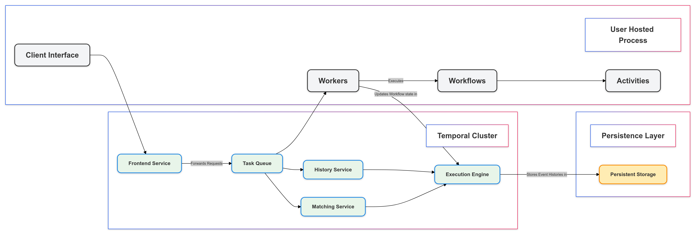

# What is Temporal?

Temporal is a durable execution platform that empowers developers to build scalable applications without compromising productivity or reliability. One of the core challenges in building distributed applications is managing complexities like handling failures, ensuring consistency, and maintaining visibility into the application state. Temporal addresses these challenges by providing powerful constructs that simplify error handling and retries, making it easier to build reliable systems. Additionally, Temporal's tools, such as its Web UI and CLI, offer developers robust visualization and control over workflow execution.


# Why Use Temporal?

Temporal abstracts the complexities of constructing scalable, reliable distributed systems by maintaining complete application state, enabling seamless migration of execution to another machine in the event of a host or software failure. It allows you to code resilience directly into your applications, removing the need for intricate failure and error handling logic, which accelerates development and simplifies infrastructure.

Temporal eliminates the need for traditional components like queues, pub/sub systems, and schedulers, which are often used to manage complex workflows in distributed systems. Instead, Temporal inherently manages task execution, event handling, and timing, significantly reducing architectural complexity while enhancing the reliability and scalability of your applications.


# High-level architecture

Temporal's architecture is designed to separate the application logic from the underlying execution infrastructure, providing a clear distinction between user-hosted processes and Temporal cluster processes.

To fully understand how Temporal's architecture operates, it’s important to first grasp the key components that make up the system. These components—Workflows, Activities, Workers, and the Temporal Server—each play a distinct role in how your application logic is executed and managed.

**Workflows** represent the heart of your application logic, defining the sequence of steps your application will take. Written using Temporal SDKs in the programming language of your choice, Workflows are designed to be deterministic, ensuring consistent outcomes given the same inputs. They are executed on your infrastructure, not directly on the Temporal Server.

**Activities** are discrete units of business logic within your application, designed to perform specific tasks that may be prone to failure, such as interacting with external services or sending emails. Like Workflows, Activities run on your infrastructure and are managed by Temporal to ensure reliability.

**Workers** are processes that execute your Workflows and Activities. They act as the bridge between your application logic and the Temporal Server, ensuring that your tasks are performed reliably and in the correct order. Workers constantly communicate with the Temporal Server to coordinate the execution of tasks.

**Temporal SDKs** (Software Development Kits) are open-source collections of tools, libraries, and APIs that enable Temporal Application development. They offer a Temporal Client to interact with the Temporal Service, APIs to develop your Temporal Application, and APIs to run horizontally scalable Workers. Temporal SDKs are available in multiple languages including Go, Java, PHP, Python, TypeScript, and .NET

The Temporal Server is the backbone of the Temporal system. It acts as the supervisor for your application, maintaining the source of truth for Workflow Execution Event Histories and ensuring that your distributed applications execute durably and consistently. This server can be hosted by you in a self-hosted setup or managed by Temporal through Temporal Cloud, a SaaS platform that abstracts the complexities of server management.





**User-hosted processes**


* User-hosted processes in the Temporal system refer to the Worker processes that execute the Workflow and Activity code of your application. These Worker processes are hosted and operated by you, the user, and they use one of the Temporal SDKs to communicate with the Temporal Server.
* The Worker processes are responsible for executing the Workflow and Activity code segregated from your application and communicating with the Temporal Server, The Worker processes continuously poll the Temporal Server for Workflow and Activity tasks, and on completion of each task, they send information back to the server.
* The main client of the User-hosted processes is the Temporal Server. The Worker processes communicate with the Temporal Server to receive tasks and update the server on task completion.

**Temporal Cluster**


* The Temporal Cluster is a group of services that together act as a component of the Temporal Platform. It includes the Temporal Server, combined with Visibility stores. One of the key components of the Temporal Server is the Frontend Service. The Frontend Service is a stateless gateway service that exposes a strongly typed API using Protocol Buffers (Protobuf). It is responsible for rate limiting, authorizing, validating, and routing all inbound calls, including those from the Worker processes.
* The Temporal Cluster is responsible for maintaining the state and progress of your workflows. It ensures that your distributed applications execute durably and consistently.
*  The History Service within the Temporal Cluster manages individual Workflow Executions, handling RPCs from the User Application and the Temporal Worker, driving the Workflow Execution to completion, and storing all state required for durable execution. 
   The Matching Service within the Temporal Cluster manages the Task Queues being polled by Temporal Worker processes, with a single task queue holding tasks for multiple Workflow Executions.
* The main clients of the Temporal Cluster are the User Applications and the Temporal Workers. The User Applications use one of the Temporal SDKs to communicate with the Temporal Server to start/cancel workflows, and interact with running workflows. The Temporal Workers execute the Workflow and Activity code and communicate with the Temporal Server.
*  The User Applications and Temporal Workers communicate with the Temporal Server (part of the Temporal Cluster) using the Temporal SDKs. This communication is done via gRPC, a high-performance, open-source framework for RPC communication. The Worker processes continuously poll the Temporal Server for tasks and send updates back to the server upon task completion.

Your application's logic runs in Workers on your infrastructure, while the Temporal cluster orchestrates and manages these Workers, ensuring everything runs smoothly and reliably. With Temporal Cloud, you can offload the management of the cluster to a hosted service, while self-hosting allows you to have full control over the infrastructure. In short, Temporal is a platform designed to ensure the durable execution of your application code. Temporal handles these challenges for you, enabling your application to run reliably and consistently even in the face of unexpected issues.


# What does Durable execution mean?

Durable Execution in the context of Temporal refers to the ability of a Workflow Execution to maintain its state and progress even in the face of failures, crashes, or server outages. This is achieved through Temporal's use of an Event History, which records the state of a Workflow Execution at each step. If a failure occurs, the Workflow Execution can resume from the last recorded event, ensuring that progress isn't lost. This durability is a key feature of Temporal Workflow Executions, making them reliable and resilient. It enables application code to execute effectively once and to completion, regardless of whether it takes seconds or years.

In other words, Durable Execution guarantees that the main function of your application and all the steps defined in it will effectively execute just once and to completion, even in the face of failures


# How does Temporal achieve Durable Execution?

Temporal achieves durable execution of your application code through a combination of Workflows, Activities, and an underlying Event History mechanism.

Temporal automatically retries failed Activities based on the Retry Policy configured for that Activity. This allows Temporal to handle transient failures and continue the Workflow Execution once the issue is resolved. You can configure the Retry Policy to fit your needs, specifying things like the maximum number of attempts, the initial interval between retries, and the maximum interval between retries.

The Event History is a key feature of Temporal that records the state of a Workflow Execution at each step. If a failure occurs, the Workflow Execution can resume from the last recorded event, ensuring that progress isn't lost. This durability is a key feature of Temporal Workflow Executions, making them reliable and resilient.

Timeouts in Temporal are used to detect application failures. They are configurable for both Workflows and Activities, allowing you to control the maximum duration of different aspects of a Workflow or Activity Execution. There are several types of timeouts that you can set:


* Workflow Timeouts: Each Workflow timeout controls the maximum duration of a different aspect of a Workflow Execution.
* Activity Timeouts: Each Activity timeout controls the maximum duration of a different aspect of an Activity Execution.
* Heartbeat Timeouts: A Heartbeat Timeout works in conjunction with Activity Heartbeats. An Activity Heartbeat is a ping from the Worker that is executing the Activity to the Temporal Service. If the Temporal Service does not receive a heartbeat from an Activity within the heartbeat timeout interval, it will consider the Activity as failed.

Here's an example of how Temporal handles a server crash:


1. A Workflow is running and executing Activities.
2. The server running the Temporal Cluster crashes.
3. After the Temporal Server (which could be the entire Temporal Cluster if it's a single-server setup) has stopped due to the crash, it is restarted. This could be a manual restart by an operator or an automatic restart by a system supervisor. In a multi-server setup, If one server crashes, the remaining servers in the cluster can continue to operate and maintain the state of the workflows.
4. The Workflow is still listed and running. It picks up where it left off when the server comes back online. Because when a Temporal server crashes, the state of the workflow is preserved in its history. If a worker is unable to communicate with the server, the workflow doesn't stop. Temporal times out the workflow task and places it back on the task queue. Another worker can then pick up the task and continue the execution by replaying the workflow history to recreate the workflow state.


# Developing Workflows and Activities

Let us take an example and look into developing Workflows and Activities using the Temporal Python SDK.

**Developing a Workflow**

In Temporal, workflows are defined as classes. The @workflow.defn decorator is used to identify a workflow, and the @workflow.run decorator is used to mark the entry point method to be invoked. Here's an example of a workflow definition:

```python
@workflow.defn
class GreetSomeone:
    @workflow.run
    async def run(self, name: str) -> str:
        greeting = await workflow.execute_activity(
            TranslateActivities.say_hello,
            name,
            start_to_close_timeout=timedelta(seconds=5),
        )
        return f"{greeting}"
```

In this example, when the run method of the GreetSomeone workflow is invoked with a name argument, it calls the say_hello activity with the same argument.

**Developing Activities**

Activities are where you execute non-deterministic code or perform operations that may fail. In the Temporal Python SDK, you define an Activity by decorating a function with @activity.defn. Here's an example of an activity definition:

```python
import urllib.parse
from temporalio import activity
class TranslateActivities:
    def __init__(self, session):
        self.session = session
    @activity.defn
    async def say_hello(self, name: str) -> str:
        greeting = await self.call_service("get-spanish-greeting", name)
        return greeting

    # Utility method for making calls to the microservices
    async def call_service(self, stem: str, name: str) -> str:
        base = f"http://localhost:9999/{stem}"
        url = f"{base}?name={urllib.parse.quote(name)}"
        async with self.session.get(url) as response:
            response.raise_for_status()
            return await response.text()
```

In this example, the say_hello activity calls the call_service method with the stem argument as "get-spanish-greeting" and the name argument. The call_service method constructs a URL using the stem and name arguments and makes a GET request to this URL using the aiohttp.ClientSession instance stored in self.session. The call_service method returns the text of the response, which is then returned by the say_hello activity.


# Understanding Workflow Execution in Temporal

When working with Temporal, it's essential to grasp how Workflow Execution unfolds. Let’s dive into the process, from launching Workers to handling failures and retries, to ensure you understand each step of Workflow Execution.

**Starting with the Worker**

The Workflow Execution hinges on the Worker, which runs your Workflow and Activity code. To begin, you need to launch the Worker, which involves starting a new process. In Python, this typically involves defining a main function that initializes a Temporal client, creates a Worker entity, and starts the Worker.

Here's a high-level overview of the process:


1. **Creating the Temporal Client:** This client interacts with the Temporal service and manages Workflow and Activity requests.
2. **Setting Up the Worker:** The Worker is created with the Temporal client, a task queue name, and the registered Workflows and Activities.
3. **Polling for Tasks:** Once the Worker is running, it maintains a long-lasting connection to the Temporal Cluster, polling for new tasks. At this point, the task queue is empty, and the Worker is idle.

In Python, you typically start a Worker process by defining a main function that initializes a Temporal client, creates a Worker entity, and starts the Worker. Here's a simplified example:

```python
import asyncio
import aiohttp
from temporalio.client import Client
from temporalio.worker import Worker
from translate import TranslateActivities
from greeting import GreetSomeone

async def main():
    client = await Client.connect("localhost:7233", namespace="default")

    # Run the worker
    async with aiohttp.ClientSession() as session:
        activities = TranslateActivities(session)
        worker = Worker(
            client,
            task_queue="greeting-tasks",
            workflows=[GreetSomeone],
            activities=[activities.greet_in_spanish],
        )

        print("Starting the worker....")
        await worker.run()

if __name__ == "__main__":
    asyncio.run(main())
```

In this example, the Worker is set up to listen to the "GREETING_TASKS" task queue and is registered with the GreetSomeone Workflow and TranslateActivities Activities.

**Starting the Workflow**

You can initiate a Workflow either using the Temporal command-line tool or programmatically through your application code. In both methods, you provide:


* **Task Queue Name**
* **Workflow ID**
* **Workflow Type**
* **Input Data**

Regardless of the starting method, the Temporal Cluster records a WorkflowExecutionStarted event, marking the beginning of the Workflow Execution.

Here’s an example for starting a workflow using the python sdk, let us take the workflow described in the Developing a Workflow section as the workflow to start.

```python
import asyncio
import sys
from greeting import GreetSomeone
from temporalio.client import Client

async def main():
    # Create client connected to server at the given address
    client = await Client.connect("localhost:7233")

    # Execute a workflow
    handle = await client.start_workflow(
        GreetSomeone.run,
        sys.argv[1],
        id="greeting-workflow",
        task_queue="greeting-tasks",
    )

    print(f"Started workflow. Workflow ID: {handle.id}, RunID {handle.result_run_id}")
    result = await handle.result()
    print(f"Result: {result}")

if __name__ == "__main__":
    asyncio.run(main())
```


**Workflow and Activity Tasks**

As the Workflow Execution progresses, the Temporal Cluster schedules and records various events:


1. **Workflow Task Scheduled:** The Cluster schedules a new Workflow Task and logs an event.
2. **Workflow Task Started:** The Worker accepts the task and starts executing the Workflow code.

In the Python SDK, Activity options like start_to_close_timeout are specified as keyword arguments. The Workflow method calls execute_activity_method to invoke an Activity. The Worker must wait for the Activity to complete before proceeding.

**Handling Activity Execution**

During Activity execution:


1. **Activity Task Scheduled:** The Worker notifies the Cluster that the Workflow Task is complete and requests an Activity Task.
2. **Activity Task Started:** The Cluster schedules and records a new Activity Task.

The Worker then runs the code for the Activity, such as calling a microservice to get a response.

**Failure Scenarios and Retries**

In the event of a Worker failure, such as a crash due to memory issues, you can recover by restarting the Worker or launching a new one. Temporal will automatically recreate the Workflow state up to the failure point, ensuring continuity. Completed Activities are not re-executed; Temporal reuses their previous results.

For scenarios where the Activity encounters failures (e.g., a microservice is offline), Temporal automatically retries the Activity by default. You can configure this behavior with a Retry Policy. If the microservice is back online, the Activity will eventually succeed, and Temporal will log the appropriate events.

**Completing the Workflow**

As the Workflow code progresses and all Activities complete, the Cluster records the final WorkflowTaskCompleted event. The Workflow Execution concludes, and the client application receives the result.


# Use Cases

Netflix uses Temporal to manage complex workflows for their content delivery and recommendation systems. Temporal helps Netflix orchestrate various microservices involved in content ingestion, metadata management, and user personalization, ensuring reliability and scalability.

DoorDash employs Temporal for orchestrating its delivery and logistics operations. Temporal helps manage workflows related to order processing, delivery routing, and real-time tracking, enhancing operational efficiency and reliability.

Box uses Temporal to handle file synchronization and collaborative workflows. Temporal enables Box to manage file uploads, version control, and collaborative editing, providing a scalable and fault-tolerant solution for their document management system.

At Platformatory, we use Temporal for the orchestration of workflows in our Eventception platform. Eventception transforms traditional APIs to an event-driven architecture, enabling seamless integration and scalability without code changes. Temporal is used to provision necessary resources, update resources or delete resources based on user actions on the platform. These typically involves running multiple steps that need to be orchestrated for the end goal. Each user activity involving CUD (Create, Update and Delete Operations) is translated into 1 or more workflows in Temporal. The workflows are triggered as a response to a Kafka message, thus making it an event driven orchestration. Temporal allows us to manage complex, long-running processes efficiently, with automatic retries, state management, and precise execution tracking, all crucial for maintaining the robustness and reliability of our platform. To know more about Eventception, check out this video available on youtube [ EventCeption - Reflexive Eventing for Data-driven Application](https://www.youtube.com/watch?v=3NL2ctqglfo).

We also use Temporal Interceptors in our Eventception platform to automatically manage workflow statuses, ensuring consistency and reducing repetitive code across our platform's complex processes. This streamlined approach enhances operational visibility and reliability. If you wish to know more about Temporal Interceptors, make sure to check out our blog post  [Understanding Temporal Interceptors: Enhancing Workflow Management](https://platformatory.io/blog/Understanding-Temporal-Interceptors/).


# Conclusion

Temporal stands out as a powerful tool for managing durable executions in distributed systems. Its ability to simplify development and infrastructure while enhancing reliability makes it an invaluable asset for organizations looking to scale and innovate. 

Temporal also offers various amounts of courses to learn from, start your Temporal journey from the [Temporal 101](https://learn.temporal.io/courses/temporal_101/) course to get a hold of the basics of Temporal, the course gets you through all the basic concepts as well as how you could set up Temporal in your Local environment.
