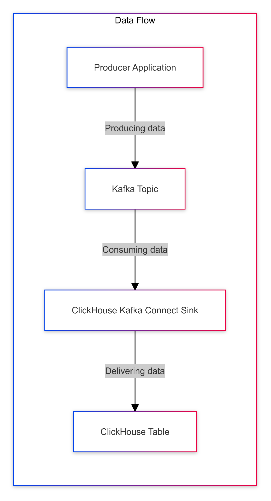
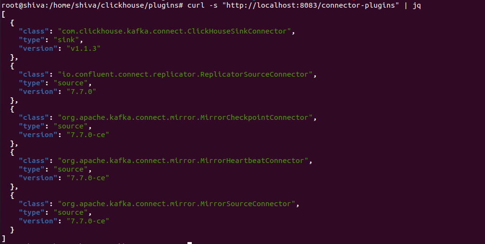
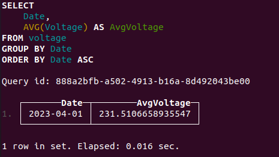
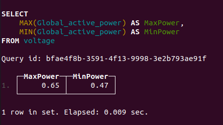
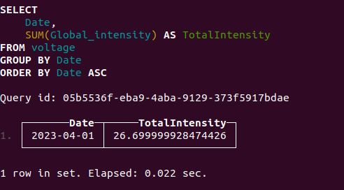
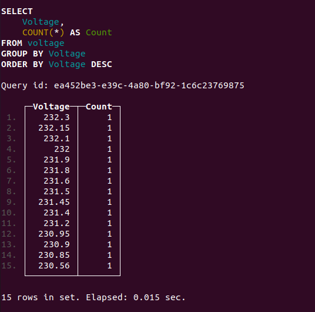
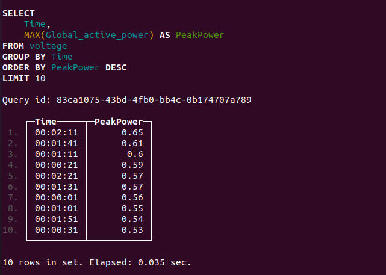

# Introduction to ClickHouse Analytics with Kafka

In today’s data-driven world, businesses rely heavily on real-time analytics to gain insights and make informed decisions. As data volumes grow and the need for immediate insights increases, traditional databases often struggle with challenges such as high latency, limited scalability, and the inability to handle large-scale, real-time data streams. These issues make it difficult to deliver low-latency, high-throughput analytics. This is where ClickHouse and Kafka come into play.

ClickHouse is a fast, open-source columnar database management system known for its performance in real-time analytics. It’s designed to handle large volumes of data, making it ideal for scenarios where quick retrieval and processing of data are essential.

Kafka, on the other hand, is a distributed streaming platform that excels at handling real-time data feeds. It’s widely used for building real-time data pipelines and streaming applications, making it a perfect match for ClickHouse when it comes to real-time analytics.

# Why ClickHouse and Kafka?

The combination of ClickHouse and Kafka offers a powerful solution for businesses that need to process and analyze large streams of data in real time. Here’s why:

- **Real-Time Data Ingestion**: Kafka’s ability to handle real-time data streams means you can ingest data into ClickHouse as it arrives. This is crucial for applications like monitoring, IoT analytics, and real-time reporting, where insights need to be as fresh as possible.

- **Scalability**: Both ClickHouse and Kafka are designed to scale horizontally, meaning they can handle increasing loads by simply adding more nodes to the cluster. This scalability ensures that your analytics infrastructure can grow with your data.

- **Performance**: ClickHouse’s columnar storage and compression techniques allow it to query large datasets quickly, making it suitable for complex analytical queries. Kafka, along with the ClickHouse sink connector, ensures that data is efficiently streamed and delivered from Kafka topics to ClickHouse, minimizing latency in the data pipeline.

# Getting Started

To start leveraging the power of ClickHouse and Kafka for analytics, you'll need to set up a data pipeline where Kafka streams data into ClickHouse. Here’s a high-level overview of how this can be done:



- **Set Up Kafka:** Deploy Kafka in your environment, either on-premise or in the cloud. Create Kafka topics that will store the data produced by the applications.
- **Configure ClickHouse:** Install and configure ClickHouse on a server or cluster. Ensure that ClickHouse can handle the data volume and query load you anticipate.
- **Connect Kafka to ClickHouse:** Use Kafka Connect with the ClickHouse Kafka Connect Sink to consume data from Kafka topics and deliver it to ClickHouse tables. This setup involves configuring a Kafka Connect Sink connector with workers running the connector to efficiently read data from Kafka and write it to ClickHouse.
- **Query and Analyze Data:** Once the data is stored in ClickHouse, you can start running queries to analyze it in real-time. ClickHouse’s SQL-like query language makes it easy to perform complex analytics on the data.


# How ClickHouse Differs from Other Analytics Tools:
- **Speed:** ClickHouse is designed for real-time analytics and can handle billions of rows per second. It's highly optimized for querying large datasets quickly, making it much faster than traditional databases for analytics.
- **Columnar Storage:** Unlike row-based storage used by traditional relational databases, ClickHouse uses columnar storage, which is more efficient for read-heavy analytical queries.
- **Scalability:** ClickHouse scales horizontally, allowing you to distribute data and queries across multiple servers, making it ideal for handling large-scale analytics.
- **Query Language:** ClickHouse uses SQL-like syntax but offers specialized functions and optimizations tailored for analytics, such as powerful array functions like arrayJoin() for flattening arrays into rows, and the AggregatingMergeTree engine for pre-aggregating data to optimize query performance—features that may not be available in other SQL-based systems.
- **Real-Time Analytics:** ClickHouse can handle real-time data ingestion and querying, providing immediate insights, which is crucial for monitoring and streaming analytics.
These features make ClickHouse particularly well-suited for scenarios where high performance, scalability, and real-time analytics are crucial, compared to other analytics tools that might be slower or less optimized for large-scale data processing.

# Now Let’s configure it step by step with example


## Step 1: Set Up Kafka

- Create Kafka topics that will store the data produced by your applications. For a local setup, you can use this GitHub repository to set up Kafka and ClickHouse: [cp-clickhouse](https://github.com/Platformatory/cp-clickhouse).

- Create Kafka Topic
```
kafka-topics --create --topic kafka_topic  --bootstrap-server localhost:9092 --partitions 1 --replication-factor 1
```

## Step 2: Install the Connector
- Download the latest connector from the following repository: ClickHouse Kafka Connect v1.1.3.
- Add the downloaded connector to the plugins folder, restart the Kafka Connect service, and then list the connector plugins to check for the [ClickHouse Kafka Connect plugin](https://github.com/ClickHouse/clickhouse-kafka-connect/releases/tag/v1.1.3)


## Step 3: Configure the Sink Connector
- When integrating Kafka with ClickHouse, ensure that the name of the Kafka topic (which stores the data) matches the name of the ClickHouse table (where the data will be stored). If the names don't match, you can use a transformer, such as ExtractTopic, to modify the data or metadata so that the topic name is appropriately aligned with the table name in ClickHouse. This ensures that the data flows correctly from Kafka to the intended table in ClickHouse.

- Example configuration for the ClickHouse Kafka Sink Connector. For more details about each field, refer to the following documentation: [ClickHouse Kafka Connect Sink Documentation.](https://clickhouse.com/docs/en/integrations/kafka/clickhouse-kafka-connect-sink)

```
{
  "name": "voltage",
  "config": {
    "connector.class": "com.clickhouse.kafka.connect.ClickHouseSinkConnector",
    "tasks.max": "1",
    "hostname": "clickhouse",
    "port": "8123",
    "ssl": "false",
    "username": "default",
    "password": "",
    "database": "default",
    "topics": "voltage",
    "key.converter": "org.apache.kafka.connect.storage.StringConverter",
    "value.converter": "org.apache.kafka.connect.json.JsonConverter",
    "value.converter.schemas.enable": "false"
  }
}
```

## Step 4: Configure the ClickHouse Table
- Before configuring the sink connector, ensure the table is created in ClickHouse. Otherwise, the connector will fail.

- Example to create a table in ClickHouse for the voltage dataset:

```
CREATE TABLE voltage (
    Date Date,
    Time String,
    Global_active_power Float32,
    Global_reactive_power Float32,
    Voltage Float32,
    Global_intensity Float32,
    Sub_metering_1 Float32,
    Sub_metering_2 Float32,
    Sub_metering_3 Float32
) ENGINE = MergeTree()
ORDER BY (Date, Time);
```
- After creating the table, ensure that the Connect worker is running. Once confirmed, produce the data to the voltage topic. The data should match the schema of the table in ClickHouse.

- Example of the data to be produced to the voltage topic:

```
{
  "Date": "2023/08/23",
  "Time": "12:49:00",
  "Global_active_power": 3.666,
  "Global_reactive_power": 0.528,
  "Voltage": 235.68,
  "Global_intensity": 15.8,
  "Sub_metering_1": 0.0,
  "Sub_metering_2": 1.0,
  "Sub_metering_3": 17.0
}
```

### Step 5: Performing Analytics on the Table
- Here are a few examples of analytics you can perform on the voltage table in ClickHouse:

- **Average Voltage Over Time: Calculates the average voltage for each date.**


- **Maximum and Minimum Global Active Power: Finds the highest and lowest values of global active power.**


- **Total Global Intensity by Date: Sums up the global intensity for each date.**


- **Voltage Distribution: Counts how frequently each voltage value occurs.**


- **Peak Hours for Energy Consumption: Identifies the time periods with the highest energy consumption.**


# Example Use Cases

- **Real-Time Monitoring:** Companies can use ClickHouse and Kafka to monitor application performance, server metrics, or user activity in real-time, allowing for immediate action on critical events.
- **IoT Analytics:** IoT devices generate massive amounts of data that need to be processed and analyzed quickly. ClickHouse can ingest and analyze this data in real-time, providing valuable insights into device behavior and system performance.
- **Fraud Detection:** Financial institutions can stream transaction data into ClickHouse via Kafka to detect fraudulent activities as they occur, enabling them to take swift action.

# Conclusion

ClickHouse and Kafka together form a robust foundation for real-time analytics. Whether you’re looking to monitor application performance, analyze IoT data, or detect fraud, this powerful combination can help you gain insights at the speed of data. By setting up a pipeline that streams data from Kafka to ClickHouse, you can ensure that your analytics are always up-to-date and ready to inform your business decisions.
