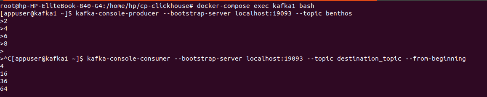

Before diving into the capabilities of Redpanda Connect, it's essential to understand its origins, particularly the acquisition and transformation of Benthos, which played a pivotal role in shaping what Redpanda Connect is today.
Benthos, an open-source data streaming tool, was renowned for its versatility and simplicity in managing and processing data streams. It gained popularity due to its declarative approach, allowing users to define complex data processing pipelines with minimal configuration. Benthos was particularly favored for its stateless processing, which made it highly reliable and easy to scale.

**Key Features of Benthos:**


* **Declarative** Configuration: Users could define processing pipelines using a simple configuration file, making it accessible even to those without deep programming expertise.
* **Flexibility**: Benthos supported a wide range of input, output, and processing components, making it adaptable to various use cases.
* **Scalability**: Built with scalability in mind, Benthos could handle high-throughput data streams efficiently.

**The Acquisition by Redpanda**

Recognizing the potential of Benthos, Redpanda, a company known for its high-performance streaming data platform, acquired Benthos. The acquisition marked the beginning of Benthos' transformation into what is now known as Redpanda Connect.

**The Fork to Bento**

While Redpanda acquired Benthos, rebranding it as Redpanda Connect and introducing commercial licensing for key integrations. This prompted WarpStream to fork the Benthos project, renaming it Bento, which will remain a 100% MIT-licensed, open-source project. The Bento fork continues Benthos' legacy, offering a lightweight, Go-based stream processing alternative to Kafka Connect. WarpStream invites others to contribute and help maintain Bento, ensuring stability and open governance for those concerned about Redpanda's commercial shifts. 

You can find [the new Bento repository here](https://github.com/warpstreamlabs/bento), as well as a hosted version of the [original docs](https://warpstreamlabs.github.io/bento/). For more details check out the full article on the fork from the official [Warpstream website](https://www.warpstream.com/blog/announcing-bento-the-open-source-fork-of-the-project-formerly-known-as-benthos).


# What is Redpanda Connect

Redpanda Connect builds upon the foundation laid by Benthos, enhancing its capabilities and integrating it into the broader Redpanda ecosystem. While Benthos provided a robust framework for data streaming, Redpanda, known for its high-performance streaming capabilities, took the functionality of Benthos and improved upon it in several ways:


* **Integration with Redpanda Ecosystem**: Redpanda Connect is designed to work natively with Redpanda’s broader ecosystem. This means it's optimized for Redpanda’s distributed data platform, allowing for more seamless and efficient data streaming, transformation, and routing.
* **Scalability**: While Benthos is highly capable, Redpanda Connect is designed to handle larger volumes of data more efficiently. It leverages Redpanda’s architecture to scale up and manage high-throughput data streams in a more resilient and efficient way.
* **Cohesion**: Redpanda Connect provides a more unified and cohesive experience. By building on top of Benthos, it integrates well with Redpanda's tools, offering streamlined workflows and management.

In summary, Redpanda took Benthos' foundation and optimized it to work specifically with Redpanda’s high-performance platform, adding better scalability, easier integration, and a more cohesive user experience.

Redpanda Connect is a framework for creating declarative stream processors where a pipeline of one or more sources, an arbitrary series of processing stages, and one or more sinks can be configured in a single config


# Benefits of Using Redpanda Connect

**Real-Time Data Processing**: Redpanda Connect can be used for real-time data processing. It can consume data from the specified inputs, process it using the specified processors, and then send the processed data to the specified outputs. This makes it suitable for use cases that require real-time data processing

**Fault Tolerance**: Redpanda Connect includes mechanisms for fault tolerance, ensuring that data processing continues smoothly even in the event of failures. This includes support for distributed connectors and automatic recovery from errors.

**Transaction-Based Resiliency:** It implements transaction-based resiliency with back pressure, ensuring at-least-once delivery without needing to persist messages during transit.

**Wide Range of Connectors**: Redpanda Connect comes with a wide range of connectors, making it easy to integrate with your existing infrastructure. Some of the connectors include AWS DynamoDB, AWS Kinesis, Azure Blob Storage, MongoDB, Kafka, and many more.

**Data Agnostic**: Redpanda Connect is totally data agnostic, which means it can handle any type of data you need to process.

**Overlap with Traditional Tools**: Redpanda Connect has functionality that overlaps with integration frameworks, log aggregators, and ETL workflow engines. This means it can be used to complement these traditional data engineering tools or act as a simpler alternative.


# Key Components of Redpanda Connect

Redpanda Connect is composed of several key components that work together to provide a robust data streaming service:


1. **Inputs**: These are the sources from which data is consumed. They can be various services like Kafka, AWS S3, HTTP, etc. 
2. **Buffers**: These are optional components that can be used to temporarily store data before it is processed 
3. **Processors**: These are the components that perform operations on the data. They can perform various tasks like mapping, filtering, etc.
4. **Outputs**: These are the destinations where the processed data is sent. They can be various services like AWS S3, HTTP, etc. 
5. **Observability Components**: These components allow you to specify how Connect exposes observability data. They include HTTP, logger, metrics, and tracing.


# How Does Redpanda Connect Work?

Redpanda Connect works by consuming data from the specified inputs, optionally storing it in a buffer, processing it using the specified processors, and then sending the processed data to the specified outputs. The observability components provide visibility into the operation of the Connect pipeline.

In this example, we'll set up a Kafka-Benthos pipeline where data is consumed from one Kafka topic, processed by Benthos, and then sent to another Kafka topic. We'll use Docker Compose to spin up a Zookeeper, Kafka, and Benthos services, and we'll walk through each step of the process, including how to verify that the data has been processed correctly.

**Step 1: Create the Docker Compose File**

Let's start by creating a docker-compose.yml file. This file defines the services we need: Zookeeper, Kafka, and Benthos.

```yaml
version: '3.7'
services:
  zookeeper1:
    image: confluentinc/cp-zookeeper:7.6.2
    hostname: zookeeper1
    container_name: zookeeper1
    ports:
      - "2181:2181"
    command: zookeeper-server-start /etc/kafka/zookeeper.properties
    volumes:
      - ./zookeeper1:/etc/kafka
    deploy:
      resources:
        limits:
          cpus: "1"
          memory: 512M

  kafka1:
    image: confluentinc/cp-server:7.6.2
    hostname: kafka1
    container_name: kafka1
    depends_on:
      - zookeeper1
    command: kafka-server-start /etc/kafka/server.properties
    volumes:
      - ./kafka1:/etc/kafka
    deploy:
      resources:
        limits:
          cpus: "1.5"
          memory: 1536M

  benthos:
    image: jeffail/benthos:latest
    hostname: benthos
    container_name: benthos
    volumes:
      - ./benthos.yaml:/benthos.yaml
    ports:
      - "4195:4195"
    depends_on:
      - kafka1
```

**Step 2: Configure Benthos**

Next, we'll configure Benthos by creating a benthos.yaml file. This configuration will consume messages from the benthos Kafka topic, process each message by squaring its value, and then produce the result to the destination_topic.

```yaml
input:
  kafka:
    addresses:
      - kafka1:19092
    topics: [ benthos ] #source topic name
    consumer_group: benthos_group
    client_id: benthos_client
    start_from_oldest: true
    tls: {}
    sasl: {}

pipeline:
  processors:
    - bloblang: |
        root = this * this
output:
  kafka:
    addresses:
      - kafka1:19093
    topic: destination_topic  # The new topic to sink data into
    client_id: benthos_client
    tls: {}
    sasl: {}
    max_in_flight: 64
```

Benthos uses a powerful language called Bloblang for data transformations. Bloblang allows you to manipulate and reshape data in various ways.

**root = this * this**: This is the specific Bloblang expression used in the processor. Let’s break it down:

**root**: This represents the entire document or message being processed. Assigning a value to root effectively transforms the entire message.

**this**: In Bloblang, this refers to the current value of the data being processed. If the data is a single number, this represents that number.

**this * this**: This expression takes the value of this (i.e., the number) and multiplies it by itself. This operation squares the number. For example, if the incoming message is 2, this processor will transform it to 4.

**Step 3: Spin Up the Services**

With your docker-compose.yml and benthos.yaml files in place, you can now bring up the services using Docker Compose.

```bash
docker-compose up -d
```

This command will start the Zookeeper, Kafka, and Benthos services in detached mode.

**Step 4: Create Kafka Topics**

Before sending any data, you need to create the destination Kafka topic that will be used: destination_topic.

**Step 5: Produce messages in the source topic and verify the output by consuming in the destination topic:**





Here we have produced a simple set of integers to the source topic and then consumed from the destination topic.


# Applications and Use Cases

**Data Integration**: Redpanda Connect can be used to integrate data from various sources and send it to different destinations using its wide range of connectors.

**ETL Workflows**: Redpanda Connect can be used to build ETL (Extract, Transform, Load) workflows. It can extract data from various sources, transform the data using its processors, and load the transformed data into various destinations.

**Data Filtering**: With its processors, Redpanda Connect can be used to filter data. This can be useful in use cases that require filtering of data before it is sent to the destination.

**Log Aggregation**: Redpanda Connect can be used to aggregate logs from various systems and send them to a centralized logging service. This can be useful for monitoring and debugging distributed systems.


# Comparison with Kafka Connect

In the world of data streaming, both Kafka Connect and Redpanda Connect serve as critical tools, but they differ significantly in approach and design philosophy. Kafka Connect, part of the broader Apache Kafka ecosystem, is known for its robust, distributed architecture, making it ideal for complex ETL workflows and large-scale deployments. Redpanda Connect, on the other hand, evolved from the lightweight, open-source Benthos project and focuses on simplicity, stateless processing, and high performance. While Kafka Connect excels in stateful transformations, Redpanda Connect aims to streamline real-time data streaming with minimal overhead. Here's how they stack up against each other.


<table border="1" cellspacing="0" cellpadding="8">
  <tr>
   <td><strong>Category</strong>
   </td>
   <td><strong>Kafka Connect</strong>
   </td>
   <td><strong>Redpanda Connect</strong>
   </td>
  </tr>
  <tr>
   <td><strong>Architecture</strong>
   </td>
   <td>Distributed, scalable, with support for standalone and distributed modes.
   </td>
   <td>Declarative, stateless, simpler architecture focused on ease of deployment.
   </td>
  </tr>
  <tr>
   <td><strong>Ecosystem & Integration</strong>
   </td>
   <td>Part of the Apache Kafka ecosystem; integrates seamlessly with Kafka topics and brokers.
   </td>
   <td>Designed for Redpanda, with flexibility inherited from Benthos; supports a wide range of connectors.
   </td>
  </tr>
  <tr>
   <td><strong>Configuration</strong>
   </td>
   <td>Requires detailed configuration for connectors, tasks, and workers; supports distributed configuration.
   </td>
   <td>Simple, declarative configuration with minimal setup effort, focusing on lightweight pipeline setups.
   </td>
  </tr>
  <tr>
   <td><strong>Processing</strong>
   </td>
   <td>Stateful processing with distributed transformations; suitable for complex ETL workflows.
   </td>
   <td>Stateless, lightweight processing with simpler use cases; focuses on chained, minimal transformations.
   </td>
  </tr>
  <tr>
   <td><strong>Observability</strong>
   </td>
   <td>Extensive monitoring through JMX, REST APIs, and integration with systems like Prometheus.
   </td>
   <td>Offers observability components like logging and tracing, but with potentially less mature tooling.
   </td>
  </tr>
  <tr>
   <td><strong>Licensing & Community</strong>
   </td>
   <td>Open-source under Apache License 2.0, with strong community and extensive library of connectors.
   </td>
   <td>Mixed licensing post-acquisition; originally fully open-source, now some parts are proprietary, leading to a fork.
   </td>
  </tr>
  <tr>
   <td><strong>Use Cases</strong>
   </td>
   <td>Ideal for large-scale, complex ETL workflows, distributed fault tolerance, and enterprise-level deployments.
   </td>
   <td>Best for simpler, stateless streaming, and performance-sensitive applications with minimal overhead.
   </td>
  </tr>
  <tr>
   <td><strong>Performance & Scalability</strong>
   </td>
   <td>Scales effectively with Kafka's architecture; handles high-throughput data and large deployments.
   </td>
   <td>Designed for low-latency streaming; excels in performance but may not scale as easily for large, stateful use cases.
   </td>
  </tr>
</table>


This comparison highlights the core differences and strengths of both tools based on their architecture, processing capabilities, and ecosystem.


# Getting Started with Redpanda Connect

To get started with Redpanda Connect, you can follow the [Getting Started guide](https://docs.redpanda.com/redpanda-connect/guides/getting_started/). This guide will walk you through the process of setting up Redpanda Connect and using it for your data streaming needs.


# Conclusion

Redpanda Connect stands out as a powerful and versatile tool in the realm of data streaming. With its declarative configuration, fault tolerance, and wide range of connectors, it simplifies the complexities of real-time data processing across various systems. Its flexibility and scalability make it a valuable asset for diverse use cases, from ETL workflows to log aggregation. As you delve into Redpanda Connect, you'll discover a reliable and efficient solution that meets the demands of modern data engineering, providing both the power and ease of use required to handle large-scale data streams effectively.
