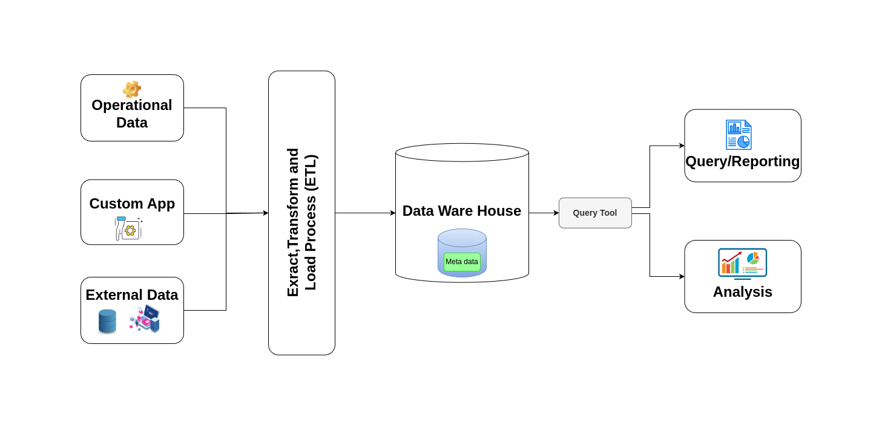
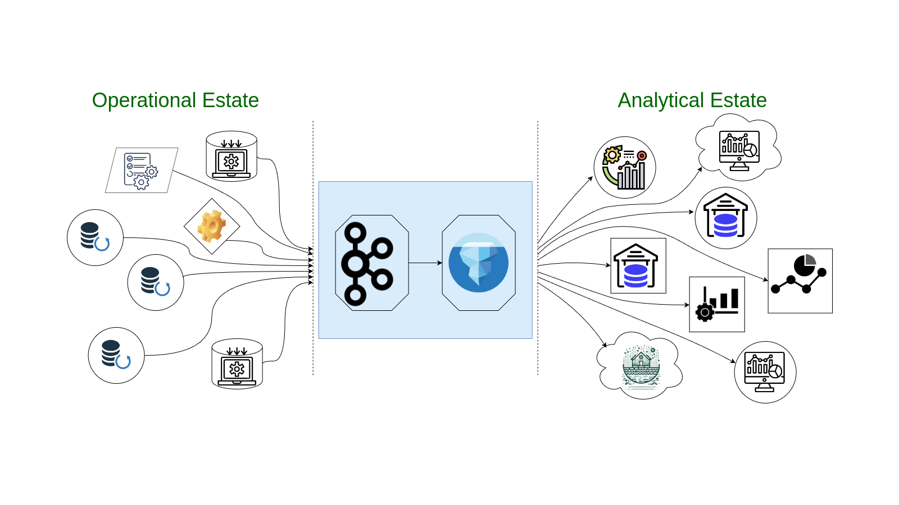

## The Current Divide in Data Processing

In today’s fast-paced world, businesses rely on two main types of data: operational and analytical. However, a significant problem is that these two types of data have traditionally been kept separate, leading to various challenges. These challenges include data latency caused by moving data between different systems, the cost and complexity of maintaining separate systems, and the need to manage complex data pipelines for synchronizing operational and analytical data.

Operational data is what keeps your business running day-to-day. It comes from real-time applications, SaaS platforms, and databases. On the other hand, analytical data is used for making business decisions and is stored in data warehouses, lakes, and analytics tools.

The problem is that moving data between these two types of systems is complex, slow, and expensive. You have to extract, transform, and load (ETL) the data from operational systems to analytical ones, which takes time and resources. This means your data is often outdated by the time it’s ready for analysis, leading to delays and inefficiencies.

## The Role of Apache Iceberg and Confluent Tableflow

Confluent saw this problem and introduced Tableflow—a new feature that helps bridge the gap between operational and analytical data. And the key to this is Apache Iceberg, an open table format that’s become a standard for managing large datasets in data lakes and warehouses.

### How Apache Iceberg Bridges the Gap

Apache Iceberg plays a crucial role in bringing these two types of data together. It provides a powerful, open format that allows data to be shared across different platforms and always kept up to date. For example, consider an e-commerce platform where operational data consists of user transactions, including transaction IDs, user IDs, product IDs, timestamps, and amounts. With Iceberg, this data can be stored in a unified table format:

<table>
  <tr>
   <td>transaction_id
   </td>
   <td>user_id
   </td>
   <td>product_id
   </td>
   <td>timestamp
   </td>
   <td>amount
   </td>
   <td>event_type
   </td>
   <td>partition
   </td>
  </tr>
  <tr>
   <td>1001
   </td>
   <td>2001
   </td>
   <td>3001
   </td>
   <td>2024-09-04 10:01:23.123
   </td>
   <td>20
   </td>
   <td>purchase
   </td>
   <td>2024-09-04
   </td>
  </tr>
  <tr>
   <td>1002
   </td>
   <td>2002
   </td>
   <td>3002
   </td>
   <td>2024-09-04 10:10:20.123
   </td>
   <td>10
   </td>
   <td>purchase
   </td>
   <td>2024-09-04
   </td>
  </tr>
  <tr>
   <td>1003
   </td>
   <td>2003
   </td>
   <td>3003
   </td>
   <td>2024-09-04 10:15:00.000
   </td>
   <td>05
   </td>
   <td>refund
   </td>
   <td>2024-09-04
   </td>
  </tr>
  <tr>
   <td>1004
   </td>
   <td>2004
   </td>
   <td>3004
   </td>
   <td>2024-09-04 10:16:23.123
   </td>
   <td>50
   </td>
   <td>purchase
   </td>
   <td>2024-09-04
   </td>
  </tr>
</table>

With Iceberg, the same data that powers real-time applications can also be stored as tables in a data lake, making it ready for analytical tools without the need for complicated ETL processes. This approach ensures that both operational and analytical queries can access the latest data, bridging the gap between these traditionally separate types of data.

## How Tableflow Makes It Easy

Tableflow allows you to turn Apache Kafka topics directly into Iceberg tables with just a click. What makes this even more powerful is that Tableflow leverages object storage as its backend. Object storage is ideal for handling large amounts of unstructured data and provides a scalable, cost-effective solution. This object storage can be used to create Iceberg tables, ensuring that your data is not only stored efficiently but also organized in a way that makes it immediately accessible for analysis. This makes it incredibly simple to get your data into warehouses, lakes, or analytics engines. The best part is that the data is always fresh, accurate, and ready for you to use.

## The Advantage of Using Object Storage

Tableflow’s seamless integration with object storage systems like Amazon S3 is one of its standout benefits. Given that object storage is specifically designed to manage vast amounts of unstructured data, it perfectly complements the large-scale data management capabilities that Tableflow offers. Whether you're dealing with raw logs, multimedia files, or complex transactional records, object storage can handle it all with ease. By storing data in an object storage system ensures that data remains highly durable, easily accessible, and cost-effective to manage. This approach is also perfectly suited for Iceberg’s open table format, which thrives in environments where data is stored flexibly and efficiently.

## Stream-Table Duality

A unique feature of Tableflow is something called "stream-table duality." This means that Tableflow, with the help of Apache Iceberg, can manage data as both streams and tables. Before, you had to choose between optimizing for real-time data or batch analysis. With Tableflow, you don’t have to choose. The same data can be accessed as a live stream or a historical table, depending on what you need.

## Key Features of Confluent Tableflow

**Real-time Data Processing:** Tableflow lets you process data in real-time, so you can get insights and make decisions based on the latest information.

**Scalability and Flexibility:** It’s built to scale as your business grows, ensuring smooth performance even as your data volumes increase.

**Event-Driven Architecture:** This makes it easy to integrate and synchronize data across different systems, improving data accessibility and consistency.

**Fault Tolerance and Reliability:** With built-in mechanisms for data replication and recovery, Tableflow minimizes the risk of data loss or downtime.

## Why Tableflow is Better Than Traditional Approaches

**Instant Insights:** Gain real-time insights to make quicker, more informed decisions without the delay of traditional processing methods.

**Streamlined Architecture: **Tableflow's event-driven design simplifies data infrastructure, reducing the complexity typical of data warehousing and lakehouse setups.

**Dynamic Scalability:** Easily scale your data infrastructure to meet changing demands, ensuring cost-efficiency and optimal performance.

**Modern Technology Integration:** Tableflow seamlessly connects with contemporary data technologies like Apache Kafka, enhancing its ability to integrate with diverse data sources and applications.

## The Future of Data Streaming

Confluent Tableflow marks a significant leap forward in data streaming and processing, especially for organizations aiming to unify their operational and analytical data. By leveraging modern technologies like Apache Iceberg and object storage, Tableflow not only simplifies data pipelines but also enhances data governance, making it easier and more cost-effective to manage large-scale data environments. It bridges the often complex gap between real-time data streams and historical analytics, offering a seamless solution that optimizes both data accessibility and usability.

As Confluent has noted, “The first version of Tableflow stores the data in Confluent Cloud, however, we know that being able to store long-term data in customer-owned storage is important. In the near future, Tableflow will have the option to store the Apache Iceberg metadata and parquet files directly in your own object storage.” This upcoming feature will give you even more control and flexibility over your data, allowing you to keep your long-term data exactly where you want it.

Confluent Tableflow is an innovative solution that addresses many of the challenges faced by organizations dealing with large volumes of data. Its real-time processing capabilities and event-driven architecture make it a powerful tool for businesses that require timely insights and seamless data integration. The platform's ability to scale and integrate with modern technologies like Apache Kafka further solidifies its position as a leading choice for enterprises looking to modernize their data infrastructure. By simplifying complex data workflows and enhancing data governance, Tableflow stands out as a forward-thinking solution that can transform how businesses manage and utilize their data.
