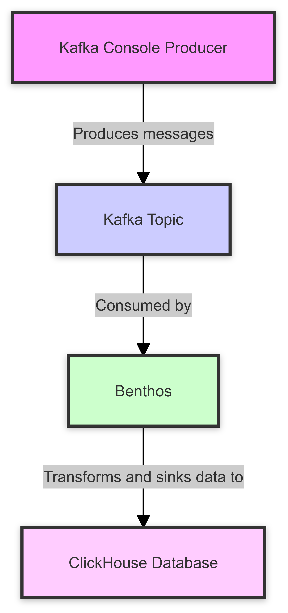
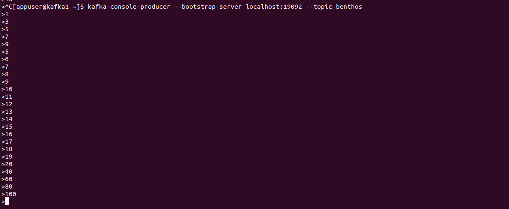
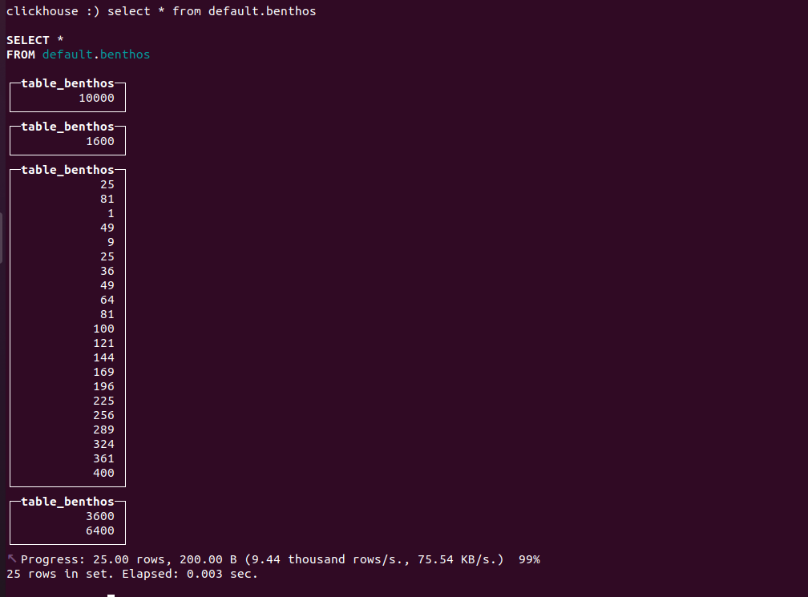

# Migrating from kafka Connect to Redpanda Connect


# Introduction


## Redpanda Connect

Redpanda Connect previously known as benthos is a lightweight stream-processing framework for building data pipelines. It contains many different types of input and output connectors and provides transformation capabilities via a custom language called Bloblang. It is designed for handling and transforming large amounts of data in real time, making it ideal for use cases like ETL (Extract, Transform and Load) pipelines, log processing, data enrichment, and more. It can complement these traditional data engineering tools or act as a simpler alternative.


### Bloblang

Bloblang is a language used mainly for data transformation. It allows users to define complex data transformations with easy-to-understand syntax. Writing code in Bloblang can be straightforward for those familiar with programming concepts, as it provides a set of functions and operators to manipulate data. The language is designed to be clear and simple to use.


## Kafka Connect 

Kafka Connect is a flexible, declarative framework for integration data with Kafka. It connects data sources and sinks to Kafka, allowing the rest of the Kafka ecosystem to efficiently manage event streams. With hundreds of connectors available, Kafka Connect simplifies streaming data from various sources into Kafka and from Kafka into different destinations. A common Kafka Connect use case is orchestrating real-time event streams from a data source to a target system for analytics. 


# Why Choose Redpanda Connect over Kafka Connect? 

Redpanda Connect may be a better fit than Kafka Connect in scenarios where you need more flexibility and control over data transformations, particularly when you’re dealing with complex process logic. Repanda offers a framework for creating and deploying inline transformations (data transforms) directly within Redpanda topics. This enables the processing and validation of data right inside the broker, so that consumers receive data in the format they expect. By handling transformations within the broker itself, Redpanda eliminates the need for managing separate stream processing environments or relying on third-party tools. You can read more about it [here](https://docs.redpanda.com/current/develop/data-transforms/how-transforms-work/).

It’s also a strong choice for building data pipelines outside of the Kafka ecosystem. When building data integration pipelines, we rarely send data in exactly the same way. While Kafka Connect offers SMTs (Single Message Transforms) for simple, stateless transformations like filtering, projecting or routing messages, more complex tasks require a stream-processing framework like Kafka Streams, which can add significant overhead. Redpanda Connect, however, offers a more lightweight alternative by exposing data ingestion endpoints over HTTP(s) allowing you to send and receive data via standard HTTP requests. This enables seamless integration with non-Kafka systems or microservices, making data ingestion and transformation more efficient without the need for additional infrastructure. 

Additionally, Redpanda Connect offers superior performance in lightweight, high-throughput environments due to its streamlined architecture and efficient Go-based design. If your use case requires advanced data transformations, or operates in an environment where minimizing overhead is crucial, Redpanda Connect is likely the better choice. Its architecture is optimized for handling transformations more efficiently, with lower latency and less overhead, and is ideal for high-throughput environments. While Kafka Connect is reliable, it can be more resource-intensive due to its Java-based system, which may slow things down when processing large volumes of data or complex operations. 


# Migrating Connectors


## Understanding Source and Sink Connectors in Kafka Connect


* **Source Connector**: Source connector pulls data from an external system (e.g., databases, message queues) and pushes into the Kafka topics. Source connector can also collect metrics from all your application servers and store the data in Kafka topics. 
* **Sink Connector**: Sink connector delivers the data from Kafka topics to external systems, such as Elasticsearch, or batch systems, ensuring that processed or raw data can be stored or further processed. 


## Migrating Kafka Connect Pipeline to Redpanda Connect 


**<span style="text-decoration:underline;">Workflow: </span>**




We are running kafka, Benthos, ClickHouse, and zookeeper as docker containers. We have created a docker compose file, which creates the docker container for all these services mentioned above. 

```yml
---
version: '3.7'
services:
  zookeeper1:
    image: confluentinc/cp-zookeeper:7.6.2
    hostname: zookeeper1
    container_name: zookeeper1
    ports:
      - "2181:2181"
    command: zookeeper-server-start /etc/kafka/zookeeper.properties
    volumes:
    - ./zookeeper1:/etc/kafka
    deploy:
      resources:
        limits:
          cpus: "1"
          memory: 512M

  kafka1:
    image: confluentinc/cp-server:7.6.2
    hostname: kafka1
    container_name: kafka1
    depends_on:
      - zookeeper1
    command: kafka-server-start /etc/kafka/server.properties
    volumes:
    - ./kafka1:/etc/kafka
    deploy:
      resources:
        limits:
          cpus: "1.5"
          memory: 1536M
 
  connect:
    image: confluentinc/cp-server-connect:7.6.2
    hostname: connect
    container_name: connect
    depends_on:
      - kafka1
    command: connect-distributed /etc/kafka/connect-distributed.properties
    ports:
      - "8083:8083"
    volumes:
    - ./connect:/etc/kafka
    - ./plugins:/usr/share/java
    deploy:
      resources:
        limits:
          cpus: "2"
          memory: 4G        
 
  clickhouse:
    image: clickhouse/clickhouse-server
    hostname: clickhouse
    container_name: clickhouse
    ports:
      - "8123:8123"
      - "9000:9000"  # if you need the native client port
    volumes:
      - clickhouse-data:/var/lib/clickhouse
      - clickhouse-config:/etc/clickhouse-server
      
  benthos:
    image: jeffail/benthos:latest
    hostname: benthos
    container_name: benthos
    volumes:
      - ./benthos.yaml:/benthos.yaml
    ports:
      - "4195:4195"
    depends_on:
      - kafka1
      - clickhouse

volumes:
  clickhouse-data:
  clickhouse-config:
```


### Step-by-Step Guide 

Let’s walk through an example of migrating Kafka Connect pipeline that reads data from Kafka topic, performs an aggregation and writes the data to a ClickHouse database.

**<span style="text-decoration:underline;">Migrating to Redpanda Connect</span>**


- **Create the Kafka Topic**:

    ```
    kafka-topic.sh --bootstrap-server localhost:19092 --create --topic benthos
    ```


- **Produce the data into a Kafka topic**

    ```
    kafka-console-producer.sh --bootstrap-server localhost:19092 --topic benthos
    ```
    


- **Create the Table in ClickHouse**
    1. **Set Database Context**: You can set the database context in your connection string if your client supports it: 

        ```
        clickhouse-client --user default --password '' --host localhost --port 9000 --query "USE default"
        ```


    2. **Create Table**: If the table does not exist, create it with the following commands 

        ```
        clickhouse-client --user default --password '' --host localhost --port 9000 --query "
        CREATE TABLE default.benthos (
            table_benthos Float64
        ) ENGINE = MergeTree()
        ORDER BY tuple();"
        ```


    3. **Describe Table**: If the table exists, describe it to ensure the schema is correct. 

        ```
        clickhouse-client --user default --password '' --host localhost --port 9000 --query "DESCRIBE TABLE default.benthos"
        ```


    4. **List Tables**: Check if the ‘benthos’ table exists in the ‘default’ database. 

        ```
        clickhouse-client --user default --password '' --host localhost --port 9000 --query "SHOW TABLES FROM default"
        ```


    5. **Query Table**: If the table exists and is described correctly, run the query to select data from it. 

        ```
        clickhouse-client --user default --password '' --host localhost --port 9000 --query "SELECT * FROM default.benthos"
        ```


* **Write the Redpanda Connect configuration file**

    ```yml
    ---
    input:
    kafka:
        addresses:
        - kafka1:19092
        topics: [ benthos ]
        consumer_group: benthos_group
        client_id: benthos_client
        start_from_oldest: true
        tls: {}
        sasl: {}

    pipeline:
    processors:
        - bloblang: |
            root = this * this

    output:
    sql_insert:
        driver: clickhouse
        dsn: clickhouse://default:@clickhouse:9000/default
        table: benthos
        columns:
        - "table_benthos"
        args_mapping: root = [ this ]
        max_in_flight: 64
        batching:
        count: 100
        period: 5s
    ```


    6. **Define the Input Configuration**

        The Redpanda Connect configuration will start with an input section that consumed messages from a Kafka topic.


        ```yml
        ---
        input:
        kafka:
            addresses:
            - kafka1:19092
            topics: [ benthos ]
            consumer_group: benthos_group
            client_id: benthos_client
            start_from_oldest: true
            tls: {}
            sasl: {}
        ```


    7. **Configure Data Transformation**

        Next, use Bloblang to define the transformation logic. 


        ```yml
        pipeline:
        processors:
            - bloblang: |
                root = this * this
        ```


    8. **Define the Output Configuration**

        Finally, set up the output section to write to ClickHouse using the SQL insert processor. 


        ```yml
        output:
        sql_insert:
            driver: clickhouse
            dsn: clickhouse://default:@clickhouse:9000/default
            table: benthos
            columns:
            - "table_benthos"
            args_mapping: root = [ this ]
            max_in_flight: 64
            batching:
            count: 100
            period: 5s
        ```


        Format of dsn that used to connect with the benthos and send the data from topic to click house table.


        ```
        dsn: clickhouse://default:@<hostname>:9000/<database_name>
        ```


* **Output**

    As shown in the following output, the pipeline reads messages from Kafka topic i.e. benthos and processes each message by squaring its value. This transformation is handled by Redpanda Connect’s Blobland language, which allows flexible data manipulation within the pipeline. The processed data is then inserted into a ClickHouse table in batches of 100 messages or every 5 seconds, whichever occurs first.

    


# Conclusion 

When migrating from Kafka Connect to Redpanda Connect, it’s essential to evaluate several factors to ensure a successful transition. Redpanda Connect enhances flexibility and control over data transformations, making it suitable for scenarios involving complex processing logic or when operating outside the Kafka ecosystem. However, Kafka Connect remains a robust choice in situations where its extensive ecosystem of connectors and seamless integration with Kafka’s event streams are advantageous. Before making a full commitment to Redpanda Connect, it’s important to understand your needs, allowing you to test and validate its capabilities in your environment. This careful evaluation will help ensure that your chosen tool aligns with your data processing requirements and operational goals.
